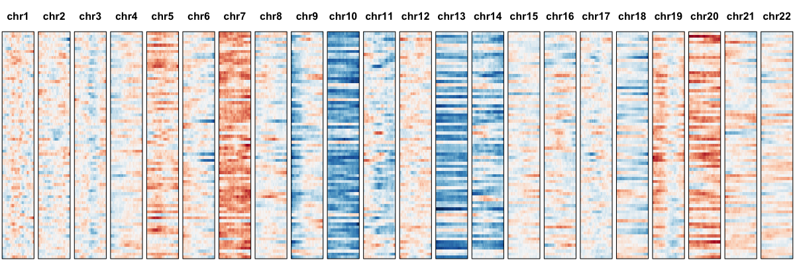
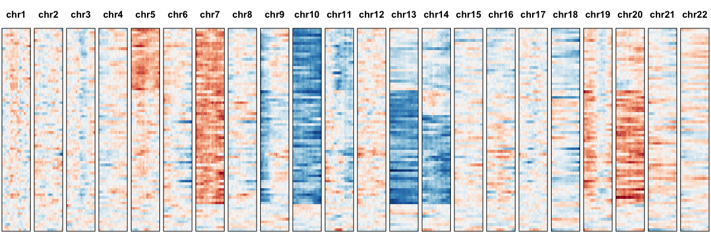
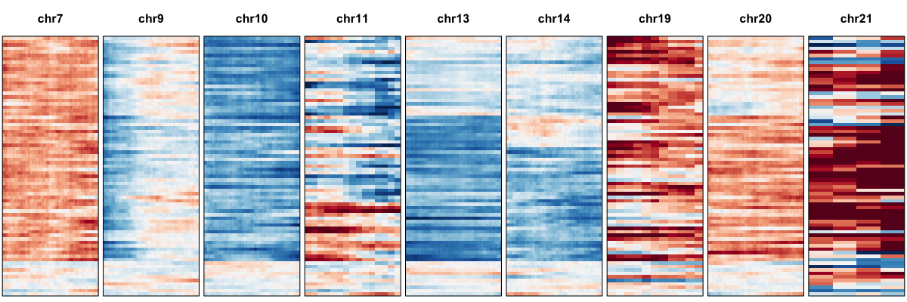
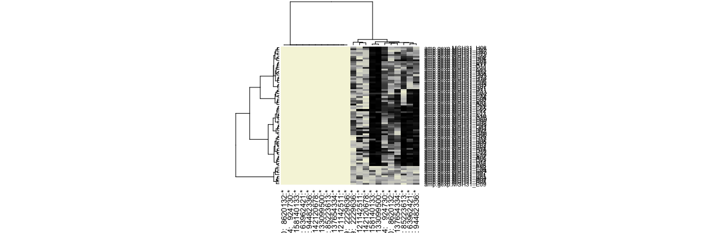
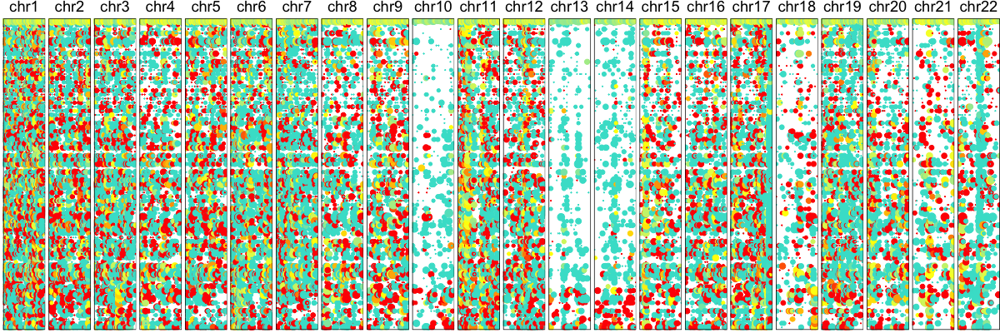

# Getting Started

In this tutorial, we will walk you through a sample `HoneyBADGER` analysis using data from patient MGH31 from [Patel et al](https://www.ncbi.nlm.nih.gov/pubmed/24925914).

```r
library(HoneyBADGER)
```

## Expression-based model

For the expression-based model, we can load the gene expression data for cells from patient MGH31 along with an expression reference.

```r
data(gexp)
data(ref)
```

We will use `bioMart` to obtain the gene coordinates for each gene, which we will use later to order the genes according to their chromosomal location.

``r
require(biomaRt) ## for gene coordinates
mart.obj <- useMart(biomart = "ENSEMBL_MART_ENSEMBL", dataset = 'hsapiens_gene_ensembl', host = "jul2015.archive.ensembl.org")
```

Now, we can make a new HoneyBADGER object and initialize the gene expression matrices. This data has already been filtered for highly expressed shared genes and scaled for library size differences so we can override the default filtering and scaling.

```r
hb <- new('HoneyBADGER', name='MGH31')
hb$setGexpMats(gexp, ref, mart.obj, filter=FALSE, scale=FALSE)
```

```
## Initializing expression matrices ... 
## normalizing gene expression for 6082 genes and 75 cells ... 
## Done setting initial expression matrices!
```

Now, let's plot a smoothed normalized gene expression profile to see if we can visually identify any abnormalities. 

```r
hb$plotGexpProfile()
```



To quantitatively identify and assess the posterior probability of abnormalities, we will first model the gene expression variance.


```r
hb$setMvFit()
```

```
## Modeling expected variance ... Done!
```

Now, we can use an HMM to identify regions potentially affected by CNVs. 

```r
hb$calcGexpCnvBoundaries(init=TRUE)

## double check what CNVs were identified
bgf <- get('bound.genes.final', slot(hb, '.xData'))
genes <- get('genes', slot(hb, '.xData'))
regions <- range(genes[unlist(bgf)])
print(regions)
```

```
## GRanges object with 11 ranges and 0 metadata columns:
##        seqnames                ranges strand
##           <Rle>             <IRanges>  <Rle>
##    [1]    chr20 [  325401,  64287821]      *
##    [2]     chr6 [49430360, 170572870]      *
##    [3]    chr11 [  167784,   2397419]      *
##    [4]     chr7 [  816615, 158956747]      *
##    [5]     chr9 [  470291, 138124624]      *
##    ...      ...                   ...    ...
##    [7]    chr10 [  274190, 133373689]      *
##    [8]    chr19 [57630395,  58555124]      *
##    [9]     chr8 [ 2935353, 145056030]      *
##   [10]    chr13 [19823482, 114305817]      *
##   [11]    chr21 [ 6444869,  15065000]      *
##   -------
##   seqinfo: 78 sequences from an unspecified genome; no seqlengths
```

Looks like we identified a number of regions with potential CNVs. We recommend retesting all identified CNVs on all cells, cluster cells to derive a final posterior probability that we can then use for cell ordering and classification. 


```r
hb$retestIdentifiedCnvs()
```

```
## Retesting bound genes ... restricting to 167 genes in region 
## aggregating data to list ... 
## Initializing model ... 
## ...Done!restricting to 159 genes in region 
## aggregating data to list ... 
## Initializing model ... 
## ...Done!restricting to 15 genes in region 
## aggregating data to list ... 
## Initializing model ... 
## ...Done!restricting to 312 genes in region 
## aggregating data to list ... 
## Initializing model ... 
## ...Done!restricting to 218 genes in region 
## aggregating data to list ... 
## Initializing model ... 
## ...Done!restricting to 221 genes in region 
## aggregating data to list ... 
## Initializing model ... 
## ...Done!restricting to 206 genes in region 
## aggregating data to list ... 
## Initializing model ... 
## ...Done!restricting to 11 genes in region 
## aggregating data to list ... 
## Initializing model ... 
## ...Done!restricting to 209 genes in region 
## aggregating data to list ... 
## Initializing model ... 
## ...Done!restricting to 92 genes in region 
## aggregating data to list ... 
## Initializing model ... 
## ...Done!restricting to 4 genes in region 
## aggregating data to list ... 
## Initializing model ... 
## ...Done!
```

Let's take a look at our final results for the expression-based model. 

```r
## look at final results
retest <- get('results', slot(hb, '.xData'))[['gene-based']]
results.amp <- do.call(rbind, lapply(retest, function(x) x[[1]])) 
results.del <- do.call(rbind, lapply(retest, function(x) x[[2]])) 

## filter to regions with at least some highly confident cells
vi <- rowSums(results.amp > 0.8) > 10 | rowSums(results.del > 0.8) > 10
print(regions[vi])
```

```
## GRanges object with 9 ranges and 0 metadata columns:
##       seqnames                ranges strand
##          <Rle>             <IRanges>  <Rle>
##   [1]    chr20 [  325401,  64287821]      *
##   [2]    chr11 [  167784,   2397419]      *
##   [3]     chr7 [  816615, 158956747]      *
##   [4]     chr9 [  470291, 138124624]      *
##   [5]    chr14 [20256558, 105480170]      *
##   [6]    chr10 [  274190, 133373689]      *
##   [7]    chr19 [57630395,  58555124]      *
##   [8]    chr13 [19823482, 114305817]      *
##   [9]    chr21 [ 6444869,  15065000]      *
##   -------
##   seqinfo: 78 sequences from an unspecified genome; no seqlengths
```

We can cluster our cells based on their posterior probabilities of having each alteration. 

```r
results <- rbind(results.amp[vi,], results.del[vi,])
hc <- hclust(dist(t(results)), method='ward.D')
```

And visualize the results. 

```r
## plot all chromosomes
hb$plotGexpProfile(cellOrder=hc$labels[hc$order])
```



We can also visualize just the regions affected by CNVs.

```r
## plot identified CNV region only
hb$plotGexpProfile(cellOrder=hc$labels[hc$order], region=regions[vi])
```



Or summarize the results numerically.

```r
## summarize results
hb$summarizeResults(geneBased=TRUE, alleleBased=FALSE)
```

```
##    seqnames    start       end     width strand avg.amp.gexp avg.del.gexp
## 1     chr20   325401  64287821  63962421      *    0.7725967    0.0000000
## 2      chr6 49430360 170572870 121142511      *    0.0000000    0.5093600
## 3     chr11   167784   2397419   2229636      *    0.0000000    0.5389467
## 4      chr7   816615 158956747 158140133      *    0.8978033    0.0000000
## 5      chr9   470291 138124624 137654334      *    0.0000000    0.6608100
## 6     chr14 20256558 105480170  85223613      *    0.0000000    0.7571800
## 7     chr10   274190 133373689 133099500      *    0.0000000    0.9035167
## 8     chr19 57630395  58555124    924730      *    0.6967500    0.0000000
## 9      chr8  2935353 145056030 142120678      *    0.0000000    0.4353567
## 10    chr13 19823482 114305817  94482336      *    0.0000000    0.7860800
## 11    chr21  6444869  15065000   8620132      *    0.6377933    0.0000000
.
.
.
##    del.gexp.MGH31_H10 del.gexp.MGH31_H11 del.gexp.MGH31_H12
## 1             0.00000            0.00000            0.00000
## 2             0.91875            0.14500            0.17950
## 3             0.66100            0.41675            0.86850
## 4             0.00000            0.00000            0.00000
## 5             0.26000            0.91175            0.50975
## 6             0.98600            0.98825            0.80475
## 7             0.97450            0.99775            0.99475
## 8             0.00000            0.00000            0.00000
## 9             0.90250            0.09000            0.33350
## 10            0.89075            0.98925            0.59900
## 11            0.00000            0.00000            0.00000
```

Or summarize the results as a heatmap of the posterior probabilities. 

```r
## visualize as heatmap 
hb$visualizeResults(geneBased=TRUE, alleleBased=FALSE, hc=hc)
```



We can also analyze using allele information. Load the allele data and add them to our HoneyBADGER object.


```r
data(r)
data(cov.sc)

hb <- new('HoneyBADGER', name='MGH31')
hb$setAlleleMats(r.init=r, n.sc.init=cov.sc, n.cores=1, het.deviance.threshold=0.1)
```

```
## Initializing allele matrices ... 
## creating in-silico bulk ... 
## using 75 cells ... 
## filtering for putative heterozygous snps ... 
## allowing for a 0.1 deviation from the expected 0.5 heterozygous allele fraction ... 
## must have coverage in at least 3 cells ... 
## 5359 heterozygous SNPs identified 
## setting composite minor allele count ... 
## Done setting initial allele matrices!
```

```r
library(TxDb.Hsapiens.UCSC.hg19.knownGene)
txdb <- TxDb.Hsapiens.UCSC.hg19.knownGene
hb$setGeneFactors(txdb)
```

```
## Mapping snps to genes ... 
## >> preparing features information...		 2017-05-18 14:18:23 
## >> identifying nearest features...		 2017-05-18 14:18:23 
## >> calculating distance from peak to TSS...	 2017-05-18 14:18:24 
## >> assigning genomic annotation...		 2017-05-18 14:18:24 
## >> assigning chromosome lengths			 2017-05-18 14:18:29 
## >> done...					 2017-05-18 14:18:29 
## Done mapping snps to genes!
```


```r
hb$plotAlleleProfile()
```


Now run our allele HMM to identify putative regions affected by deletions or LOH.


```r
hb$calcAlleleCnvBoundaries(init=TRUE)
```

```
## ignore previously identified CNVs ... iterative HMM ... max vote:310 49 78 36SNPS AFFECTED BY DELETION/LOH: chr1:33475750:33475750 chr1:33475767:33475767 chr1:33475791:33475791 chr1:33475879:33475879 chr1:33476032:33476032 chr1:33476065:33476065 chr1:33476090:33476090 chr1:33476239:33476239 chr1:33476292:33476292Assessing posterior probability of CNV in region ... 
## with 9 snps ... within 1 genes ... 
## converting to multi-dimensional arrays ... aggregating data to list ... 
## Running model ... 
## Compiling model graph
##    Resolving undeclared variables
##    Allocating nodes
##    Graph Size: 6373
## 
## Initializing model
## 
## 
  |                                                        
  |                                                  |   0%
  |                                                        
  |+                                                 |   2%
  |                                                        
  |++                                                |   4%
  |                                                        
  |+++                                               |   6%
  |                                                        
  |++++                                              |   8%
  |                                                        
  |+++++                                             |  10%
  |                                                        
  |++++++                                            |  12%
  |                                                        
  |+++++++                                           |  14%
  |                                                        
  |++++++++                                          |  16%
  |                                                        
  |+++++++++                                         |  18%
  |                                                        
  |++++++++++                                        |  20%
  |                                                        
  |+++++++++++                                       |  22%
  |                                                        
  |++++++++++++                                      |  24%
  |                                                        
  |+++++++++++++                                     |  26%
  |                                                        
  |++++++++++++++                                    |  28%
  |                                                        
  |+++++++++++++++                                   |  30%
  |                                                        
  |++++++++++++++++                                  |  32%
  |                                                        
  |+++++++++++++++++                                 |  34%
  |                                                        
  |++++++++++++++++++                                |  36%
  |                                                        
  |+++++++++++++++++++                               |  38%
  |                                                        
  |++++++++++++++++++++                              |  40%
  |                                                        
  |+++++++++++++++++++++                             |  42%
  |                                                        
  |++++++++++++++++++++++                            |  44%
  |                                                        
  |+++++++++++++++++++++++                           |  46%
  |                                                        
  |++++++++++++++++++++++++                          |  48%
  |                                                        
  |+++++++++++++++++++++++++                         |  50%
  |                                                        
  |++++++++++++++++++++++++++                        |  52%
  |                                                        
  |+++++++++++++++++++++++++++                       |  54%
  |                                                        
  |++++++++++++++++++++++++++++                      |  56%
  |                                                        
  |+++++++++++++++++++++++++++++                     |  58%
  |                                                        
  |++++++++++++++++++++++++++++++                    |  60%
  |                                                        
  |+++++++++++++++++++++++++++++++                   |  62%
  |                                                        
  |++++++++++++++++++++++++++++++++                  |  64%
  |                                                        
  |+++++++++++++++++++++++++++++++++                 |  66%
  |                                                        
  |++++++++++++++++++++++++++++++++++                |  68%
  |                                                        
  |+++++++++++++++++++++++++++++++++++               |  70%
  |                                                        
  |++++++++++++++++++++++++++++++++++++              |  72%
  |                                                        
  |+++++++++++++++++++++++++++++++++++++             |  74%
  |                                                        
  |++++++++++++++++++++++++++++++++++++++            |  76%
  |                                                        
  |+++++++++++++++++++++++++++++++++++++++           |  78%
  |                                                        
  |++++++++++++++++++++++++++++++++++++++++          |  80%
  |                                                        
  |+++++++++++++++++++++++++++++++++++++++++         |  82%
  |                                                        
  |++++++++++++++++++++++++++++++++++++++++++        |  84%
  |                                                        
  |+++++++++++++++++++++++++++++++++++++++++++       |  86%
  |                                                        
  |++++++++++++++++++++++++++++++++++++++++++++      |  88%
  |                                                        
  |+++++++++++++++++++++++++++++++++++++++++++++     |  90%
  |                                                        
  |++++++++++++++++++++++++++++++++++++++++++++++    |  92%
  |                                                        
  |+++++++++++++++++++++++++++++++++++++++++++++++   |  94%
  |                                                        
  |++++++++++++++++++++++++++++++++++++++++++++++++  |  96%
  |                                                        
  |+++++++++++++++++++++++++++++++++++++++++++++++++ |  98%
  |                                                        
  |++++++++++++++++++++++++++++++++++++++++++++++++++| 100%
## 
  |                                                        
  |                                                  |   0%
  |                                                        
  |*                                                 |   2%
  |                                                        
  |**                                                |   4%
  |                                                        
  |***                                               |   6%
  |                                                        
  |****                                              |   8%
  |                                                        
  |*****                                             |  10%
  |                                                        
  |******                                            |  12%
  |                                                        
  |*******                                           |  14%
  |                                                        
  |********                                          |  16%
  |                                                        
  |*********                                         |  18%
  |                                                        
  |**********                                        |  20%
  |                                                        
  |***********                                       |  22%
  |                                                        
  |************                                      |  24%
  |                                                        
  |*************                                     |  26%
  |                                                        
  |**************                                    |  28%
  |                                                        
  |***************                                   |  30%
  |                                                        
  |****************                                  |  32%
  |                                                        
  |*****************                                 |  34%
  |                                                        
  |******************                                |  36%
  |                                                        
  |*******************                               |  38%
  |                                                        
  |********************                              |  40%
  |                                                        
  |*********************                             |  42%
  |                                                        
  |**********************                            |  44%
  |                                                        
  |***********************                           |  46%
  |                                                        
  |************************                          |  48%
  |                                                        
  |*************************                         |  50%
  |                                                        
  |**************************                        |  52%
  |                                                        
  |***************************                       |  54%
  |                                                        
  |****************************                      |  56%
  |                                                        
  |*****************************                     |  58%
  |                                                        
  |******************************                    |  60%
  |                                                        
  |*******************************                   |  62%
  |                                                        
  |********************************                  |  64%
  |                                                        
  |*********************************                 |  66%
  |                                                        
  |**********************************                |  68%
  |                                                        
  |***********************************               |  70%
  |                                                        
  |************************************              |  72%
  |                                                        
  |*************************************             |  74%
  |                                                        
  |**************************************            |  76%
  |                                                        
  |***************************************           |  78%
  |                                                        
  |****************************************          |  80%
  |                                                        
  |*****************************************         |  82%
  |                                                        
  |******************************************        |  84%
  |                                                        
  |*******************************************       |  86%
  |                                                        
  |********************************************      |  88%
  |                                                        
  |*********************************************     |  90%
  |                                                        
  |**********************************************    |  92%
  |                                                        
  |***********************************************   |  94%
  |                                                        
  |************************************************  |  96%
  |                                                        
  |************************************************* |  98%
  |                                                        
  |**************************************************| 100%
## Done modeling!
  |                                                        
  |                                                  |   0%
  |                                                        
  |*                                                 |   2%
  |                                                        
  |**                                                |   4%
  |                                                        
  |***                                               |   6%
  |                                                        
  |****                                              |   8%
  |                                                        
  |*****                                             |  10%
  |                                                        
  |******                                            |  12%
  |                                                        
  |*******                                           |  14%
  |                                                        
  |********                                          |  16%
  |                                                        
  |*********                                         |  18%
  |                                                        
  |**********                                        |  20%
  |                                                        
  |***********                                       |  22%
  |                                                        
  |************                                      |  24%
  |                                                        
  |*************                                     |  26%
  |                                                        
  |**************                                    |  28%
  |                                                        
  |***************                                   |  30%
  |                                                        
  |****************                                  |  32%
  |                                                        
  |*****************                                 |  34%
  |                                                        
  |******************                                |  36%
  |                                                        
  |*******************                               |  38%
  |                                                        
  |********************                              |  40%
  |                                                        
  |*********************                             |  42%
  |                                                        
  |**********************                            |  44%
  |                                                        
  |***********************                           |  46%
  |                                                        
  |************************                          |  48%
  |                                                        
  |*************************                         |  50%
  |                                                        
  |**************************                        |  52%
  |                                                        
  |***************************                       |  54%
  |                                                        
  |****************************                      |  56%
  |                                                        
  |*****************************                     |  58%
  |                                                        
  |******************************                    |  60%
  |                                                        
  |*******************************                   |  62%
  |                                                        
  |********************************                  |  64%
  |                                                        
  |*********************************                 |  66%
  |                                                        
  |**********************************                |  68%
  |                                                        
  |***********************************               |  70%
  |                                                        
  |************************************              |  72%
  |                                                        
  |*************************************             |  74%
  |                                                        
  |**************************************            |  76%
  |                                                        
  |***************************************           |  78%
  |                                                        
  |****************************************          |  80%
  |                                                        
  |*****************************************         |  82%
  |                                                        
  |******************************************        |  84%
  |                                                        
  |*******************************************       |  86%
  |                                                        
  |********************************************      |  88%
  |                                                        
  |*********************************************     |  90%
  |                                                        
  |**********************************************    |  92%
  |                                                        
  |***********************************************   |  94%
  |                                                        
  |************************************************  |  96%
  |                                                        
  |************************************************* |  98%
  |                                                        
  |**************************************************| 100%
## DELETION/LOH PROBABILITY:0.0025 0.82 0 0.52 0.72 0.7675 0.485 0.5225 0.66 0 0.7725 0.4975 0.535 0.7325 0.7675 0.545 0.465 0.7775 0.5125 0.455 0.6775 0 0.545 0.635 0.6925 0.6 0.765 0.5275 0.5325 0 0.495 0.7125 0.4625 0.7825 0.71 0.4575 0.53 0.4575 0.5 0.4675 0.73 0.7325 0.5475 0.5325 0 0.745 0.515 0.515 0.7275 0.4275 0.5275 0.7275 0.7175 0.505 0.55 0.6475 0.4825 0.4725 0.6425 0.7225 0.765 0.53 0.525 0.6475 0.735 0.6825 0.51 0.5375 0.4725 0 0.4975 0.5075 0.4875 0.4925 0.4075SNPS AFFECTED BY DELETION/LOH: chr10:3180316:3180316 chr10:3189380:3189380 chr10:3191823:3191823 chr10:3207632:3207632 chr10:12209752:12209752 chr10:13735947:13735947 chr10:15008493:15008493 chr10:18828663:18828663 chr10:29839787:29839787 chr10:29839798:29839798 chr10:29840038:29840038 chr10:30629136:30629136 chr10:37890955:37890955 chr10:38645343:38645343 chr10:38680963:38680963 chr10:51361850:51361850 chr10:51361901:51361901 chr10:51607097:51607097 chr10:51612914:51612914 chr10:51623147:51623147 chr10:51623174:51623174 chr10:51623190:51623190 chr10:57359697:57359697 chr10:61007534:61007534 chr10:70700944:70700944 chr10:71993094:71993094 chr10:73585526:73585526 chr10:75506674:75506674 chr10:88203068:88203068 chr10:88635779:88635779 chr10:88768253:88768253 chr10:88939962:88939962 chr10:91143529:91143529 chr10:93000211:93000211 chr10:95791613:95791613 chr10:96541616:96541616 chr10:97023630:97023630 chr10:99006083:99006083 chr10:99225738:99225738 chr10:99226370:99226370 chr10:101372411:101372411 chr10:101373729:101373729 chr10:106022789:106022789 chr10:113917085:113917085Assessing posterior probability of CNV in region ... 
## with 44 snps ... within 33 genes ... 
## converting to multi-dimensional arrays ... aggregating data to list ... 
## Running model ... 
## Compiling model graph
##    Resolving undeclared variables
##    Allocating nodes
##    Graph Size: 86035
## 
## Initializing model
## 
## 
  |                                                        
  |                                                  |   0%
  |                                                        
  |+                                                 |   2%
  |                                                        
  |++                                                |   4%
  |                                                        
  |+++                                               |   6%
  |                                                        
  |++++                                              |   8%
  |                                                        
  |+++++                                             |  10%
  |                                                        
  |++++++                                            |  12%
  |                                                        
  |+++++++                                           |  14%
  |                                                        
  |++++++++                                          |  16%
  |                                                        
  |+++++++++                                         |  18%
  |                                                        
  |++++++++++                                        |  20%
  |                                                        
  |+++++++++++                                       |  22%
  |                                                        
  |++++++++++++                                      |  24%
  |                                                        
  |+++++++++++++                                     |  26%
  |                                                        
  |++++++++++++++                                    |  28%
  |                                                        
  |+++++++++++++++                                   |  30%
  |                                                        
  |++++++++++++++++                                  |  32%
  |                                                        
  |+++++++++++++++++                                 |  34%
  |                                                        
  |++++++++++++++++++                                |  36%
  |                                                        
  |+++++++++++++++++++                               |  38%
  |                                                        
  |++++++++++++++++++++                              |  40%
  |                                                        
  |+++++++++++++++++++++                             |  42%
  |                                                        
  |++++++++++++++++++++++                            |  44%
  |                                                        
  |+++++++++++++++++++++++                           |  46%
  |                                                        
  |++++++++++++++++++++++++                          |  48%
  |                                                        
  |+++++++++++++++++++++++++                         |  50%
  |                                                        
  |++++++++++++++++++++++++++                        |  52%
  |                                                        
  |+++++++++++++++++++++++++++                       |  54%
  |                                                        
  |++++++++++++++++++++++++++++                      |  56%
  |                                                        
  |+++++++++++++++++++++++++++++                     |  58%
  |                                                        
  |++++++++++++++++++++++++++++++                    |  60%
  |                                                        
  |+++++++++++++++++++++++++++++++                   |  62%
  |                                                        
  |++++++++++++++++++++++++++++++++                  |  64%
  |                                                        
  |+++++++++++++++++++++++++++++++++                 |  66%
  |                                                        
  |++++++++++++++++++++++++++++++++++                |  68%
  |                                                        
  |+++++++++++++++++++++++++++++++++++               |  70%
  |                                                        
  |++++++++++++++++++++++++++++++++++++              |  72%
  |                                                        
  |+++++++++++++++++++++++++++++++++++++             |  74%
  |                                                        
  |++++++++++++++++++++++++++++++++++++++            |  76%
  |                                                        
  |+++++++++++++++++++++++++++++++++++++++           |  78%
  |                                                        
  |++++++++++++++++++++++++++++++++++++++++          |  80%
  |                                                        
  |+++++++++++++++++++++++++++++++++++++++++         |  82%
  |                                                        
  |++++++++++++++++++++++++++++++++++++++++++        |  84%
  |                                                        
  |+++++++++++++++++++++++++++++++++++++++++++       |  86%
  |                                                        
  |++++++++++++++++++++++++++++++++++++++++++++      |  88%
  |                                                        
  |+++++++++++++++++++++++++++++++++++++++++++++     |  90%
  |                                                        
  |++++++++++++++++++++++++++++++++++++++++++++++    |  92%
  |                                                        
  |+++++++++++++++++++++++++++++++++++++++++++++++   |  94%
  |                                                        
  |++++++++++++++++++++++++++++++++++++++++++++++++  |  96%
  |                                                        
  |+++++++++++++++++++++++++++++++++++++++++++++++++ |  98%
  |                                                        
  |++++++++++++++++++++++++++++++++++++++++++++++++++| 100%
## 
  |                                                        
  |                                                  |   0%
  |                                                        
  |*                                                 |   2%
  |                                                        
  |**                                                |   4%
  |                                                        
  |***                                               |   6%
  |                                                        
  |****                                              |   8%
  |                                                        
  |*****                                             |  10%
  |                                                        
  |******                                            |  12%
  |                                                        
  |*******                                           |  14%
  |                                                        
  |********                                          |  16%
  |                                                        
  |*********                                         |  18%
  |                                                        
  |**********                                        |  20%
  |                                                        
  |***********                                       |  22%
  |                                                        
  |************                                      |  24%
  |                                                        
  |*************                                     |  26%
  |                                                        
  |**************                                    |  28%
  |                                                        
  |***************                                   |  30%
  |                                                        
  |****************                                  |  32%
  |                                                        
  |*****************                                 |  34%
  |                                                        
  |******************                                |  36%
  |                                                        
  |*******************                               |  38%
  |                                                        
  |********************                              |  40%
  |                                                        
  |*********************                             |  42%
  |                                                        
  |**********************                            |  44%
  |                                                        
  |***********************                           |  46%
  |                                                        
  |************************                          |  48%
  |                                                        
  |*************************                         |  50%
  |                                                        
  |**************************                        |  52%
  |                                                        
  |***************************                       |  54%
  |                                                        
  |****************************                      |  56%
  |                                                        
  |*****************************                     |  58%
  |                                                        
  |******************************                    |  60%
  |                                                        
  |*******************************                   |  62%
  |                                                        
  |********************************                  |  64%
  |                                                        
  |*********************************                 |  66%
  |                                                        
  |**********************************                |  68%
  |                                                        
  |***********************************               |  70%
  |                                                        
  |************************************              |  72%
  |                                                        
  |*************************************             |  74%
  |                                                        
  |**************************************            |  76%
  |                                                        
  |***************************************           |  78%
  |                                                        
  |****************************************          |  80%
  |                                                        
  |*****************************************         |  82%
  |                                                        
  |******************************************        |  84%
  |                                                        
  |*******************************************       |  86%
  |                                                        
  |********************************************      |  88%
  |                                                        
  |*********************************************     |  90%
  |                                                        
  |**********************************************    |  92%
  |                                                        
  |***********************************************   |  94%
  |                                                        
  |************************************************  |  96%
  |                                                        
  |************************************************* |  98%
  |                                                        
  |**************************************************| 100%
## Done modeling!
  |                                                        
  |                                                  |   0%
  |                                                        
  |*                                                 |   2%
  |                                                        
  |**                                                |   4%
  |                                                        
  |***                                               |   6%
  |                                                        
  |****                                              |   8%
  |                                                        
  |*****                                             |  10%
  |                                                        
  |******                                            |  12%
  |                                                        
  |*******                                           |  14%
  |                                                        
  |********                                          |  16%
  |                                                        
  |*********                                         |  18%
  |                                                        
  |**********                                        |  20%
  |                                                        
  |***********                                       |  22%
  |                                                        
  |************                                      |  24%
  |                                                        
  |*************                                     |  26%
  |                                                        
  |**************                                    |  28%
  |                                                        
  |***************                                   |  30%
  |                                                        
  |****************                                  |  32%
  |                                                        
  |*****************                                 |  34%
  |                                                        
  |******************                                |  36%
  |                                                        
  |*******************                               |  38%
  |                                                        
  |********************                              |  40%
  |                                                        
  |*********************                             |  42%
  |                                                        
  |**********************                            |  44%
  |                                                        
  |***********************                           |  46%
  |                                                        
  |************************                          |  48%
  |                                                        
  |*************************                         |  50%
  |                                                        
  |**************************                        |  52%
  |                                                        
  |***************************                       |  54%
  |                                                        
  |****************************                      |  56%
  |                                                        
  |*****************************                     |  58%
  |                                                        
  |******************************                    |  60%
  |                                                        
  |*******************************                   |  62%
  |                                                        
  |********************************                  |  64%
  |                                                        
  |*********************************                 |  66%
  |                                                        
  |**********************************                |  68%
  |                                                        
  |***********************************               |  70%
  |                                                        
  |************************************              |  72%
  |                                                        
  |*************************************             |  74%
  |                                                        
  |**************************************            |  76%
  |                                                        
  |***************************************           |  78%
  |                                                        
  |****************************************          |  80%
  |                                                        
  |*****************************************         |  82%
  |                                                        
  |******************************************        |  84%
  |                                                        
  |*******************************************       |  86%
  |                                                        
  |********************************************      |  88%
  |                                                        
  |*********************************************     |  90%
  |                                                        
  |**********************************************    |  92%
  |                                                        
  |***********************************************   |  94%
  |                                                        
  |************************************************  |  96%
  |                                                        
  |************************************************* |  98%
  |                                                        
  |**************************************************| 100%
## DELETION/LOH PROBABILITY:0 0.79 0 0.975 0.94 0.945 0 0.955 0.455 0.765 0.2525 0.945 0.9675 0.8775 0 0.8075 0.3575 0.86 0.035 0.61 0 0.92 0.265 0.9075 0.7025 0.4825 0.9125 0.9475 0.6825 0.3975 0.5275 0.7425 0.99 0.7975 0.9975 0.07 0.6025 0.78 0 0 0.985 0 0 0.99 0.0225 0.9025 1 0.09 0.9525 0.7275 0.7225 0.945 0 0.705 0.865 0.92 0.675 0 0.96 0.625 0 0.94 0.6125 0.62 0.515 0.76 0.7025 0.995 0.85 0 0.7825 0.9275 0.905 0.9275 0.8475SNPS AFFECTED BY DELETION/LOH: chr13:21949267:21949267 chr13:21949361:21949361 chr13:23824783:23824783 chr13:23929095:23929095 chr13:24798120:24798120 chr13:25008903:25008903 chr13:25009297:25009297 chr13:25876011:25876011 chr13:28883061:28883061 chr13:31036681:31036681 chr13:33095620:33095620 chr13:37580139:37580139 chr13:42872719:42872719 chr13:42872779:42872779 chr13:45563464:45563464 chr13:50126382:50126382 chr13:50134150:50134150 chr13:50296115:50296115 chr13:53217270:53217270 chr13:67800935:67800935 chr13:77751892:77751892 chr13:80095030:80095030 chr13:101287340:101287340 chr13:101287404:101287404 chr13:101294428:101294428 chr13:113889474:113889474 chr13:114175004:114175004 chr13:114175032:114175032 chr14:20216560:20216560 chr14:20529019:20529019 chr14:20665840:20665840 chr14:20665887:20665887 chr14:20917442:20917442 chr14:20920340:20920340 chr14:21899631:21899631 chr14:22409571:22409571 chr14:22580762:22580762 chr14:22636784:22636784 chr14:23549319:23549319 chr14:24649669:24649669 chr14:24662177:24662177 chr14:24736961:24736961 chr14:24909281:24909281 chr14:24909362:24909362 chr14:24910973:24910973 chr14:24911764:24911764 chr14:33293022:33293022 chr14:35180389:35180389 chr14:39650234:39650234 chr14:50799126:50799126 chr14:51224658:51224658 chr14:51228655:51228655 chr14:51716188:51716188 chr14:51716467:51716467 chr14:52907353:52907353 chr14:56078739:56078739 chr14:57676330:57676330 chr14:58563694:58563694 chr14:59951278:59951278 chr14:60611528:60611528 chr14:64421392:64421392 chr14:64423187:64423187 chr14:64491695:64491695 chr14:64686125:64686125 chr14:69392264:69392264 chr14:69521345:69521345 chr14:70936840:70936840 chr14:73220020:73220020 chr14:73459917:73459917 chr14:73465003:73465003Assessing posterior probability of CNV in region ... 
## with 70 snps ... within 50 genes ... 
## converting to multi-dimensional arrays ... aggregating data to list ... 
## Running model ... 
## Compiling model graph
##    Resolving undeclared variables
##    Allocating nodes
##    Graph Size: 116045
## 
## Initializing model
## 
## 
  |                                                        
  |                                                  |   0%
  |                                                        
  |+                                                 |   2%
  |                                                        
  |++                                                |   4%
  |                                                        
  |+++                                               |   6%
  |                                                        
  |++++                                              |   8%
  |                                                        
  |+++++                                             |  10%
  |                                                        
  |++++++                                            |  12%
  |                                                        
  |+++++++                                           |  14%
  |                                                        
  |++++++++                                          |  16%
  |                                                        
  |+++++++++                                         |  18%
  |                                                        
  |++++++++++                                        |  20%
  |                                                        
  |+++++++++++                                       |  22%
  |                                                        
  |++++++++++++                                      |  24%
  |                                                        
  |+++++++++++++                                     |  26%
  |                                                        
  |++++++++++++++                                    |  28%
  |                                                        
  |+++++++++++++++                                   |  30%
  |                                                        
  |++++++++++++++++                                  |  32%
  |                                                        
  |+++++++++++++++++                                 |  34%
  |                                                        
  |++++++++++++++++++                                |  36%
  |                                                        
  |+++++++++++++++++++                               |  38%
  |                                                        
  |++++++++++++++++++++                              |  40%
  |                                                        
  |+++++++++++++++++++++                             |  42%
  |                                                        
  |++++++++++++++++++++++                            |  44%
  |                                                        
  |+++++++++++++++++++++++                           |  46%
  |                                                        
  |++++++++++++++++++++++++                          |  48%
  |                                                        
  |+++++++++++++++++++++++++                         |  50%
  |                                                        
  |++++++++++++++++++++++++++                        |  52%
  |                                                        
  |+++++++++++++++++++++++++++                       |  54%
  |                                                        
  |++++++++++++++++++++++++++++                      |  56%
  |                                                        
  |+++++++++++++++++++++++++++++                     |  58%
  |                                                        
  |++++++++++++++++++++++++++++++                    |  60%
  |                                                        
  |+++++++++++++++++++++++++++++++                   |  62%
  |                                                        
  |++++++++++++++++++++++++++++++++                  |  64%
  |                                                        
  |+++++++++++++++++++++++++++++++++                 |  66%
  |                                                        
  |++++++++++++++++++++++++++++++++++                |  68%
  |                                                        
  |+++++++++++++++++++++++++++++++++++               |  70%
  |                                                        
  |++++++++++++++++++++++++++++++++++++              |  72%
  |                                                        
  |+++++++++++++++++++++++++++++++++++++             |  74%
  |                                                        
  |++++++++++++++++++++++++++++++++++++++            |  76%
  |                                                        
  |+++++++++++++++++++++++++++++++++++++++           |  78%
  |                                                        
  |++++++++++++++++++++++++++++++++++++++++          |  80%
  |                                                        
  |+++++++++++++++++++++++++++++++++++++++++         |  82%
  |                                                        
  |++++++++++++++++++++++++++++++++++++++++++        |  84%
  |                                                        
  |+++++++++++++++++++++++++++++++++++++++++++       |  86%
  |                                                        
  |++++++++++++++++++++++++++++++++++++++++++++      |  88%
  |                                                        
  |+++++++++++++++++++++++++++++++++++++++++++++     |  90%
  |                                                        
  |++++++++++++++++++++++++++++++++++++++++++++++    |  92%
  |                                                        
  |+++++++++++++++++++++++++++++++++++++++++++++++   |  94%
  |                                                        
  |++++++++++++++++++++++++++++++++++++++++++++++++  |  96%
  |                                                        
  |+++++++++++++++++++++++++++++++++++++++++++++++++ |  98%
  |                                                        
  |++++++++++++++++++++++++++++++++++++++++++++++++++| 100%
## 
  |                                                        
  |                                                  |   0%
  |                                                        
  |*                                                 |   2%
  |                                                        
  |**                                                |   4%
  |                                                        
  |***                                               |   6%
  |                                                        
  |****                                              |   8%
  |                                                        
  |*****                                             |  10%
  |                                                        
  |******                                            |  12%
  |                                                        
  |*******                                           |  14%
  |                                                        
  |********                                          |  16%
  |                                                        
  |*********                                         |  18%
  |                                                        
  |**********                                        |  20%
  |                                                        
  |***********                                       |  22%
  |                                                        
  |************                                      |  24%
  |                                                        
  |*************                                     |  26%
  |                                                        
  |**************                                    |  28%
  |                                                        
  |***************                                   |  30%
  |                                                        
  |****************                                  |  32%
  |                                                        
  |*****************                                 |  34%
  |                                                        
  |******************                                |  36%
  |                                                        
  |*******************                               |  38%
  |                                                        
  |********************                              |  40%
  |                                                        
  |*********************                             |  42%
  |                                                        
  |**********************                            |  44%
  |                                                        
  |***********************                           |  46%
  |                                                        
  |************************                          |  48%
  |                                                        
  |*************************                         |  50%
  |                                                        
  |**************************                        |  52%
  |                                                        
  |***************************                       |  54%
  |                                                        
  |****************************                      |  56%
  |                                                        
  |*****************************                     |  58%
  |                                                        
  |******************************                    |  60%
  |                                                        
  |*******************************                   |  62%
  |                                                        
  |********************************                  |  64%
  |                                                        
  |*********************************                 |  66%
  |                                                        
  |**********************************                |  68%
  |                                                        
  |***********************************               |  70%
  |                                                        
  |************************************              |  72%
  |                                                        
  |*************************************             |  74%
  |                                                        
  |**************************************            |  76%
  |                                                        
  |***************************************           |  78%
  |                                                        
  |****************************************          |  80%
  |                                                        
  |*****************************************         |  82%
  |                                                        
  |******************************************        |  84%
  |                                                        
  |*******************************************       |  86%
  |                                                        
  |********************************************      |  88%
  |                                                        
  |*********************************************     |  90%
  |                                                        
  |**********************************************    |  92%
  |                                                        
  |***********************************************   |  94%
  |                                                        
  |************************************************  |  96%
  |                                                        
  |************************************************* |  98%
  |                                                        
  |**************************************************| 100%
## Done modeling!
  |                                                        
  |                                                  |   0%
  |                                                        
  |*                                                 |   2%
  |                                                        
  |**                                                |   4%
  |                                                        
  |***                                               |   6%
  |                                                        
  |****                                              |   8%
  |                                                        
  |*****                                             |  10%
  |                                                        
  |******                                            |  12%
  |                                                        
  |*******                                           |  14%
  |                                                        
  |********                                          |  16%
  |                                                        
  |*********                                         |  18%
  |                                                        
  |**********                                        |  20%
  |                                                        
  |***********                                       |  22%
  |                                                        
  |************                                      |  24%
  |                                                        
  |*************                                     |  26%
  |                                                        
  |**************                                    |  28%
  |                                                        
  |***************                                   |  30%
  |                                                        
  |****************                                  |  32%
  |                                                        
  |*****************                                 |  34%
  |                                                        
  |******************                                |  36%
  |                                                        
  |*******************                               |  38%
  |                                                        
  |********************                              |  40%
  |                                                        
  |*********************                             |  42%
  |                                                        
  |**********************                            |  44%
  |                                                        
  |***********************                           |  46%
  |                                                        
  |************************                          |  48%
  |                                                        
  |*************************                         |  50%
  |                                                        
  |**************************                        |  52%
  |                                                        
  |***************************                       |  54%
  |                                                        
  |****************************                      |  56%
  |                                                        
  |*****************************                     |  58%
  |                                                        
  |******************************                    |  60%
  |                                                        
  |*******************************                   |  62%
  |                                                        
  |********************************                  |  64%
  |                                                        
  |*********************************                 |  66%
  |                                                        
  |**********************************                |  68%
  |                                                        
  |***********************************               |  70%
  |                                                        
  |************************************              |  72%
  |                                                        
  |*************************************             |  74%
  |                                                        
  |**************************************            |  76%
  |                                                        
  |***************************************           |  78%
  |                                                        
  |****************************************          |  80%
  |                                                        
  |*****************************************         |  82%
  |                                                        
  |******************************************        |  84%
  |                                                        
  |*******************************************       |  86%
  |                                                        
  |********************************************      |  88%
  |                                                        
  |*********************************************     |  90%
  |                                                        
  |**********************************************    |  92%
  |                                                        
  |***********************************************   |  94%
  |                                                        
  |************************************************  |  96%
  |                                                        
  |************************************************* |  98%
  |                                                        
  |**************************************************| 100%
## DELETION/LOH PROBABILITY:0.9975 1 0 0.925 1 1 0 0.6925 0.9975 0.9875 1 1 0 0.5975 0 0.9325 0.6225 0.9925 0.9925 0.9975 1 0.8075 1 0.805 0.575 0.2025 0.9975 0.9325 0.71 0.9775 0.975 0.9075 0 1 1 0.9675 1 0.9825 0 1 1 0 0.465 0.995 0 0.9625 1 1 1 0.99 0.9175 0.995 0 0.9825 1 0.235 0.93 1 0.9925 0.9975 0.8925 1 0.6475 0.8425 0.985 0.9825 0.9875 0.0175 0.87 0 0.445 0.8675 0.725 1 0.8525SNPS AFFECTED BY DELETION/LOH: chr19:33439187:33439187 chr19:33470874:33470874 chr19:35435776:35435776 chr19:35577870:35577870 chr19:35790503:35790503 chr19:35793589:35793589 chr19:36605794:36605794 chr19:36940760:36940760 chr19:37118439:37118439 chr19:37147330:37147330 chr19:37210529:37210529 chr19:37210805:37210805 chr19:39196745:39196745 chr19:40929363:40929363 chr19:41945837:41945837 chr19:44470420:44470420 chr19:44500478:44500478 chr19:44501627:44501627 chr19:44611066:44611066 chr19:44832875:44832875 chr19:44832992:44832992 chr19:44833506:44833506 chr19:44833851:44833851 chr19:44981375:44981375 chr19:46352122:46352122 chr19:46357811:46357811 chr19:47769839:47769839 chr19:47770015:47770015 chr19:48598823:48598823 chr19:48602948:48602948 chr19:48622427:48622427 chr19:49377424:49377424Assessing posterior probability of CNV in region ... 
## with 32 snps ... within 22 genes ... 
## converting to multi-dimensional arrays ... aggregating data to list ... 
## Running model ... 
## Compiling model graph
##    Resolving undeclared variables
##    Allocating nodes
##    Graph Size: 51555
## 
## Initializing model
## 
## 
  |                                                        
  |                                                  |   0%
  |                                                        
  |+                                                 |   2%
  |                                                        
  |++                                                |   4%
  |                                                        
  |+++                                               |   6%
  |                                                        
  |++++                                              |   8%
  |                                                        
  |+++++                                             |  10%
  |                                                        
  |++++++                                            |  12%
  |                                                        
  |+++++++                                           |  14%
  |                                                        
  |++++++++                                          |  16%
  |                                                        
  |+++++++++                                         |  18%
  |                                                        
  |++++++++++                                        |  20%
  |                                                        
  |+++++++++++                                       |  22%
  |                                                        
  |++++++++++++                                      |  24%
  |                                                        
  |+++++++++++++                                     |  26%
  |                                                        
  |++++++++++++++                                    |  28%
  |                                                        
  |+++++++++++++++                                   |  30%
  |                                                        
  |++++++++++++++++                                  |  32%
  |                                                        
  |+++++++++++++++++                                 |  34%
  |                                                        
  |++++++++++++++++++                                |  36%
  |                                                        
  |+++++++++++++++++++                               |  38%
  |                                                        
  |++++++++++++++++++++                              |  40%
  |                                                        
  |+++++++++++++++++++++                             |  42%
  |                                                        
  |++++++++++++++++++++++                            |  44%
  |                                                        
  |+++++++++++++++++++++++                           |  46%
  |                                                        
  |++++++++++++++++++++++++                          |  48%
  |                                                        
  |+++++++++++++++++++++++++                         |  50%
  |                                                        
  |++++++++++++++++++++++++++                        |  52%
  |                                                        
  |+++++++++++++++++++++++++++                       |  54%
  |                                                        
  |++++++++++++++++++++++++++++                      |  56%
  |                                                        
  |+++++++++++++++++++++++++++++                     |  58%
  |                                                        
  |++++++++++++++++++++++++++++++                    |  60%
  |                                                        
  |+++++++++++++++++++++++++++++++                   |  62%
  |                                                        
  |++++++++++++++++++++++++++++++++                  |  64%
  |                                                        
  |+++++++++++++++++++++++++++++++++                 |  66%
  |                                                        
  |++++++++++++++++++++++++++++++++++                |  68%
  |                                                        
  |+++++++++++++++++++++++++++++++++++               |  70%
  |                                                        
  |++++++++++++++++++++++++++++++++++++              |  72%
  |                                                        
  |+++++++++++++++++++++++++++++++++++++             |  74%
  |                                                        
  |++++++++++++++++++++++++++++++++++++++            |  76%
  |                                                        
  |+++++++++++++++++++++++++++++++++++++++           |  78%
  |                                                        
  |++++++++++++++++++++++++++++++++++++++++          |  80%
  |                                                        
  |+++++++++++++++++++++++++++++++++++++++++         |  82%
  |                                                        
  |++++++++++++++++++++++++++++++++++++++++++        |  84%
  |                                                        
  |+++++++++++++++++++++++++++++++++++++++++++       |  86%
  |                                                        
  |++++++++++++++++++++++++++++++++++++++++++++      |  88%
  |                                                        
  |+++++++++++++++++++++++++++++++++++++++++++++     |  90%
  |                                                        
  |++++++++++++++++++++++++++++++++++++++++++++++    |  92%
  |                                                        
  |+++++++++++++++++++++++++++++++++++++++++++++++   |  94%
  |                                                        
  |++++++++++++++++++++++++++++++++++++++++++++++++  |  96%
  |                                                        
  |+++++++++++++++++++++++++++++++++++++++++++++++++ |  98%
  |                                                        
  |++++++++++++++++++++++++++++++++++++++++++++++++++| 100%
## 
  |                                                        
  |                                                  |   0%
  |                                                        
  |*                                                 |   2%
  |                                                        
  |**                                                |   4%
  |                                                        
  |***                                               |   6%
  |                                                        
  |****                                              |   8%
  |                                                        
  |*****                                             |  10%
  |                                                        
  |******                                            |  12%
  |                                                        
  |*******                                           |  14%
  |                                                        
  |********                                          |  16%
  |                                                        
  |*********                                         |  18%
  |                                                        
  |**********                                        |  20%
  |                                                        
  |***********                                       |  22%
  |                                                        
  |************                                      |  24%
  |                                                        
  |*************                                     |  26%
  |                                                        
  |**************                                    |  28%
  |                                                        
  |***************                                   |  30%
  |                                                        
  |****************                                  |  32%
  |                                                        
  |*****************                                 |  34%
  |                                                        
  |******************                                |  36%
  |                                                        
  |*******************                               |  38%
  |                                                        
  |********************                              |  40%
  |                                                        
  |*********************                             |  42%
  |                                                        
  |**********************                            |  44%
  |                                                        
  |***********************                           |  46%
  |                                                        
  |************************                          |  48%
  |                                                        
  |*************************                         |  50%
  |                                                        
  |**************************                        |  52%
  |                                                        
  |***************************                       |  54%
  |                                                        
  |****************************                      |  56%
  |                                                        
  |*****************************                     |  58%
  |                                                        
  |******************************                    |  60%
  |                                                        
  |*******************************                   |  62%
  |                                                        
  |********************************                  |  64%
  |                                                        
  |*********************************                 |  66%
  |                                                        
  |**********************************                |  68%
  |                                                        
  |***********************************               |  70%
  |                                                        
  |************************************              |  72%
  |                                                        
  |*************************************             |  74%
  |                                                        
  |**************************************            |  76%
  |                                                        
  |***************************************           |  78%
  |                                                        
  |****************************************          |  80%
  |                                                        
  |*****************************************         |  82%
  |                                                        
  |******************************************        |  84%
  |                                                        
  |*******************************************       |  86%
  |                                                        
  |********************************************      |  88%
  |                                                        
  |*********************************************     |  90%
  |                                                        
  |**********************************************    |  92%
  |                                                        
  |***********************************************   |  94%
  |                                                        
  |************************************************  |  96%
  |                                                        
  |************************************************* |  98%
  |                                                        
  |**************************************************| 100%
## Done modeling!
  |                                                        
  |                                                  |   0%
  |                                                        
  |*                                                 |   2%
  |                                                        
  |**                                                |   4%
  |                                                        
  |***                                               |   6%
  |                                                        
  |****                                              |   8%
  |                                                        
  |*****                                             |  10%
  |                                                        
  |******                                            |  12%
  |                                                        
  |*******                                           |  14%
  |                                                        
  |********                                          |  16%
  |                                                        
  |*********                                         |  18%
  |                                                        
  |**********                                        |  20%
  |                                                        
  |***********                                       |  22%
  |                                                        
  |************                                      |  24%
  |                                                        
  |*************                                     |  26%
  |                                                        
  |**************                                    |  28%
  |                                                        
  |***************                                   |  30%
  |                                                        
  |****************                                  |  32%
  |                                                        
  |*****************                                 |  34%
  |                                                        
  |******************                                |  36%
  |                                                        
  |*******************                               |  38%
  |                                                        
  |********************                              |  40%
  |                                                        
  |*********************                             |  42%
  |                                                        
  |**********************                            |  44%
  |                                                        
  |***********************                           |  46%
  |                                                        
  |************************                          |  48%
  |                                                        
  |*************************                         |  50%
  |                                                        
  |**************************                        |  52%
  |                                                        
  |***************************                       |  54%
  |                                                        
  |****************************                      |  56%
  |                                                        
  |*****************************                     |  58%
  |                                                        
  |******************************                    |  60%
  |                                                        
  |*******************************                   |  62%
  |                                                        
  |********************************                  |  64%
  |                                                        
  |*********************************                 |  66%
  |                                                        
  |**********************************                |  68%
  |                                                        
  |***********************************               |  70%
  |                                                        
  |************************************              |  72%
  |                                                        
  |*************************************             |  74%
  |                                                        
  |**************************************            |  76%
  |                                                        
  |***************************************           |  78%
  |                                                        
  |****************************************          |  80%
  |                                                        
  |*****************************************         |  82%
  |                                                        
  |******************************************        |  84%
  |                                                        
  |*******************************************       |  86%
  |                                                        
  |********************************************      |  88%
  |                                                        
  |*********************************************     |  90%
  |                                                        
  |**********************************************    |  92%
  |                                                        
  |***********************************************   |  94%
  |                                                        
  |************************************************  |  96%
  |                                                        
  |************************************************* |  98%
  |                                                        
  |**************************************************| 100%
## DELETION/LOH PROBABILITY:0.94 0.72 0.11 0.5875 0.1675 0.9975 0 0.66 0.8875 0.245 0.9375 0 0 0.4675 0 0.86 0.0575 0.74 0.6875 0.92 0.0475 0.9975 0.01 0.125 0.26 0.6825 0.96 0.715 0.58 0.58 0.1875 0.6175 0.9975 0.4525 0.0675 0.87 0.8 0.81 0.0375 0.87 0.4725 0 0.4425 0.6525 0.685 0.965 0.91 0 0.9325 0.5425 0.4525 0.8725 0 0.9 0.8475 0.7475 0.715 0 0.92 0.77 0.905 0.0025 0.6225 0.695 0.68 0.845 0.9325 0.71 0.83 0.0325 0.65 0.3475 0.99 0.8725 0.5275[[1]]
## [[1]]$dp
##      MGH31_A02 MGH31_A03 MGH31_A04 MGH31_A05 MGH31_A06 MGH31_A07 MGH31_A08
## [1,]    0.0025      0.82         0      0.52      0.72    0.7675     0.485
##      MGH31_A10 MGH31_A11 MGH31_B01 MGH31_B02 MGH31_B04 MGH31_B05 MGH31_B06
## [1,]    0.5225      0.66         0    0.7725    0.4975     0.535    0.7325
##      MGH31_B07 MGH31_B08 MGH31_B09 MGH31_B10 MGH31_C02 MGH31_C03 MGH31_C04
## [1,]    0.7675     0.545     0.465    0.7775    0.5125     0.455    0.6775
##      MGH31_C05 MGH31_C06 MGH31_C07 MGH31_C09 MGH31_C10 MGH31_C11 MGH31_D02
## [1,]         0     0.545     0.635    0.6925       0.6     0.765    0.5275
##      MGH31_D03 MGH31_D05 MGH31_D07 MGH31_D09 MGH31_D10 MGH31_D11 MGH31_D12
## [1,]    0.5325         0     0.495    0.7125    0.4625    0.7825      0.71
##      MGH31_E01 MGH31_E02 MGH31_E03 MGH31_E04 MGH31_E05 MGH31_E08 MGH31_E09
## [1,]    0.4575      0.53    0.4575       0.5    0.4675      0.73    0.7325
##      MGH31_E11 MGH31_E12 MGH31_F01 MGH31_F02 MGH31_F03 MGH31_F04 MGH31_F06
## [1,]    0.5475    0.5325         0     0.745     0.515     0.515    0.7275
##      MGH31_F07 MGH31_F08 MGH31_F09 MGH31_F10 MGH31_F11 MGH31_F12 MGH31_G01
## [1,]    0.4275    0.5275    0.7275    0.7175     0.505      0.55    0.6475
##      MGH31_G02 MGH31_G04 MGH31_G05 MGH31_G07 MGH31_G08 MGH31_G09 MGH31_G10
## [1,]    0.4825    0.4725    0.6425    0.7225     0.765      0.53     0.525
##      MGH31_G12 MGH31_H01 MGH31_H02 MGH31_H04 MGH31_H05 MGH31_H06 MGH31_H07
## [1,]    0.6475     0.735    0.6825      0.51    0.5375    0.4725         0
##      MGH31_H08 MGH31_H09 MGH31_H10 MGH31_H11 MGH31_H12
## [1,]    0.4975    0.5075    0.4875    0.4925    0.4075
## 
## [[1]]$bs
## [1] "chr1:33475750:33475750" "chr1:33475767:33475767"
## [3] "chr1:33475791:33475791" "chr1:33475879:33475879"
## [5] "chr1:33476032:33476032" "chr1:33476065:33476065"
## [7] "chr1:33476090:33476090" "chr1:33476239:33476239"
## [9] "chr1:33476292:33476292"
## 
## 
## [[2]]
## [[2]]$dp
##      MGH31_A02 MGH31_A03 MGH31_A04 MGH31_A05 MGH31_A06 MGH31_A07 MGH31_A08
## [1,]         0      0.79         0     0.975      0.94     0.945         0
##      MGH31_A10 MGH31_A11 MGH31_B01 MGH31_B02 MGH31_B04 MGH31_B05 MGH31_B06
## [1,]     0.955     0.455     0.765    0.2525     0.945    0.9675    0.8775
##      MGH31_B07 MGH31_B08 MGH31_B09 MGH31_B10 MGH31_C02 MGH31_C03 MGH31_C04
## [1,]         0    0.8075    0.3575      0.86     0.035      0.61         0
##      MGH31_C05 MGH31_C06 MGH31_C07 MGH31_C09 MGH31_C10 MGH31_C11 MGH31_D02
## [1,]      0.92     0.265    0.9075    0.7025    0.4825    0.9125    0.9475
##      MGH31_D03 MGH31_D05 MGH31_D07 MGH31_D09 MGH31_D10 MGH31_D11 MGH31_D12
## [1,]    0.6825    0.3975    0.5275    0.7425      0.99    0.7975    0.9975
##      MGH31_E01 MGH31_E02 MGH31_E03 MGH31_E04 MGH31_E05 MGH31_E08 MGH31_E09
## [1,]      0.07    0.6025      0.78         0         0     0.985         0
##      MGH31_E11 MGH31_E12 MGH31_F01 MGH31_F02 MGH31_F03 MGH31_F04 MGH31_F06
## [1,]         0      0.99    0.0225    0.9025         1      0.09    0.9525
##      MGH31_F07 MGH31_F08 MGH31_F09 MGH31_F10 MGH31_F11 MGH31_F12 MGH31_G01
## [1,]    0.7275    0.7225     0.945         0     0.705     0.865      0.92
##      MGH31_G02 MGH31_G04 MGH31_G05 MGH31_G07 MGH31_G08 MGH31_G09 MGH31_G10
## [1,]     0.675         0      0.96     0.625         0      0.94    0.6125
##      MGH31_G12 MGH31_H01 MGH31_H02 MGH31_H04 MGH31_H05 MGH31_H06 MGH31_H07
## [1,]      0.62     0.515      0.76    0.7025     0.995      0.85         0
##      MGH31_H08 MGH31_H09 MGH31_H10 MGH31_H11 MGH31_H12
## [1,]    0.7825    0.9275     0.905    0.9275    0.8475
## 
## [[2]]$bs
##  [1] "chr10:3180316:3180316"     "chr10:3189380:3189380"    
##  [3] "chr10:3191823:3191823"     "chr10:3207632:3207632"    
##  [5] "chr10:12209752:12209752"   "chr10:13735947:13735947"  
##  [7] "chr10:15008493:15008493"   "chr10:18828663:18828663"  
##  [9] "chr10:29839787:29839787"   "chr10:29839798:29839798"  
## [11] "chr10:29840038:29840038"   "chr10:30629136:30629136"  
## [13] "chr10:37890955:37890955"   "chr10:38645343:38645343"  
## [15] "chr10:38680963:38680963"   "chr10:51361850:51361850"  
## [17] "chr10:51361901:51361901"   "chr10:51607097:51607097"  
## [19] "chr10:51612914:51612914"   "chr10:51623147:51623147"  
## [21] "chr10:51623174:51623174"   "chr10:51623190:51623190"  
## [23] "chr10:57359697:57359697"   "chr10:61007534:61007534"  
## [25] "chr10:70700944:70700944"   "chr10:71993094:71993094"  
## [27] "chr10:73585526:73585526"   "chr10:75506674:75506674"  
## [29] "chr10:88203068:88203068"   "chr10:88635779:88635779"  
## [31] "chr10:88768253:88768253"   "chr10:88939962:88939962"  
## [33] "chr10:91143529:91143529"   "chr10:93000211:93000211"  
## [35] "chr10:95791613:95791613"   "chr10:96541616:96541616"  
## [37] "chr10:97023630:97023630"   "chr10:99006083:99006083"  
## [39] "chr10:99225738:99225738"   "chr10:99226370:99226370"  
## [41] "chr10:101372411:101372411" "chr10:101373729:101373729"
## [43] "chr10:106022789:106022789" "chr10:113917085:113917085"
## 
## 
## [[3]]
## [[3]]$dp
##      MGH31_A02 MGH31_A03 MGH31_A04 MGH31_A05 MGH31_A06 MGH31_A07 MGH31_A08
## [1,]    0.9975         1         0     0.925         1         1         0
##      MGH31_A10 MGH31_A11 MGH31_B01 MGH31_B02 MGH31_B04 MGH31_B05 MGH31_B06
## [1,]    0.6925    0.9975    0.9875         1         1         0    0.5975
##      MGH31_B07 MGH31_B08 MGH31_B09 MGH31_B10 MGH31_C02 MGH31_C03 MGH31_C04
## [1,]         0    0.9325    0.6225    0.9925    0.9925    0.9975         1
##      MGH31_C05 MGH31_C06 MGH31_C07 MGH31_C09 MGH31_C10 MGH31_C11 MGH31_D02
## [1,]    0.8075         1     0.805     0.575    0.2025    0.9975    0.9325
##      MGH31_D03 MGH31_D05 MGH31_D07 MGH31_D09 MGH31_D10 MGH31_D11 MGH31_D12
## [1,]      0.71    0.9775     0.975    0.9075         0         1         1
##      MGH31_E01 MGH31_E02 MGH31_E03 MGH31_E04 MGH31_E05 MGH31_E08 MGH31_E09
## [1,]    0.9675         1    0.9825         0         1         1         0
##      MGH31_E11 MGH31_E12 MGH31_F01 MGH31_F02 MGH31_F03 MGH31_F04 MGH31_F06
## [1,]     0.465     0.995         0    0.9625         1         1         1
##      MGH31_F07 MGH31_F08 MGH31_F09 MGH31_F10 MGH31_F11 MGH31_F12 MGH31_G01
## [1,]      0.99    0.9175     0.995         0    0.9825         1     0.235
##      MGH31_G02 MGH31_G04 MGH31_G05 MGH31_G07 MGH31_G08 MGH31_G09 MGH31_G10
## [1,]      0.93         1    0.9925    0.9975    0.8925         1    0.6475
##      MGH31_G12 MGH31_H01 MGH31_H02 MGH31_H04 MGH31_H05 MGH31_H06 MGH31_H07
## [1,]    0.8425     0.985    0.9825    0.9875    0.0175      0.87         0
##      MGH31_H08 MGH31_H09 MGH31_H10 MGH31_H11 MGH31_H12
## [1,]     0.445    0.8675     0.725         1    0.8525
## 
## [[3]]$bs
##  [1] "chr13:21949267:21949267"   "chr13:21949361:21949361"  
##  [3] "chr13:23824783:23824783"   "chr13:23929095:23929095"  
##  [5] "chr13:24798120:24798120"   "chr13:25008903:25008903"  
##  [7] "chr13:25009297:25009297"   "chr13:25876011:25876011"  
##  [9] "chr13:28883061:28883061"   "chr13:31036681:31036681"  
## [11] "chr13:33095620:33095620"   "chr13:37580139:37580139"  
## [13] "chr13:42872719:42872719"   "chr13:42872779:42872779"  
## [15] "chr13:45563464:45563464"   "chr13:50126382:50126382"  
## [17] "chr13:50134150:50134150"   "chr13:50296115:50296115"  
## [19] "chr13:53217270:53217270"   "chr13:67800935:67800935"  
## [21] "chr13:77751892:77751892"   "chr13:80095030:80095030"  
## [23] "chr13:101287340:101287340" "chr13:101287404:101287404"
## [25] "chr13:101294428:101294428" "chr13:113889474:113889474"
## [27] "chr13:114175004:114175004" "chr13:114175032:114175032"
## [29] "chr14:20216560:20216560"   "chr14:20529019:20529019"  
## [31] "chr14:20665840:20665840"   "chr14:20665887:20665887"  
## [33] "chr14:20917442:20917442"   "chr14:20920340:20920340"  
## [35] "chr14:21899631:21899631"   "chr14:22409571:22409571"  
## [37] "chr14:22580762:22580762"   "chr14:22636784:22636784"  
## [39] "chr14:23549319:23549319"   "chr14:24649669:24649669"  
## [41] "chr14:24662177:24662177"   "chr14:24736961:24736961"  
## [43] "chr14:24909281:24909281"   "chr14:24909362:24909362"  
## [45] "chr14:24910973:24910973"   "chr14:24911764:24911764"  
## [47] "chr14:33293022:33293022"   "chr14:35180389:35180389"  
## [49] "chr14:39650234:39650234"   "chr14:50799126:50799126"  
## [51] "chr14:51224658:51224658"   "chr14:51228655:51228655"  
## [53] "chr14:51716188:51716188"   "chr14:51716467:51716467"  
## [55] "chr14:52907353:52907353"   "chr14:56078739:56078739"  
## [57] "chr14:57676330:57676330"   "chr14:58563694:58563694"  
## [59] "chr14:59951278:59951278"   "chr14:60611528:60611528"  
## [61] "chr14:64421392:64421392"   "chr14:64423187:64423187"  
## [63] "chr14:64491695:64491695"   "chr14:64686125:64686125"  
## [65] "chr14:69392264:69392264"   "chr14:69521345:69521345"  
## [67] "chr14:70936840:70936840"   "chr14:73220020:73220020"  
## [69] "chr14:73459917:73459917"   "chr14:73465003:73465003"  
## 
## 
## [[4]]
## [[4]]$dp
##      MGH31_A02 MGH31_A03 MGH31_A04 MGH31_A05 MGH31_A06 MGH31_A07 MGH31_A08
## [1,]      0.94      0.72      0.11    0.5875    0.1675    0.9975         0
##      MGH31_A10 MGH31_A11 MGH31_B01 MGH31_B02 MGH31_B04 MGH31_B05 MGH31_B06
## [1,]      0.66    0.8875     0.245    0.9375         0         0    0.4675
##      MGH31_B07 MGH31_B08 MGH31_B09 MGH31_B10 MGH31_C02 MGH31_C03 MGH31_C04
## [1,]         0      0.86    0.0575      0.74    0.6875      0.92    0.0475
##      MGH31_C05 MGH31_C06 MGH31_C07 MGH31_C09 MGH31_C10 MGH31_C11 MGH31_D02
## [1,]    0.9975      0.01     0.125      0.26    0.6825      0.96     0.715
##      MGH31_D03 MGH31_D05 MGH31_D07 MGH31_D09 MGH31_D10 MGH31_D11 MGH31_D12
## [1,]      0.58      0.58    0.1875    0.6175    0.9975    0.4525    0.0675
##      MGH31_E01 MGH31_E02 MGH31_E03 MGH31_E04 MGH31_E05 MGH31_E08 MGH31_E09
## [1,]      0.87       0.8      0.81    0.0375      0.87    0.4725         0
##      MGH31_E11 MGH31_E12 MGH31_F01 MGH31_F02 MGH31_F03 MGH31_F04 MGH31_F06
## [1,]    0.4425    0.6525     0.685     0.965      0.91         0    0.9325
##      MGH31_F07 MGH31_F08 MGH31_F09 MGH31_F10 MGH31_F11 MGH31_F12 MGH31_G01
## [1,]    0.5425    0.4525    0.8725         0       0.9    0.8475    0.7475
##      MGH31_G02 MGH31_G04 MGH31_G05 MGH31_G07 MGH31_G08 MGH31_G09 MGH31_G10
## [1,]     0.715         0      0.92      0.77     0.905    0.0025    0.6225
##      MGH31_G12 MGH31_H01 MGH31_H02 MGH31_H04 MGH31_H05 MGH31_H06 MGH31_H07
## [1,]     0.695      0.68     0.845    0.9325      0.71      0.83    0.0325
##      MGH31_H08 MGH31_H09 MGH31_H10 MGH31_H11 MGH31_H12
## [1,]      0.65    0.3475      0.99    0.8725    0.5275
## 
## [[4]]$bs
##  [1] "chr19:33439187:33439187" "chr19:33470874:33470874"
##  [3] "chr19:35435776:35435776" "chr19:35577870:35577870"
##  [5] "chr19:35790503:35790503" "chr19:35793589:35793589"
##  [7] "chr19:36605794:36605794" "chr19:36940760:36940760"
##  [9] "chr19:37118439:37118439" "chr19:37147330:37147330"
## [11] "chr19:37210529:37210529" "chr19:37210805:37210805"
## [13] "chr19:39196745:39196745" "chr19:40929363:40929363"
## [15] "chr19:41945837:41945837" "chr19:44470420:44470420"
## [17] "chr19:44500478:44500478" "chr19:44501627:44501627"
## [19] "chr19:44611066:44611066" "chr19:44832875:44832875"
## [21] "chr19:44832992:44832992" "chr19:44833506:44833506"
## [23] "chr19:44833851:44833851" "chr19:44981375:44981375"
## [25] "chr19:46352122:46352122" "chr19:46357811:46357811"
## [27] "chr19:47769839:47769839" "chr19:47770015:47770015"
## [29] "chr19:48598823:48598823" "chr19:48602948:48602948"
## [31] "chr19:48622427:48622427" "chr19:49377424:49377424"
## 
## 
## DELETION SNPS:chr13:21949267:21949267 chr13:21949361:21949361 chr13:23824783:23824783 chr13:23929095:23929095 chr13:24798120:24798120 chr13:25008903:25008903 chr13:25009297:25009297 chr13:25876011:25876011 chr13:28883061:28883061 chr13:31036681:31036681 chr13:33095620:33095620 chr13:37580139:37580139 chr13:42872719:42872719 chr13:42872779:42872779 chr13:45563464:45563464 chr13:50126382:50126382 chr13:50134150:50134150 chr13:50296115:50296115 chr13:53217270:53217270 chr13:67800935:67800935 chr13:77751892:77751892 chr13:80095030:80095030 chr13:101287340:101287340 chr13:101287404:101287404 chr13:101294428:101294428 chr13:113889474:113889474 chr13:114175004:114175004 chr13:114175032:114175032 chr14:20216560:20216560 chr14:20529019:20529019 chr14:20665840:20665840 chr14:20665887:20665887 chr14:20917442:20917442 chr14:20920340:20920340 chr14:21899631:21899631 chr14:22409571:22409571 chr14:22580762:22580762 chr14:22636784:22636784 chr14:23549319:23549319 chr14:24649669:24649669 chr14:24662177:24662177 chr14:24736961:24736961 chr14:24909281:24909281 chr14:24909362:24909362 chr14:24910973:24910973 chr14:24911764:24911764 chr14:33293022:33293022 chr14:35180389:35180389 chr14:39650234:39650234 chr14:50799126:50799126 chr14:51224658:51224658 chr14:51228655:51228655 chr14:51716188:51716188 chr14:51716467:51716467 chr14:52907353:52907353 chr14:56078739:56078739 chr14:57676330:57676330 chr14:58563694:58563694 chr14:59951278:59951278 chr14:60611528:60611528 chr14:64421392:64421392 chr14:64423187:64423187 chr14:64491695:64491695 chr14:64686125:64686125 chr14:69392264:69392264 chr14:69521345:69521345 chr14:70936840:70936840 chr14:73220020:73220020 chr14:73459917:73459917 chr14:73465003:734650030.9975 1 0 0.925 1 1 0 0.6925 0.9975 0.9875 1 1 0 0.5975 0 0.9325 0.6225 0.9925 0.9925 0.9975 1 0.8075 1 0.805 0.575 0.2025 0.9975 0.9325 0.71 0.9775 0.975 0.9075 0 1 1 0.9675 1 0.9825 0 1 1 0 0.465 0.995 0 0.9625 1 1 1 0.99 0.9175 0.995 0 0.9825 1 0.235 0.93 1 0.9925 0.9975 0.8925 1 0.6475 0.8425 0.985 0.9825 0.9875 0.0175 0.87 0 0.445 0.8675 0.725 1 0.8525GROUP1:MGH31_A02 MGH31_A03 MGH31_A05 MGH31_A06 MGH31_A07 MGH31_A11 MGH31_B01 MGH31_B02 MGH31_B04 MGH31_B08 MGH31_B10 MGH31_C02 MGH31_C03 MGH31_C04 MGH31_C05 MGH31_C06 MGH31_C07 MGH31_C11 MGH31_D02 MGH31_D05 MGH31_D07 MGH31_D09 MGH31_D11 MGH31_D12 MGH31_E01 MGH31_E02 MGH31_E03 MGH31_E05 MGH31_E08 MGH31_E12 MGH31_F02 MGH31_F03 MGH31_F04 MGH31_F06 MGH31_F07 MGH31_F08 MGH31_F09 MGH31_F11 MGH31_F12 MGH31_G02 MGH31_G04 MGH31_G05 MGH31_G07 MGH31_G08 MGH31_G09 MGH31_G12 MGH31_H01 MGH31_H02 MGH31_H04 MGH31_H06 MGH31_H09 MGH31_H11 MGH31_H12GROUP2:MGH31_A04 MGH31_A08 MGH31_B05 MGH31_B07 MGH31_C10 MGH31_D10 MGH31_E04 MGH31_E09 MGH31_F01 MGH31_F10 MGH31_G01 MGH31_H05 MGH31_H07Recursion for Group1ignore previously identified CNVs ... iterative HMM ... max vote:310 9 58 17 33SNPS AFFECTED BY DELETION/LOH: chr1:33475750:33475750 chr1:33475767:33475767 chr1:33475791:33475791 chr1:33475879:33475879 chr1:33476032:33476032 chr1:33476065:33476065 chr1:33476090:33476090 chr1:33476239:33476239 chr1:33476292:33476292Assessing posterior probability of CNV in region ... 
## with 9 snps ... within 1 genes ... 
## converting to multi-dimensional arrays ... aggregating data to list ... 
## Running model ... 
## Compiling model graph
##    Resolving undeclared variables
##    Allocating nodes
##    Graph Size: 4525
## 
## Initializing model
## 
## 
  |                                                        
  |                                                  |   0%
  |                                                        
  |+                                                 |   2%
  |                                                        
  |++                                                |   4%
  |                                                        
  |+++                                               |   6%
  |                                                        
  |++++                                              |   8%
  |                                                        
  |+++++                                             |  10%
  |                                                        
  |++++++                                            |  12%
  |                                                        
  |+++++++                                           |  14%
  |                                                        
  |++++++++                                          |  16%
  |                                                        
  |+++++++++                                         |  18%
  |                                                        
  |++++++++++                                        |  20%
  |                                                        
  |+++++++++++                                       |  22%
  |                                                        
  |++++++++++++                                      |  24%
  |                                                        
  |+++++++++++++                                     |  26%
  |                                                        
  |++++++++++++++                                    |  28%
  |                                                        
  |+++++++++++++++                                   |  30%
  |                                                        
  |++++++++++++++++                                  |  32%
  |                                                        
  |+++++++++++++++++                                 |  34%
  |                                                        
  |++++++++++++++++++                                |  36%
  |                                                        
  |+++++++++++++++++++                               |  38%
  |                                                        
  |++++++++++++++++++++                              |  40%
  |                                                        
  |+++++++++++++++++++++                             |  42%
  |                                                        
  |++++++++++++++++++++++                            |  44%
  |                                                        
  |+++++++++++++++++++++++                           |  46%
  |                                                        
  |++++++++++++++++++++++++                          |  48%
  |                                                        
  |+++++++++++++++++++++++++                         |  50%
  |                                                        
  |++++++++++++++++++++++++++                        |  52%
  |                                                        
  |+++++++++++++++++++++++++++                       |  54%
  |                                                        
  |++++++++++++++++++++++++++++                      |  56%
  |                                                        
  |+++++++++++++++++++++++++++++                     |  58%
  |                                                        
  |++++++++++++++++++++++++++++++                    |  60%
  |                                                        
  |+++++++++++++++++++++++++++++++                   |  62%
  |                                                        
  |++++++++++++++++++++++++++++++++                  |  64%
  |                                                        
  |+++++++++++++++++++++++++++++++++                 |  66%
  |                                                        
  |++++++++++++++++++++++++++++++++++                |  68%
  |                                                        
  |+++++++++++++++++++++++++++++++++++               |  70%
  |                                                        
  |++++++++++++++++++++++++++++++++++++              |  72%
  |                                                        
  |+++++++++++++++++++++++++++++++++++++             |  74%
  |                                                        
  |++++++++++++++++++++++++++++++++++++++            |  76%
  |                                                        
  |+++++++++++++++++++++++++++++++++++++++           |  78%
  |                                                        
  |++++++++++++++++++++++++++++++++++++++++          |  80%
  |                                                        
  |+++++++++++++++++++++++++++++++++++++++++         |  82%
  |                                                        
  |++++++++++++++++++++++++++++++++++++++++++        |  84%
  |                                                        
  |+++++++++++++++++++++++++++++++++++++++++++       |  86%
  |                                                        
  |++++++++++++++++++++++++++++++++++++++++++++      |  88%
  |                                                        
  |+++++++++++++++++++++++++++++++++++++++++++++     |  90%
  |                                                        
  |++++++++++++++++++++++++++++++++++++++++++++++    |  92%
  |                                                        
  |+++++++++++++++++++++++++++++++++++++++++++++++   |  94%
  |                                                        
  |++++++++++++++++++++++++++++++++++++++++++++++++  |  96%
  |                                                        
  |+++++++++++++++++++++++++++++++++++++++++++++++++ |  98%
  |                                                        
  |++++++++++++++++++++++++++++++++++++++++++++++++++| 100%
## 
  |                                                        
  |                                                  |   0%
  |                                                        
  |*                                                 |   2%
  |                                                        
  |**                                                |   4%
  |                                                        
  |***                                               |   6%
  |                                                        
  |****                                              |   8%
  |                                                        
  |*****                                             |  10%
  |                                                        
  |******                                            |  12%
  |                                                        
  |*******                                           |  14%
  |                                                        
  |********                                          |  16%
  |                                                        
  |*********                                         |  18%
  |                                                        
  |**********                                        |  20%
  |                                                        
  |***********                                       |  22%
  |                                                        
  |************                                      |  24%
  |                                                        
  |*************                                     |  26%
  |                                                        
  |**************                                    |  28%
  |                                                        
  |***************                                   |  30%
  |                                                        
  |****************                                  |  32%
  |                                                        
  |*****************                                 |  34%
  |                                                        
  |******************                                |  36%
  |                                                        
  |*******************                               |  38%
  |                                                        
  |********************                              |  40%
  |                                                        
  |*********************                             |  42%
  |                                                        
  |**********************                            |  44%
  |                                                        
  |***********************                           |  46%
  |                                                        
  |************************                          |  48%
  |                                                        
  |*************************                         |  50%
  |                                                        
  |**************************                        |  52%
  |                                                        
  |***************************                       |  54%
  |                                                        
  |****************************                      |  56%
  |                                                        
  |*****************************                     |  58%
  |                                                        
  |******************************                    |  60%
  |                                                        
  |*******************************                   |  62%
  |                                                        
  |********************************                  |  64%
  |                                                        
  |*********************************                 |  66%
  |                                                        
  |**********************************                |  68%
  |                                                        
  |***********************************               |  70%
  |                                                        
  |************************************              |  72%
  |                                                        
  |*************************************             |  74%
  |                                                        
  |**************************************            |  76%
  |                                                        
  |***************************************           |  78%
  |                                                        
  |****************************************          |  80%
  |                                                        
  |*****************************************         |  82%
  |                                                        
  |******************************************        |  84%
  |                                                        
  |*******************************************       |  86%
  |                                                        
  |********************************************      |  88%
  |                                                        
  |*********************************************     |  90%
  |                                                        
  |**********************************************    |  92%
  |                                                        
  |***********************************************   |  94%
  |                                                        
  |************************************************  |  96%
  |                                                        
  |************************************************* |  98%
  |                                                        
  |**************************************************| 100%
## Done modeling!
  |                                                        
  |                                                  |   0%
  |                                                        
  |*                                                 |   2%
  |                                                        
  |**                                                |   4%
  |                                                        
  |***                                               |   6%
  |                                                        
  |****                                              |   8%
  |                                                        
  |*****                                             |  10%
  |                                                        
  |******                                            |  12%
  |                                                        
  |*******                                           |  14%
  |                                                        
  |********                                          |  16%
  |                                                        
  |*********                                         |  18%
  |                                                        
  |**********                                        |  20%
  |                                                        
  |***********                                       |  22%
  |                                                        
  |************                                      |  24%
  |                                                        
  |*************                                     |  26%
  |                                                        
  |**************                                    |  28%
  |                                                        
  |***************                                   |  30%
  |                                                        
  |****************                                  |  32%
  |                                                        
  |*****************                                 |  34%
  |                                                        
  |******************                                |  36%
  |                                                        
  |*******************                               |  38%
  |                                                        
  |********************                              |  40%
  |                                                        
  |*********************                             |  42%
  |                                                        
  |**********************                            |  44%
  |                                                        
  |***********************                           |  46%
  |                                                        
  |************************                          |  48%
  |                                                        
  |*************************                         |  50%
  |                                                        
  |**************************                        |  52%
  |                                                        
  |***************************                       |  54%
  |                                                        
  |****************************                      |  56%
  |                                                        
  |*****************************                     |  58%
  |                                                        
  |******************************                    |  60%
  |                                                        
  |*******************************                   |  62%
  |                                                        
  |********************************                  |  64%
  |                                                        
  |*********************************                 |  66%
  |                                                        
  |**********************************                |  68%
  |                                                        
  |***********************************               |  70%
  |                                                        
  |************************************              |  72%
  |                                                        
  |*************************************             |  74%
  |                                                        
  |**************************************            |  76%
  |                                                        
  |***************************************           |  78%
  |                                                        
  |****************************************          |  80%
  |                                                        
  |*****************************************         |  82%
  |                                                        
  |******************************************        |  84%
  |                                                        
  |*******************************************       |  86%
  |                                                        
  |********************************************      |  88%
  |                                                        
  |*********************************************     |  90%
  |                                                        
  |**********************************************    |  92%
  |                                                        
  |***********************************************   |  94%
  |                                                        
  |************************************************  |  96%
  |                                                        
  |************************************************* |  98%
  |                                                        
  |**************************************************| 100%
## DELETION/LOH PROBABILITY:0.005 0.7725 0.48 0.8175 0.7975 0.5975 0 0.735 0.5275 0.6025 0.745 0.415 0.535 0.6875 0 0.51 0.7125 0.7625 0.5075 0 0.5275 0.6875 0.7725 0.815 0.49 0.4725 0.48 0.465 0.8 0.5475 0.83 0.4975 0.4675 0.72 0.5175 0.4975 0.775 0.5225 0.4675 0.5025 0.465 0.6875 0.72 0.75 0.5875 0.695 0.6425 0.7075 0.54 0.4525 0.47 0.5025 0.4325SNPS AFFECTED BY DELETION/LOH: chr3:121435624:121435624 chr3:121448675:121448675 chr3:121647286:121647286 chr3:122259606:122259606 chr3:122269380:122269380 chr3:124351316:124351316 chr3:124456742:124456742 chr3:124465926:124465926Assessing posterior probability of CNV in region ... 
## with 8 snps ... within 5 genes ... 
## converting to multi-dimensional arrays ... aggregating data to list ... 
## Running model ... 
## Compiling model graph
##    Resolving undeclared variables
##    Allocating nodes
##    Graph Size: 6439
## 
## Initializing model
## 
## 
  |                                                        
  |                                                  |   0%
  |                                                        
  |+                                                 |   2%
  |                                                        
  |++                                                |   4%
  |                                                        
  |+++                                               |   6%
  |                                                        
  |++++                                              |   8%
  |                                                        
  |+++++                                             |  10%
  |                                                        
  |++++++                                            |  12%
  |                                                        
  |+++++++                                           |  14%
  |                                                        
  |++++++++                                          |  16%
  |                                                        
  |+++++++++                                         |  18%
  |                                                        
  |++++++++++                                        |  20%
  |                                                        
  |+++++++++++                                       |  22%
  |                                                        
  |++++++++++++                                      |  24%
  |                                                        
  |+++++++++++++                                     |  26%
  |                                                        
  |++++++++++++++                                    |  28%
  |                                                        
  |+++++++++++++++                                   |  30%
  |                                                        
  |++++++++++++++++                                  |  32%
  |                                                        
  |+++++++++++++++++                                 |  34%
  |                                                        
  |++++++++++++++++++                                |  36%
  |                                                        
  |+++++++++++++++++++                               |  38%
  |                                                        
  |++++++++++++++++++++                              |  40%
  |                                                        
  |+++++++++++++++++++++                             |  42%
  |                                                        
  |++++++++++++++++++++++                            |  44%
  |                                                        
  |+++++++++++++++++++++++                           |  46%
  |                                                        
  |++++++++++++++++++++++++                          |  48%
  |                                                        
  |+++++++++++++++++++++++++                         |  50%
  |                                                        
  |++++++++++++++++++++++++++                        |  52%
  |                                                        
  |+++++++++++++++++++++++++++                       |  54%
  |                                                        
  |++++++++++++++++++++++++++++                      |  56%
  |                                                        
  |+++++++++++++++++++++++++++++                     |  58%
  |                                                        
  |++++++++++++++++++++++++++++++                    |  60%
  |                                                        
  |+++++++++++++++++++++++++++++++                   |  62%
  |                                                        
  |++++++++++++++++++++++++++++++++                  |  64%
  |                                                        
  |+++++++++++++++++++++++++++++++++                 |  66%
  |                                                        
  |++++++++++++++++++++++++++++++++++                |  68%
  |                                                        
  |+++++++++++++++++++++++++++++++++++               |  70%
  |                                                        
  |++++++++++++++++++++++++++++++++++++              |  72%
  |                                                        
  |+++++++++++++++++++++++++++++++++++++             |  74%
  |                                                        
  |++++++++++++++++++++++++++++++++++++++            |  76%
  |                                                        
  |+++++++++++++++++++++++++++++++++++++++           |  78%
  |                                                        
  |++++++++++++++++++++++++++++++++++++++++          |  80%
  |                                                        
  |+++++++++++++++++++++++++++++++++++++++++         |  82%
  |                                                        
  |++++++++++++++++++++++++++++++++++++++++++        |  84%
  |                                                        
  |+++++++++++++++++++++++++++++++++++++++++++       |  86%
  |                                                        
  |++++++++++++++++++++++++++++++++++++++++++++      |  88%
  |                                                        
  |+++++++++++++++++++++++++++++++++++++++++++++     |  90%
  |                                                        
  |++++++++++++++++++++++++++++++++++++++++++++++    |  92%
  |                                                        
  |+++++++++++++++++++++++++++++++++++++++++++++++   |  94%
  |                                                        
  |++++++++++++++++++++++++++++++++++++++++++++++++  |  96%
  |                                                        
  |+++++++++++++++++++++++++++++++++++++++++++++++++ |  98%
  |                                                        
  |++++++++++++++++++++++++++++++++++++++++++++++++++| 100%
## 
  |                                                        
  |                                                  |   0%
  |                                                        
  |*                                                 |   2%
  |                                                        
  |**                                                |   4%
  |                                                        
  |***                                               |   6%
  |                                                        
  |****                                              |   8%
  |                                                        
  |*****                                             |  10%
  |                                                        
  |******                                            |  12%
  |                                                        
  |*******                                           |  14%
  |                                                        
  |********                                          |  16%
  |                                                        
  |*********                                         |  18%
  |                                                        
  |**********                                        |  20%
  |                                                        
  |***********                                       |  22%
  |                                                        
  |************                                      |  24%
  |                                                        
  |*************                                     |  26%
  |                                                        
  |**************                                    |  28%
  |                                                        
  |***************                                   |  30%
  |                                                        
  |****************                                  |  32%
  |                                                        
  |*****************                                 |  34%
  |                                                        
  |******************                                |  36%
  |                                                        
  |*******************                               |  38%
  |                                                        
  |********************                              |  40%
  |                                                        
  |*********************                             |  42%
  |                                                        
  |**********************                            |  44%
  |                                                        
  |***********************                           |  46%
  |                                                        
  |************************                          |  48%
  |                                                        
  |*************************                         |  50%
  |                                                        
  |**************************                        |  52%
  |                                                        
  |***************************                       |  54%
  |                                                        
  |****************************                      |  56%
  |                                                        
  |*****************************                     |  58%
  |                                                        
  |******************************                    |  60%
  |                                                        
  |*******************************                   |  62%
  |                                                        
  |********************************                  |  64%
  |                                                        
  |*********************************                 |  66%
  |                                                        
  |**********************************                |  68%
  |                                                        
  |***********************************               |  70%
  |                                                        
  |************************************              |  72%
  |                                                        
  |*************************************             |  74%
  |                                                        
  |**************************************            |  76%
  |                                                        
  |***************************************           |  78%
  |                                                        
  |****************************************          |  80%
  |                                                        
  |*****************************************         |  82%
  |                                                        
  |******************************************        |  84%
  |                                                        
  |*******************************************       |  86%
  |                                                        
  |********************************************      |  88%
  |                                                        
  |*********************************************     |  90%
  |                                                        
  |**********************************************    |  92%
  |                                                        
  |***********************************************   |  94%
  |                                                        
  |************************************************  |  96%
  |                                                        
  |************************************************* |  98%
  |                                                        
  |**************************************************| 100%
## Done modeling!
  |                                                        
  |                                                  |   0%
  |                                                        
  |*                                                 |   2%
  |                                                        
  |**                                                |   4%
  |                                                        
  |***                                               |   6%
  |                                                        
  |****                                              |   8%
  |                                                        
  |*****                                             |  10%
  |                                                        
  |******                                            |  12%
  |                                                        
  |*******                                           |  14%
  |                                                        
  |********                                          |  16%
  |                                                        
  |*********                                         |  18%
  |                                                        
  |**********                                        |  20%
  |                                                        
  |***********                                       |  22%
  |                                                        
  |************                                      |  24%
  |                                                        
  |*************                                     |  26%
  |                                                        
  |**************                                    |  28%
  |                                                        
  |***************                                   |  30%
  |                                                        
  |****************                                  |  32%
  |                                                        
  |*****************                                 |  34%
  |                                                        
  |******************                                |  36%
  |                                                        
  |*******************                               |  38%
  |                                                        
  |********************                              |  40%
  |                                                        
  |*********************                             |  42%
  |                                                        
  |**********************                            |  44%
  |                                                        
  |***********************                           |  46%
  |                                                        
  |************************                          |  48%
  |                                                        
  |*************************                         |  50%
  |                                                        
  |**************************                        |  52%
  |                                                        
  |***************************                       |  54%
  |                                                        
  |****************************                      |  56%
  |                                                        
  |*****************************                     |  58%
  |                                                        
  |******************************                    |  60%
  |                                                        
  |*******************************                   |  62%
  |                                                        
  |********************************                  |  64%
  |                                                        
  |*********************************                 |  66%
  |                                                        
  |**********************************                |  68%
  |                                                        
  |***********************************               |  70%
  |                                                        
  |************************************              |  72%
  |                                                        
  |*************************************             |  74%
  |                                                        
  |**************************************            |  76%
  |                                                        
  |***************************************           |  78%
  |                                                        
  |****************************************          |  80%
  |                                                        
  |*****************************************         |  82%
  |                                                        
  |******************************************        |  84%
  |                                                        
  |*******************************************       |  86%
  |                                                        
  |********************************************      |  88%
  |                                                        
  |*********************************************     |  90%
  |                                                        
  |**********************************************    |  92%
  |                                                        
  |***********************************************   |  94%
  |                                                        
  |************************************************  |  96%
  |                                                        
  |************************************************* |  98%
  |                                                        
  |**************************************************| 100%
## DELETION/LOH PROBABILITY:0.8425 0.6975 0.625 0.7025 0.6975 0.4425 0.1375 0.645 0.7325 0.5 0.4675 0.6725 0.7 0.8675 0.76 0.8525 0.89 0.7025 0.5 0.8075 0.62 0.625 0.6625 0.8 0.7875 0.0375 0.405 0.5075 0.4675 0.7075 0.84 0.66 0.695 0.84 0.4425 0.6075 0.4325 0.94 0.6225 0.545 0.055 0.825 0.5675 0.555 0.86 0.725 0.45 0.61 0.5025 0.52 0.4625 0.775 0.705SNPS AFFECTED BY DELETION/LOH: chr9:140638461:140638461 chr10:3154461:3154461 chr10:3180316:3180316 chr10:3189380:3189380 chr10:3191823:3191823 chr10:3207632:3207632 chr10:12209752:12209752 chr10:13735947:13735947 chr10:15008493:15008493 chr10:18828663:18828663 chr10:29839787:29839787 chr10:29839798:29839798 chr10:29840038:29840038 chr10:30629136:30629136 chr10:37890955:37890955 chr10:38645343:38645343 chr10:38680963:38680963 chr10:51361850:51361850 chr10:51361901:51361901 chr10:51607097:51607097 chr10:51612914:51612914 chr10:51623147:51623147 chr10:51623174:51623174 chr10:51623190:51623190 chr10:57359697:57359697 chr10:61007534:61007534 chr10:70700944:70700944 chr10:71993094:71993094 chr10:73585526:73585526 chr10:75506674:75506674 chr10:88203068:88203068 chr10:88635779:88635779 chr10:88768253:88768253 chr10:88939962:88939962 chr10:91143529:91143529 chr10:93000211:93000211 chr10:95791613:95791613 chr10:96541616:96541616 chr10:97023630:97023630 chr10:99006083:99006083 chr10:99225738:99225738 chr10:99226370:99226370 chr10:101372411:101372411 chr10:101373729:101373729 chr10:106022789:106022789 chr10:113917085:113917085 chr10:121436362:121436362 chr10:123239112:123239112 chr10:124749740:124749740 chr10:124768583:124768583 chr10:126089434:126089434 chr10:126670356:126670356Assessing posterior probability of CNV in region ... 
## with 52 snps ... within 41 genes ... 
## converting to multi-dimensional arrays ... aggregating data to list ... 
## Running model ... 
## Compiling model graph
##    Resolving undeclared variables
##    Allocating nodes
##    Graph Size: 75227
## 
## Initializing model
## 
## 
  |                                                        
  |                                                  |   0%
  |                                                        
  |+                                                 |   2%
  |                                                        
  |++                                                |   4%
  |                                                        
  |+++                                               |   6%
  |                                                        
  |++++                                              |   8%
  |                                                        
  |+++++                                             |  10%
  |                                                        
  |++++++                                            |  12%
  |                                                        
  |+++++++                                           |  14%
  |                                                        
  |++++++++                                          |  16%
  |                                                        
  |+++++++++                                         |  18%
  |                                                        
  |++++++++++                                        |  20%
  |                                                        
  |+++++++++++                                       |  22%
  |                                                        
  |++++++++++++                                      |  24%
  |                                                        
  |+++++++++++++                                     |  26%
  |                                                        
  |++++++++++++++                                    |  28%
  |                                                        
  |+++++++++++++++                                   |  30%
  |                                                        
  |++++++++++++++++                                  |  32%
  |                                                        
  |+++++++++++++++++                                 |  34%
  |                                                        
  |++++++++++++++++++                                |  36%
  |                                                        
  |+++++++++++++++++++                               |  38%
  |                                                        
  |++++++++++++++++++++                              |  40%
  |                                                        
  |+++++++++++++++++++++                             |  42%
  |                                                        
  |++++++++++++++++++++++                            |  44%
  |                                                        
  |+++++++++++++++++++++++                           |  46%
  |                                                        
  |++++++++++++++++++++++++                          |  48%
  |                                                        
  |+++++++++++++++++++++++++                         |  50%
  |                                                        
  |++++++++++++++++++++++++++                        |  52%
  |                                                        
  |+++++++++++++++++++++++++++                       |  54%
  |                                                        
  |++++++++++++++++++++++++++++                      |  56%
  |                                                        
  |+++++++++++++++++++++++++++++                     |  58%
  |                                                        
  |++++++++++++++++++++++++++++++                    |  60%
  |                                                        
  |+++++++++++++++++++++++++++++++                   |  62%
  |                                                        
  |++++++++++++++++++++++++++++++++                  |  64%
  |                                                        
  |+++++++++++++++++++++++++++++++++                 |  66%
  |                                                        
  |++++++++++++++++++++++++++++++++++                |  68%
  |                                                        
  |+++++++++++++++++++++++++++++++++++               |  70%
  |                                                        
  |++++++++++++++++++++++++++++++++++++              |  72%
  |                                                        
  |+++++++++++++++++++++++++++++++++++++             |  74%
  |                                                        
  |++++++++++++++++++++++++++++++++++++++            |  76%
  |                                                        
  |+++++++++++++++++++++++++++++++++++++++           |  78%
  |                                                        
  |++++++++++++++++++++++++++++++++++++++++          |  80%
  |                                                        
  |+++++++++++++++++++++++++++++++++++++++++         |  82%
  |                                                        
  |++++++++++++++++++++++++++++++++++++++++++        |  84%
  |                                                        
  |+++++++++++++++++++++++++++++++++++++++++++       |  86%
  |                                                        
  |++++++++++++++++++++++++++++++++++++++++++++      |  88%
  |                                                        
  |+++++++++++++++++++++++++++++++++++++++++++++     |  90%
  |                                                        
  |++++++++++++++++++++++++++++++++++++++++++++++    |  92%
  |                                                        
  |+++++++++++++++++++++++++++++++++++++++++++++++   |  94%
  |                                                        
  |++++++++++++++++++++++++++++++++++++++++++++++++  |  96%
  |                                                        
  |+++++++++++++++++++++++++++++++++++++++++++++++++ |  98%
  |                                                        
  |++++++++++++++++++++++++++++++++++++++++++++++++++| 100%
## 
  |                                                        
  |                                                  |   0%
  |                                                        
  |*                                                 |   2%
  |                                                        
  |**                                                |   4%
  |                                                        
  |***                                               |   6%
  |                                                        
  |****                                              |   8%
  |                                                        
  |*****                                             |  10%
  |                                                        
  |******                                            |  12%
  |                                                        
  |*******                                           |  14%
  |                                                        
  |********                                          |  16%
  |                                                        
  |*********                                         |  18%
  |                                                        
  |**********                                        |  20%
  |                                                        
  |***********                                       |  22%
  |                                                        
  |************                                      |  24%
  |                                                        
  |*************                                     |  26%
  |                                                        
  |**************                                    |  28%
  |                                                        
  |***************                                   |  30%
  |                                                        
  |****************                                  |  32%
  |                                                        
  |*****************                                 |  34%
  |                                                        
  |******************                                |  36%
  |                                                        
  |*******************                               |  38%
  |                                                        
  |********************                              |  40%
  |                                                        
  |*********************                             |  42%
  |                                                        
  |**********************                            |  44%
  |                                                        
  |***********************                           |  46%
  |                                                        
  |************************                          |  48%
  |                                                        
  |*************************                         |  50%
  |                                                        
  |**************************                        |  52%
  |                                                        
  |***************************                       |  54%
  |                                                        
  |****************************                      |  56%
  |                                                        
  |*****************************                     |  58%
  |                                                        
  |******************************                    |  60%
  |                                                        
  |*******************************                   |  62%
  |                                                        
  |********************************                  |  64%
  |                                                        
  |*********************************                 |  66%
  |                                                        
  |**********************************                |  68%
  |                                                        
  |***********************************               |  70%
  |                                                        
  |************************************              |  72%
  |                                                        
  |*************************************             |  74%
  |                                                        
  |**************************************            |  76%
  |                                                        
  |***************************************           |  78%
  |                                                        
  |****************************************          |  80%
  |                                                        
  |*****************************************         |  82%
  |                                                        
  |******************************************        |  84%
  |                                                        
  |*******************************************       |  86%
  |                                                        
  |********************************************      |  88%
  |                                                        
  |*********************************************     |  90%
  |                                                        
  |**********************************************    |  92%
  |                                                        
  |***********************************************   |  94%
  |                                                        
  |************************************************  |  96%
  |                                                        
  |************************************************* |  98%
  |                                                        
  |**************************************************| 100%
## Done modeling!
  |                                                        
  |                                                  |   0%
  |                                                        
  |*                                                 |   2%
  |                                                        
  |**                                                |   4%
  |                                                        
  |***                                               |   6%
  |                                                        
  |****                                              |   8%
  |                                                        
  |*****                                             |  10%
  |                                                        
  |******                                            |  12%
  |                                                        
  |*******                                           |  14%
  |                                                        
  |********                                          |  16%
  |                                                        
  |*********                                         |  18%
  |                                                        
  |**********                                        |  20%
  |                                                        
  |***********                                       |  22%
  |                                                        
  |************                                      |  24%
  |                                                        
  |*************                                     |  26%
  |                                                        
  |**************                                    |  28%
  |                                                        
  |***************                                   |  30%
  |                                                        
  |****************                                  |  32%
  |                                                        
  |*****************                                 |  34%
  |                                                        
  |******************                                |  36%
  |                                                        
  |*******************                               |  38%
  |                                                        
  |********************                              |  40%
  |                                                        
  |*********************                             |  42%
  |                                                        
  |**********************                            |  44%
  |                                                        
  |***********************                           |  46%
  |                                                        
  |************************                          |  48%
  |                                                        
  |*************************                         |  50%
  |                                                        
  |**************************                        |  52%
  |                                                        
  |***************************                       |  54%
  |                                                        
  |****************************                      |  56%
  |                                                        
  |*****************************                     |  58%
  |                                                        
  |******************************                    |  60%
  |                                                        
  |*******************************                   |  62%
  |                                                        
  |********************************                  |  64%
  |                                                        
  |*********************************                 |  66%
  |                                                        
  |**********************************                |  68%
  |                                                        
  |***********************************               |  70%
  |                                                        
  |************************************              |  72%
  |                                                        
  |*************************************             |  74%
  |                                                        
  |**************************************            |  76%
  |                                                        
  |***************************************           |  78%
  |                                                        
  |****************************************          |  80%
  |                                                        
  |*****************************************         |  82%
  |                                                        
  |******************************************        |  84%
  |                                                        
  |*******************************************       |  86%
  |                                                        
  |********************************************      |  88%
  |                                                        
  |*********************************************     |  90%
  |                                                        
  |**********************************************    |  92%
  |                                                        
  |***********************************************   |  94%
  |                                                        
  |************************************************  |  96%
  |                                                        
  |************************************************* |  98%
  |                                                        
  |**************************************************| 100%
## DELETION/LOH PROBABILITY:0 0.795 0.945 0.97 1 0.705 0.8525 0.4525 0.9725 0.7625 0.8425 0.1 0.7325 0 0.9475 0.1575 0.885 0.895 0.985 0.5725 0.5025 0.83 0.805 1 0.125 0 0.91 0 1 0.97 0.94 0.9875 0.3125 1 0.6425 0.515 0.9825 0.93 0.975 0.7775 0 0.9825 0.6325 0 0.9525 0.6775 0.4825 0.83 0.91 0.7825 0.9375 0.98 0.7575SNPS AFFECTED BY DELETION/LOH: chr12:133780851:133780851 chr12:133787329:133787329 chr13:21086599:21086599 chr14:75605792:75605792 chr14:76101386:76101386 chr14:76156609:76156609 chr14:90730071:90730071 chr14:92548785:92548785 chr14:92588002:92588002 chr14:93276654:93276654 chr14:93693422:93693422 chr14:96556846:96556846 chr14:96556914:96556914 chr14:106805212:106805212 chr15:20740252:20740252Assessing posterior probability of CNV in region ... 
## with 15 snps ... within 14 genes ... 
## converting to multi-dimensional arrays ... aggregating data to list ... 
## Running model ... 
## Compiling model graph
##    Resolving undeclared variables
##    Allocating nodes
##    Graph Size: 16134
## 
## Initializing model
## 
## 
  |                                                        
  |                                                  |   0%
  |                                                        
  |+                                                 |   2%
  |                                                        
  |++                                                |   4%
  |                                                        
  |+++                                               |   6%
  |                                                        
  |++++                                              |   8%
  |                                                        
  |+++++                                             |  10%
  |                                                        
  |++++++                                            |  12%
  |                                                        
  |+++++++                                           |  14%
  |                                                        
  |++++++++                                          |  16%
  |                                                        
  |+++++++++                                         |  18%
  |                                                        
  |++++++++++                                        |  20%
  |                                                        
  |+++++++++++                                       |  22%
  |                                                        
  |++++++++++++                                      |  24%
  |                                                        
  |+++++++++++++                                     |  26%
  |                                                        
  |++++++++++++++                                    |  28%
  |                                                        
  |+++++++++++++++                                   |  30%
  |                                                        
  |++++++++++++++++                                  |  32%
  |                                                        
  |+++++++++++++++++                                 |  34%
  |                                                        
  |++++++++++++++++++                                |  36%
  |                                                        
  |+++++++++++++++++++                               |  38%
  |                                                        
  |++++++++++++++++++++                              |  40%
  |                                                        
  |+++++++++++++++++++++                             |  42%
  |                                                        
  |++++++++++++++++++++++                            |  44%
  |                                                        
  |+++++++++++++++++++++++                           |  46%
  |                                                        
  |++++++++++++++++++++++++                          |  48%
  |                                                        
  |+++++++++++++++++++++++++                         |  50%
  |                                                        
  |++++++++++++++++++++++++++                        |  52%
  |                                                        
  |+++++++++++++++++++++++++++                       |  54%
  |                                                        
  |++++++++++++++++++++++++++++                      |  56%
  |                                                        
  |+++++++++++++++++++++++++++++                     |  58%
  |                                                        
  |++++++++++++++++++++++++++++++                    |  60%
  |                                                        
  |+++++++++++++++++++++++++++++++                   |  62%
  |                                                        
  |++++++++++++++++++++++++++++++++                  |  64%
  |                                                        
  |+++++++++++++++++++++++++++++++++                 |  66%
  |                                                        
  |++++++++++++++++++++++++++++++++++                |  68%
  |                                                        
  |+++++++++++++++++++++++++++++++++++               |  70%
  |                                                        
  |++++++++++++++++++++++++++++++++++++              |  72%
  |                                                        
  |+++++++++++++++++++++++++++++++++++++             |  74%
  |                                                        
  |++++++++++++++++++++++++++++++++++++++            |  76%
  |                                                        
  |+++++++++++++++++++++++++++++++++++++++           |  78%
  |                                                        
  |++++++++++++++++++++++++++++++++++++++++          |  80%
  |                                                        
  |+++++++++++++++++++++++++++++++++++++++++         |  82%
  |                                                        
  |++++++++++++++++++++++++++++++++++++++++++        |  84%
  |                                                        
  |+++++++++++++++++++++++++++++++++++++++++++       |  86%
  |                                                        
  |++++++++++++++++++++++++++++++++++++++++++++      |  88%
  |                                                        
  |+++++++++++++++++++++++++++++++++++++++++++++     |  90%
  |                                                        
  |++++++++++++++++++++++++++++++++++++++++++++++    |  92%
  |                                                        
  |+++++++++++++++++++++++++++++++++++++++++++++++   |  94%
  |                                                        
  |++++++++++++++++++++++++++++++++++++++++++++++++  |  96%
  |                                                        
  |+++++++++++++++++++++++++++++++++++++++++++++++++ |  98%
  |                                                        
  |++++++++++++++++++++++++++++++++++++++++++++++++++| 100%
## 
  |                                                        
  |                                                  |   0%
  |                                                        
  |*                                                 |   2%
  |                                                        
  |**                                                |   4%
  |                                                        
  |***                                               |   6%
  |                                                        
  |****                                              |   8%
  |                                                        
  |*****                                             |  10%
  |                                                        
  |******                                            |  12%
  |                                                        
  |*******                                           |  14%
  |                                                        
  |********                                          |  16%
  |                                                        
  |*********                                         |  18%
  |                                                        
  |**********                                        |  20%
  |                                                        
  |***********                                       |  22%
  |                                                        
  |************                                      |  24%
  |                                                        
  |*************                                     |  26%
  |                                                        
  |**************                                    |  28%
  |                                                        
  |***************                                   |  30%
  |                                                        
  |****************                                  |  32%
  |                                                        
  |*****************                                 |  34%
  |                                                        
  |******************                                |  36%
  |                                                        
  |*******************                               |  38%
  |                                                        
  |********************                              |  40%
  |                                                        
  |*********************                             |  42%
  |                                                        
  |**********************                            |  44%
  |                                                        
  |***********************                           |  46%
  |                                                        
  |************************                          |  48%
  |                                                        
  |*************************                         |  50%
  |                                                        
  |**************************                        |  52%
  |                                                        
  |***************************                       |  54%
  |                                                        
  |****************************                      |  56%
  |                                                        
  |*****************************                     |  58%
  |                                                        
  |******************************                    |  60%
  |                                                        
  |*******************************                   |  62%
  |                                                        
  |********************************                  |  64%
  |                                                        
  |*********************************                 |  66%
  |                                                        
  |**********************************                |  68%
  |                                                        
  |***********************************               |  70%
  |                                                        
  |************************************              |  72%
  |                                                        
  |*************************************             |  74%
  |                                                        
  |**************************************            |  76%
  |                                                        
  |***************************************           |  78%
  |                                                        
  |****************************************          |  80%
  |                                                        
  |*****************************************         |  82%
  |                                                        
  |******************************************        |  84%
  |                                                        
  |*******************************************       |  86%
  |                                                        
  |********************************************      |  88%
  |                                                        
  |*********************************************     |  90%
  |                                                        
  |**********************************************    |  92%
  |                                                        
  |***********************************************   |  94%
  |                                                        
  |************************************************  |  96%
  |                                                        
  |************************************************* |  98%
  |                                                        
  |**************************************************| 100%
## Done modeling!
  |                                                        
  |                                                  |   0%
  |                                                        
  |*                                                 |   2%
  |                                                        
  |**                                                |   4%
  |                                                        
  |***                                               |   6%
  |                                                        
  |****                                              |   8%
  |                                                        
  |*****                                             |  10%
  |                                                        
  |******                                            |  12%
  |                                                        
  |*******                                           |  14%
  |                                                        
  |********                                          |  16%
  |                                                        
  |*********                                         |  18%
  |                                                        
  |**********                                        |  20%
  |                                                        
  |***********                                       |  22%
  |                                                        
  |************                                      |  24%
  |                                                        
  |*************                                     |  26%
  |                                                        
  |**************                                    |  28%
  |                                                        
  |***************                                   |  30%
  |                                                        
  |****************                                  |  32%
  |                                                        
  |*****************                                 |  34%
  |                                                        
  |******************                                |  36%
  |                                                        
  |*******************                               |  38%
  |                                                        
  |********************                              |  40%
  |                                                        
  |*********************                             |  42%
  |                                                        
  |**********************                            |  44%
  |                                                        
  |***********************                           |  46%
  |                                                        
  |************************                          |  48%
  |                                                        
  |*************************                         |  50%
  |                                                        
  |**************************                        |  52%
  |                                                        
  |***************************                       |  54%
  |                                                        
  |****************************                      |  56%
  |                                                        
  |*****************************                     |  58%
  |                                                        
  |******************************                    |  60%
  |                                                        
  |*******************************                   |  62%
  |                                                        
  |********************************                  |  64%
  |                                                        
  |*********************************                 |  66%
  |                                                        
  |**********************************                |  68%
  |                                                        
  |***********************************               |  70%
  |                                                        
  |************************************              |  72%
  |                                                        
  |*************************************             |  74%
  |                                                        
  |**************************************            |  76%
  |                                                        
  |***************************************           |  78%
  |                                                        
  |****************************************          |  80%
  |                                                        
  |*****************************************         |  82%
  |                                                        
  |******************************************        |  84%
  |                                                        
  |*******************************************       |  86%
  |                                                        
  |********************************************      |  88%
  |                                                        
  |*********************************************     |  90%
  |                                                        
  |**********************************************    |  92%
  |                                                        
  |***********************************************   |  94%
  |                                                        
  |************************************************  |  96%
  |                                                        
  |************************************************* |  98%
  |                                                        
  |**************************************************| 100%
## DELETION/LOH PROBABILITY:0.375 0.0075 0.905 0.6275 0.65 0.645 0.4875 0.9525 0.87 0.53 0.6975 0.48 0.795 0.9025 0.0775 0.1 0.64 0.76 0.4725 0.1775 0.6425 0.4975 0.875 0.8975 0.755 0.01 0.7275 0.985 0.9025 0.8025 0.9425 0.6975 0.7725 0.7275 0.795 0.3625 0.89 0.78 0.9175 0.63 0 0.495 0.895 0.545 0.935 0 0.6575 0.59 0.6925 0.8275 0.465 0.345 0.905SNPS AFFECTED BY DELETION/LOH: chr19:33439187:33439187 chr19:33470874:33470874 chr19:35435776:35435776 chr19:35577870:35577870 chr19:35790503:35790503 chr19:35793589:35793589 chr19:36605794:36605794 chr19:36940760:36940760 chr19:37118439:37118439 chr19:37147330:37147330 chr19:37210529:37210529 chr19:37210805:37210805 chr19:39196745:39196745 chr19:40929363:40929363 chr19:41945837:41945837 chr19:44470420:44470420 chr19:44500478:44500478 chr19:44501627:44501627 chr19:44611066:44611066 chr19:44832875:44832875 chr19:44832992:44832992 chr19:44833506:44833506 chr19:44833851:44833851 chr19:44981375:44981375 chr19:46352122:46352122 chr19:46357811:46357811 chr19:47769839:47769839 chr19:47770015:47770015 chr19:48598823:48598823 chr19:48602948:48602948Assessing posterior probability of CNV in region ... 
## with 30 snps ... within 21 genes ... 
## converting to multi-dimensional arrays ... aggregating data to list ... 
## Running model ... 
## Compiling model graph
##    Resolving undeclared variables
##    Allocating nodes
##    Graph Size: 34801
## 
## Initializing model
## 
## 
  |                                                        
  |                                                  |   0%
  |                                                        
  |+                                                 |   2%
  |                                                        
  |++                                                |   4%
  |                                                        
  |+++                                               |   6%
  |                                                        
  |++++                                              |   8%
  |                                                        
  |+++++                                             |  10%
  |                                                        
  |++++++                                            |  12%
  |                                                        
  |+++++++                                           |  14%
  |                                                        
  |++++++++                                          |  16%
  |                                                        
  |+++++++++                                         |  18%
  |                                                        
  |++++++++++                                        |  20%
  |                                                        
  |+++++++++++                                       |  22%
  |                                                        
  |++++++++++++                                      |  24%
  |                                                        
  |+++++++++++++                                     |  26%
  |                                                        
  |++++++++++++++                                    |  28%
  |                                                        
  |+++++++++++++++                                   |  30%
  |                                                        
  |++++++++++++++++                                  |  32%
  |                                                        
  |+++++++++++++++++                                 |  34%
  |                                                        
  |++++++++++++++++++                                |  36%
  |                                                        
  |+++++++++++++++++++                               |  38%
  |                                                        
  |++++++++++++++++++++                              |  40%
  |                                                        
  |+++++++++++++++++++++                             |  42%
  |                                                        
  |++++++++++++++++++++++                            |  44%
  |                                                        
  |+++++++++++++++++++++++                           |  46%
  |                                                        
  |++++++++++++++++++++++++                          |  48%
  |                                                        
  |+++++++++++++++++++++++++                         |  50%
  |                                                        
  |++++++++++++++++++++++++++                        |  52%
  |                                                        
  |+++++++++++++++++++++++++++                       |  54%
  |                                                        
  |++++++++++++++++++++++++++++                      |  56%
  |                                                        
  |+++++++++++++++++++++++++++++                     |  58%
  |                                                        
  |++++++++++++++++++++++++++++++                    |  60%
  |                                                        
  |+++++++++++++++++++++++++++++++                   |  62%
  |                                                        
  |++++++++++++++++++++++++++++++++                  |  64%
  |                                                        
  |+++++++++++++++++++++++++++++++++                 |  66%
  |                                                        
  |++++++++++++++++++++++++++++++++++                |  68%
  |                                                        
  |+++++++++++++++++++++++++++++++++++               |  70%
  |                                                        
  |++++++++++++++++++++++++++++++++++++              |  72%
  |                                                        
  |+++++++++++++++++++++++++++++++++++++             |  74%
  |                                                        
  |++++++++++++++++++++++++++++++++++++++            |  76%
  |                                                        
  |+++++++++++++++++++++++++++++++++++++++           |  78%
  |                                                        
  |++++++++++++++++++++++++++++++++++++++++          |  80%
  |                                                        
  |+++++++++++++++++++++++++++++++++++++++++         |  82%
  |                                                        
  |++++++++++++++++++++++++++++++++++++++++++        |  84%
  |                                                        
  |+++++++++++++++++++++++++++++++++++++++++++       |  86%
  |                                                        
  |++++++++++++++++++++++++++++++++++++++++++++      |  88%
  |                                                        
  |+++++++++++++++++++++++++++++++++++++++++++++     |  90%
  |                                                        
  |++++++++++++++++++++++++++++++++++++++++++++++    |  92%
  |                                                        
  |+++++++++++++++++++++++++++++++++++++++++++++++   |  94%
  |                                                        
  |++++++++++++++++++++++++++++++++++++++++++++++++  |  96%
  |                                                        
  |+++++++++++++++++++++++++++++++++++++++++++++++++ |  98%
  |                                                        
  |++++++++++++++++++++++++++++++++++++++++++++++++++| 100%
## 
  |                                                        
  |                                                  |   0%
  |                                                        
  |*                                                 |   2%
  |                                                        
  |**                                                |   4%
  |                                                        
  |***                                               |   6%
  |                                                        
  |****                                              |   8%
  |                                                        
  |*****                                             |  10%
  |                                                        
  |******                                            |  12%
  |                                                        
  |*******                                           |  14%
  |                                                        
  |********                                          |  16%
  |                                                        
  |*********                                         |  18%
  |                                                        
  |**********                                        |  20%
  |                                                        
  |***********                                       |  22%
  |                                                        
  |************                                      |  24%
  |                                                        
  |*************                                     |  26%
  |                                                        
  |**************                                    |  28%
  |                                                        
  |***************                                   |  30%
  |                                                        
  |****************                                  |  32%
  |                                                        
  |*****************                                 |  34%
  |                                                        
  |******************                                |  36%
  |                                                        
  |*******************                               |  38%
  |                                                        
  |********************                              |  40%
  |                                                        
  |*********************                             |  42%
  |                                                        
  |**********************                            |  44%
  |                                                        
  |***********************                           |  46%
  |                                                        
  |************************                          |  48%
  |                                                        
  |*************************                         |  50%
  |                                                        
  |**************************                        |  52%
  |                                                        
  |***************************                       |  54%
  |                                                        
  |****************************                      |  56%
  |                                                        
  |*****************************                     |  58%
  |                                                        
  |******************************                    |  60%
  |                                                        
  |*******************************                   |  62%
  |                                                        
  |********************************                  |  64%
  |                                                        
  |*********************************                 |  66%
  |                                                        
  |**********************************                |  68%
  |                                                        
  |***********************************               |  70%
  |                                                        
  |************************************              |  72%
  |                                                        
  |*************************************             |  74%
  |                                                        
  |**************************************            |  76%
  |                                                        
  |***************************************           |  78%
  |                                                        
  |****************************************          |  80%
  |                                                        
  |*****************************************         |  82%
  |                                                        
  |******************************************        |  84%
  |                                                        
  |*******************************************       |  86%
  |                                                        
  |********************************************      |  88%
  |                                                        
  |*********************************************     |  90%
  |                                                        
  |**********************************************    |  92%
  |                                                        
  |***********************************************   |  94%
  |                                                        
  |************************************************  |  96%
  |                                                        
  |************************************************* |  98%
  |                                                        
  |**************************************************| 100%
## Done modeling!
  |                                                        
  |                                                  |   0%
  |                                                        
  |*                                                 |   2%
  |                                                        
  |**                                                |   4%
  |                                                        
  |***                                               |   6%
  |                                                        
  |****                                              |   8%
  |                                                        
  |*****                                             |  10%
  |                                                        
  |******                                            |  12%
  |                                                        
  |*******                                           |  14%
  |                                                        
  |********                                          |  16%
  |                                                        
  |*********                                         |  18%
  |                                                        
  |**********                                        |  20%
  |                                                        
  |***********                                       |  22%
  |                                                        
  |************                                      |  24%
  |                                                        
  |*************                                     |  26%
  |                                                        
  |**************                                    |  28%
  |                                                        
  |***************                                   |  30%
  |                                                        
  |****************                                  |  32%
  |                                                        
  |*****************                                 |  34%
  |                                                        
  |******************                                |  36%
  |                                                        
  |*******************                               |  38%
  |                                                        
  |********************                              |  40%
  |                                                        
  |*********************                             |  42%
  |                                                        
  |**********************                            |  44%
  |                                                        
  |***********************                           |  46%
  |                                                        
  |************************                          |  48%
  |                                                        
  |*************************                         |  50%
  |                                                        
  |**************************                        |  52%
  |                                                        
  |***************************                       |  54%
  |                                                        
  |****************************                      |  56%
  |                                                        
  |*****************************                     |  58%
  |                                                        
  |******************************                    |  60%
  |                                                        
  |*******************************                   |  62%
  |                                                        
  |********************************                  |  64%
  |                                                        
  |*********************************                 |  66%
  |                                                        
  |**********************************                |  68%
  |                                                        
  |***********************************               |  70%
  |                                                        
  |************************************              |  72%
  |                                                        
  |*************************************             |  74%
  |                                                        
  |**************************************            |  76%
  |                                                        
  |***************************************           |  78%
  |                                                        
  |****************************************          |  80%
  |                                                        
  |*****************************************         |  82%
  |                                                        
  |******************************************        |  84%
  |                                                        
  |*******************************************       |  86%
  |                                                        
  |********************************************      |  88%
  |                                                        
  |*********************************************     |  90%
  |                                                        
  |**********************************************    |  92%
  |                                                        
  |***********************************************   |  94%
  |                                                        
  |************************************************  |  96%
  |                                                        
  |************************************************* |  98%
  |                                                        
  |**************************************************| 100%
## DELETION/LOH PROBABILITY:0.9675 0.7575 0.9175 0.1775 0.9925 0.8675 0.2275 0.935 0 0.855 0.8125 0.77 0.79 0.0375 0.995 0.005 0.38 0.935 0.7125 0.45 0.1775 0.6125 0.5075 0.1625 0.87 0.79 0.705 0.84 0.53 0.685 0.9875 0.9 0 0.835 0.46 0.555 0.82 0.925 0.8325 0.6525 0 0.9375 0.7725 0.96 0 0.6975 0.6675 0.8175 0.835 0.8025 0.3225 0.95 0.485[[1]]
## [[1]]$dp
##      MGH31_A02 MGH31_A03 MGH31_A05 MGH31_A06 MGH31_A07 MGH31_A11 MGH31_B01
## [1,]     0.005    0.7725      0.48    0.8175    0.7975    0.5975         0
##      MGH31_B02 MGH31_B04 MGH31_B08 MGH31_B10 MGH31_C02 MGH31_C03 MGH31_C04
## [1,]     0.735    0.5275    0.6025     0.745     0.415     0.535    0.6875
##      MGH31_C05 MGH31_C06 MGH31_C07 MGH31_C11 MGH31_D02 MGH31_D05 MGH31_D07
## [1,]         0      0.51    0.7125    0.7625    0.5075         0    0.5275
##      MGH31_D09 MGH31_D11 MGH31_D12 MGH31_E01 MGH31_E02 MGH31_E03 MGH31_E05
## [1,]    0.6875    0.7725     0.815      0.49    0.4725      0.48     0.465
##      MGH31_E08 MGH31_E12 MGH31_F02 MGH31_F03 MGH31_F04 MGH31_F06 MGH31_F07
## [1,]       0.8    0.5475      0.83    0.4975    0.4675      0.72    0.5175
##      MGH31_F08 MGH31_F09 MGH31_F11 MGH31_F12 MGH31_G02 MGH31_G04 MGH31_G05
## [1,]    0.4975     0.775    0.5225    0.4675    0.5025     0.465    0.6875
##      MGH31_G07 MGH31_G08 MGH31_G09 MGH31_G12 MGH31_H01 MGH31_H02 MGH31_H04
## [1,]      0.72      0.75    0.5875     0.695    0.6425    0.7075      0.54
##      MGH31_H06 MGH31_H09 MGH31_H11 MGH31_H12
## [1,]    0.4525      0.47    0.5025    0.4325
## 
## [[1]]$bs
## [1] "chr1:33475750:33475750" "chr1:33475767:33475767"
## [3] "chr1:33475791:33475791" "chr1:33475879:33475879"
## [5] "chr1:33476032:33476032" "chr1:33476065:33476065"
## [7] "chr1:33476090:33476090" "chr1:33476239:33476239"
## [9] "chr1:33476292:33476292"
## 
## 
## [[2]]
## [[2]]$dp
##      MGH31_A02 MGH31_A03 MGH31_A05 MGH31_A06 MGH31_A07 MGH31_A11 MGH31_B01
## [1,]    0.8425    0.6975     0.625    0.7025    0.6975    0.4425    0.1375
##      MGH31_B02 MGH31_B04 MGH31_B08 MGH31_B10 MGH31_C02 MGH31_C03 MGH31_C04
## [1,]     0.645    0.7325       0.5    0.4675    0.6725       0.7    0.8675
##      MGH31_C05 MGH31_C06 MGH31_C07 MGH31_C11 MGH31_D02 MGH31_D05 MGH31_D07
## [1,]      0.76    0.8525      0.89    0.7025       0.5    0.8075      0.62
##      MGH31_D09 MGH31_D11 MGH31_D12 MGH31_E01 MGH31_E02 MGH31_E03 MGH31_E05
## [1,]     0.625    0.6625       0.8    0.7875    0.0375     0.405    0.5075
##      MGH31_E08 MGH31_E12 MGH31_F02 MGH31_F03 MGH31_F04 MGH31_F06 MGH31_F07
## [1,]    0.4675    0.7075      0.84      0.66     0.695      0.84    0.4425
##      MGH31_F08 MGH31_F09 MGH31_F11 MGH31_F12 MGH31_G02 MGH31_G04 MGH31_G05
## [1,]    0.6075    0.4325      0.94    0.6225     0.545     0.055     0.825
##      MGH31_G07 MGH31_G08 MGH31_G09 MGH31_G12 MGH31_H01 MGH31_H02 MGH31_H04
## [1,]    0.5675     0.555      0.86     0.725      0.45      0.61    0.5025
##      MGH31_H06 MGH31_H09 MGH31_H11 MGH31_H12
## [1,]      0.52    0.4625     0.775     0.705
## 
## [[2]]$bs
## [1] "chr3:121435624:121435624" "chr3:121448675:121448675"
## [3] "chr3:121647286:121647286" "chr3:122259606:122259606"
## [5] "chr3:122269380:122269380" "chr3:124351316:124351316"
## [7] "chr3:124456742:124456742" "chr3:124465926:124465926"
## 
## 
## [[3]]
## [[3]]$dp
##      MGH31_A02 MGH31_A03 MGH31_A05 MGH31_A06 MGH31_A07 MGH31_A11 MGH31_B01
## [1,]         0     0.795     0.945      0.97         1     0.705    0.8525
##      MGH31_B02 MGH31_B04 MGH31_B08 MGH31_B10 MGH31_C02 MGH31_C03 MGH31_C04
## [1,]    0.4525    0.9725    0.7625    0.8425       0.1    0.7325         0
##      MGH31_C05 MGH31_C06 MGH31_C07 MGH31_C11 MGH31_D02 MGH31_D05 MGH31_D07
## [1,]    0.9475    0.1575     0.885     0.895     0.985    0.5725    0.5025
##      MGH31_D09 MGH31_D11 MGH31_D12 MGH31_E01 MGH31_E02 MGH31_E03 MGH31_E05
## [1,]      0.83     0.805         1     0.125         0      0.91         0
##      MGH31_E08 MGH31_E12 MGH31_F02 MGH31_F03 MGH31_F04 MGH31_F06 MGH31_F07
## [1,]         1      0.97      0.94    0.9875    0.3125         1    0.6425
##      MGH31_F08 MGH31_F09 MGH31_F11 MGH31_F12 MGH31_G02 MGH31_G04 MGH31_G05
## [1,]     0.515    0.9825      0.93     0.975    0.7775         0    0.9825
##      MGH31_G07 MGH31_G08 MGH31_G09 MGH31_G12 MGH31_H01 MGH31_H02 MGH31_H04
## [1,]    0.6325         0    0.9525    0.6775    0.4825      0.83      0.91
##      MGH31_H06 MGH31_H09 MGH31_H11 MGH31_H12
## [1,]    0.7825    0.9375      0.98    0.7575
## 
## [[3]]$bs
##  [1] "chr9:140638461:140638461"  "chr10:3154461:3154461"    
##  [3] "chr10:3180316:3180316"     "chr10:3189380:3189380"    
##  [5] "chr10:3191823:3191823"     "chr10:3207632:3207632"    
##  [7] "chr10:12209752:12209752"   "chr10:13735947:13735947"  
##  [9] "chr10:15008493:15008493"   "chr10:18828663:18828663"  
## [11] "chr10:29839787:29839787"   "chr10:29839798:29839798"  
## [13] "chr10:29840038:29840038"   "chr10:30629136:30629136"  
## [15] "chr10:37890955:37890955"   "chr10:38645343:38645343"  
## [17] "chr10:38680963:38680963"   "chr10:51361850:51361850"  
## [19] "chr10:51361901:51361901"   "chr10:51607097:51607097"  
## [21] "chr10:51612914:51612914"   "chr10:51623147:51623147"  
## [23] "chr10:51623174:51623174"   "chr10:51623190:51623190"  
## [25] "chr10:57359697:57359697"   "chr10:61007534:61007534"  
## [27] "chr10:70700944:70700944"   "chr10:71993094:71993094"  
## [29] "chr10:73585526:73585526"   "chr10:75506674:75506674"  
## [31] "chr10:88203068:88203068"   "chr10:88635779:88635779"  
## [33] "chr10:88768253:88768253"   "chr10:88939962:88939962"  
## [35] "chr10:91143529:91143529"   "chr10:93000211:93000211"  
## [37] "chr10:95791613:95791613"   "chr10:96541616:96541616"  
## [39] "chr10:97023630:97023630"   "chr10:99006083:99006083"  
## [41] "chr10:99225738:99225738"   "chr10:99226370:99226370"  
## [43] "chr10:101372411:101372411" "chr10:101373729:101373729"
## [45] "chr10:106022789:106022789" "chr10:113917085:113917085"
## [47] "chr10:121436362:121436362" "chr10:123239112:123239112"
## [49] "chr10:124749740:124749740" "chr10:124768583:124768583"
## [51] "chr10:126089434:126089434" "chr10:126670356:126670356"
## 
## 
## [[4]]
## [[4]]$dp
##      MGH31_A02 MGH31_A03 MGH31_A05 MGH31_A06 MGH31_A07 MGH31_A11 MGH31_B01
## [1,]     0.375    0.0075     0.905    0.6275      0.65     0.645    0.4875
##      MGH31_B02 MGH31_B04 MGH31_B08 MGH31_B10 MGH31_C02 MGH31_C03 MGH31_C04
## [1,]    0.9525      0.87      0.53    0.6975      0.48     0.795    0.9025
##      MGH31_C05 MGH31_C06 MGH31_C07 MGH31_C11 MGH31_D02 MGH31_D05 MGH31_D07
## [1,]    0.0775       0.1      0.64      0.76    0.4725    0.1775    0.6425
##      MGH31_D09 MGH31_D11 MGH31_D12 MGH31_E01 MGH31_E02 MGH31_E03 MGH31_E05
## [1,]    0.4975     0.875    0.8975     0.755      0.01    0.7275     0.985
##      MGH31_E08 MGH31_E12 MGH31_F02 MGH31_F03 MGH31_F04 MGH31_F06 MGH31_F07
## [1,]    0.9025    0.8025    0.9425    0.6975    0.7725    0.7275     0.795
##      MGH31_F08 MGH31_F09 MGH31_F11 MGH31_F12 MGH31_G02 MGH31_G04 MGH31_G05
## [1,]    0.3625      0.89      0.78    0.9175      0.63         0     0.495
##      MGH31_G07 MGH31_G08 MGH31_G09 MGH31_G12 MGH31_H01 MGH31_H02 MGH31_H04
## [1,]     0.895     0.545     0.935         0    0.6575      0.59    0.6925
##      MGH31_H06 MGH31_H09 MGH31_H11 MGH31_H12
## [1,]    0.8275     0.465     0.345     0.905
## 
## [[4]]$bs
##  [1] "chr12:133780851:133780851" "chr12:133787329:133787329"
##  [3] "chr13:21086599:21086599"   "chr14:75605792:75605792"  
##  [5] "chr14:76101386:76101386"   "chr14:76156609:76156609"  
##  [7] "chr14:90730071:90730071"   "chr14:92548785:92548785"  
##  [9] "chr14:92588002:92588002"   "chr14:93276654:93276654"  
## [11] "chr14:93693422:93693422"   "chr14:96556846:96556846"  
## [13] "chr14:96556914:96556914"   "chr14:106805212:106805212"
## [15] "chr15:20740252:20740252"  
## 
## 
## [[5]]
## [[5]]$dp
##      MGH31_A02 MGH31_A03 MGH31_A05 MGH31_A06 MGH31_A07 MGH31_A11 MGH31_B01
## [1,]    0.9675    0.7575    0.9175    0.1775    0.9925    0.8675    0.2275
##      MGH31_B02 MGH31_B04 MGH31_B08 MGH31_B10 MGH31_C02 MGH31_C03 MGH31_C04
## [1,]     0.935         0     0.855    0.8125      0.77      0.79    0.0375
##      MGH31_C05 MGH31_C06 MGH31_C07 MGH31_C11 MGH31_D02 MGH31_D05 MGH31_D07
## [1,]     0.995     0.005      0.38     0.935    0.7125      0.45    0.1775
##      MGH31_D09 MGH31_D11 MGH31_D12 MGH31_E01 MGH31_E02 MGH31_E03 MGH31_E05
## [1,]    0.6125    0.5075    0.1625      0.87      0.79     0.705      0.84
##      MGH31_E08 MGH31_E12 MGH31_F02 MGH31_F03 MGH31_F04 MGH31_F06 MGH31_F07
## [1,]      0.53     0.685    0.9875       0.9         0     0.835      0.46
##      MGH31_F08 MGH31_F09 MGH31_F11 MGH31_F12 MGH31_G02 MGH31_G04 MGH31_G05
## [1,]     0.555      0.82     0.925    0.8325    0.6525         0    0.9375
##      MGH31_G07 MGH31_G08 MGH31_G09 MGH31_G12 MGH31_H01 MGH31_H02 MGH31_H04
## [1,]    0.7725      0.96         0    0.6975    0.6675    0.8175     0.835
##      MGH31_H06 MGH31_H09 MGH31_H11 MGH31_H12
## [1,]    0.8025    0.3225      0.95     0.485
## 
## [[5]]$bs
##  [1] "chr19:33439187:33439187" "chr19:33470874:33470874"
##  [3] "chr19:35435776:35435776" "chr19:35577870:35577870"
##  [5] "chr19:35790503:35790503" "chr19:35793589:35793589"
##  [7] "chr19:36605794:36605794" "chr19:36940760:36940760"
##  [9] "chr19:37118439:37118439" "chr19:37147330:37147330"
## [11] "chr19:37210529:37210529" "chr19:37210805:37210805"
## [13] "chr19:39196745:39196745" "chr19:40929363:40929363"
## [15] "chr19:41945837:41945837" "chr19:44470420:44470420"
## [17] "chr19:44500478:44500478" "chr19:44501627:44501627"
## [19] "chr19:44611066:44611066" "chr19:44832875:44832875"
## [21] "chr19:44832992:44832992" "chr19:44833506:44833506"
## [23] "chr19:44833851:44833851" "chr19:44981375:44981375"
## [25] "chr19:46352122:46352122" "chr19:46357811:46357811"
## [27] "chr19:47769839:47769839" "chr19:47770015:47770015"
## [29] "chr19:48598823:48598823" "chr19:48602948:48602948"
## 
## 
## DELETION SNPS:chr9:140638461:140638461 chr10:3154461:3154461 chr10:3180316:3180316 chr10:3189380:3189380 chr10:3191823:3191823 chr10:3207632:3207632 chr10:12209752:12209752 chr10:13735947:13735947 chr10:15008493:15008493 chr10:18828663:18828663 chr10:29839787:29839787 chr10:29839798:29839798 chr10:29840038:29840038 chr10:30629136:30629136 chr10:37890955:37890955 chr10:38645343:38645343 chr10:38680963:38680963 chr10:51361850:51361850 chr10:51361901:51361901 chr10:51607097:51607097 chr10:51612914:51612914 chr10:51623147:51623147 chr10:51623174:51623174 chr10:51623190:51623190 chr10:57359697:57359697 chr10:61007534:61007534 chr10:70700944:70700944 chr10:71993094:71993094 chr10:73585526:73585526 chr10:75506674:75506674 chr10:88203068:88203068 chr10:88635779:88635779 chr10:88768253:88768253 chr10:88939962:88939962 chr10:91143529:91143529 chr10:93000211:93000211 chr10:95791613:95791613 chr10:96541616:96541616 chr10:97023630:97023630 chr10:99006083:99006083 chr10:99225738:99225738 chr10:99226370:99226370 chr10:101372411:101372411 chr10:101373729:101373729 chr10:106022789:106022789 chr10:113917085:113917085 chr10:121436362:121436362 chr10:123239112:123239112 chr10:124749740:124749740 chr10:124768583:124768583 chr10:126089434:126089434 chr10:126670356:1266703560 0.795 0.945 0.97 1 0.705 0.8525 0.4525 0.9725 0.7625 0.8425 0.1 0.7325 0 0.9475 0.1575 0.885 0.895 0.985 0.5725 0.5025 0.83 0.805 1 0.125 0 0.91 0 1 0.97 0.94 0.9875 0.3125 1 0.6425 0.515 0.9825 0.93 0.975 0.7775 0 0.9825 0.6325 0 0.9525 0.6775 0.4825 0.83 0.91 0.7825 0.9375 0.98 0.7575GROUP1:MGH31_A03 MGH31_A05 MGH31_A06 MGH31_A07 MGH31_B01 MGH31_B04 MGH31_B08 MGH31_B10 MGH31_C05 MGH31_C07 MGH31_C11 MGH31_D02 MGH31_D09 MGH31_D11 MGH31_D12 MGH31_E03 MGH31_E08 MGH31_E12 MGH31_F02 MGH31_F03 MGH31_F06 MGH31_F09 MGH31_F11 MGH31_F12 MGH31_G02 MGH31_G05 MGH31_G09 MGH31_H02 MGH31_H04 MGH31_H06 MGH31_H09 MGH31_H11 MGH31_H12GROUP2:MGH31_A02 MGH31_C02 MGH31_C04 MGH31_C06 MGH31_E01 MGH31_E02 MGH31_E05 MGH31_G04 MGH31_G08Recursion for Group1ignore previously identified CNVs ... iterative HMM ... max vote:38 48SNPS AFFECTED BY DELETION/LOH: chr1:33475750:33475750 chr1:33475767:33475767 chr1:33475791:33475791 chr1:33475879:33475879 chr1:33476032:33476032 chr1:33476065:33476065 chr1:33476090:33476090Assessing posterior probability of CNV in region ... 
## with 7 snps ... within 1 genes ... 
## converting to multi-dimensional arrays ... aggregating data to list ... 
## Running model ... 
## Compiling model graph
##    Resolving undeclared variables
##    Allocating nodes
##    Graph Size: 2303
## 
## Initializing model
## 
## 
  |                                                        
  |                                                  |   0%
  |                                                        
  |+                                                 |   2%
  |                                                        
  |++                                                |   4%
  |                                                        
  |+++                                               |   6%
  |                                                        
  |++++                                              |   8%
  |                                                        
  |+++++                                             |  10%
  |                                                        
  |++++++                                            |  12%
  |                                                        
  |+++++++                                           |  14%
  |                                                        
  |++++++++                                          |  16%
  |                                                        
  |+++++++++                                         |  18%
  |                                                        
  |++++++++++                                        |  20%
  |                                                        
  |+++++++++++                                       |  22%
  |                                                        
  |++++++++++++                                      |  24%
  |                                                        
  |+++++++++++++                                     |  26%
  |                                                        
  |++++++++++++++                                    |  28%
  |                                                        
  |+++++++++++++++                                   |  30%
  |                                                        
  |++++++++++++++++                                  |  32%
  |                                                        
  |+++++++++++++++++                                 |  34%
  |                                                        
  |++++++++++++++++++                                |  36%
  |                                                        
  |+++++++++++++++++++                               |  38%
  |                                                        
  |++++++++++++++++++++                              |  40%
  |                                                        
  |+++++++++++++++++++++                             |  42%
  |                                                        
  |++++++++++++++++++++++                            |  44%
  |                                                        
  |+++++++++++++++++++++++                           |  46%
  |                                                        
  |++++++++++++++++++++++++                          |  48%
  |                                                        
  |+++++++++++++++++++++++++                         |  50%
  |                                                        
  |++++++++++++++++++++++++++                        |  52%
  |                                                        
  |+++++++++++++++++++++++++++                       |  54%
  |                                                        
  |++++++++++++++++++++++++++++                      |  56%
  |                                                        
  |+++++++++++++++++++++++++++++                     |  58%
  |                                                        
  |++++++++++++++++++++++++++++++                    |  60%
  |                                                        
  |+++++++++++++++++++++++++++++++                   |  62%
  |                                                        
  |++++++++++++++++++++++++++++++++                  |  64%
  |                                                        
  |+++++++++++++++++++++++++++++++++                 |  66%
  |                                                        
  |++++++++++++++++++++++++++++++++++                |  68%
  |                                                        
  |+++++++++++++++++++++++++++++++++++               |  70%
  |                                                        
  |++++++++++++++++++++++++++++++++++++              |  72%
  |                                                        
  |+++++++++++++++++++++++++++++++++++++             |  74%
  |                                                        
  |++++++++++++++++++++++++++++++++++++++            |  76%
  |                                                        
  |+++++++++++++++++++++++++++++++++++++++           |  78%
  |                                                        
  |++++++++++++++++++++++++++++++++++++++++          |  80%
  |                                                        
  |+++++++++++++++++++++++++++++++++++++++++         |  82%
  |                                                        
  |++++++++++++++++++++++++++++++++++++++++++        |  84%
  |                                                        
  |+++++++++++++++++++++++++++++++++++++++++++       |  86%
  |                                                        
  |++++++++++++++++++++++++++++++++++++++++++++      |  88%
  |                                                        
  |+++++++++++++++++++++++++++++++++++++++++++++     |  90%
  |                                                        
  |++++++++++++++++++++++++++++++++++++++++++++++    |  92%
  |                                                        
  |+++++++++++++++++++++++++++++++++++++++++++++++   |  94%
  |                                                        
  |++++++++++++++++++++++++++++++++++++++++++++++++  |  96%
  |                                                        
  |+++++++++++++++++++++++++++++++++++++++++++++++++ |  98%
  |                                                        
  |++++++++++++++++++++++++++++++++++++++++++++++++++| 100%
## 
  |                                                        
  |                                                  |   0%
  |                                                        
  |*                                                 |   2%
  |                                                        
  |**                                                |   4%
  |                                                        
  |***                                               |   6%
  |                                                        
  |****                                              |   8%
  |                                                        
  |*****                                             |  10%
  |                                                        
  |******                                            |  12%
  |                                                        
  |*******                                           |  14%
  |                                                        
  |********                                          |  16%
  |                                                        
  |*********                                         |  18%
  |                                                        
  |**********                                        |  20%
  |                                                        
  |***********                                       |  22%
  |                                                        
  |************                                      |  24%
  |                                                        
  |*************                                     |  26%
  |                                                        
  |**************                                    |  28%
  |                                                        
  |***************                                   |  30%
  |                                                        
  |****************                                  |  32%
  |                                                        
  |*****************                                 |  34%
  |                                                        
  |******************                                |  36%
  |                                                        
  |*******************                               |  38%
  |                                                        
  |********************                              |  40%
  |                                                        
  |*********************                             |  42%
  |                                                        
  |**********************                            |  44%
  |                                                        
  |***********************                           |  46%
  |                                                        
  |************************                          |  48%
  |                                                        
  |*************************                         |  50%
  |                                                        
  |**************************                        |  52%
  |                                                        
  |***************************                       |  54%
  |                                                        
  |****************************                      |  56%
  |                                                        
  |*****************************                     |  58%
  |                                                        
  |******************************                    |  60%
  |                                                        
  |*******************************                   |  62%
  |                                                        
  |********************************                  |  64%
  |                                                        
  |*********************************                 |  66%
  |                                                        
  |**********************************                |  68%
  |                                                        
  |***********************************               |  70%
  |                                                        
  |************************************              |  72%
  |                                                        
  |*************************************             |  74%
  |                                                        
  |**************************************            |  76%
  |                                                        
  |***************************************           |  78%
  |                                                        
  |****************************************          |  80%
  |                                                        
  |*****************************************         |  82%
  |                                                        
  |******************************************        |  84%
  |                                                        
  |*******************************************       |  86%
  |                                                        
  |********************************************      |  88%
  |                                                        
  |*********************************************     |  90%
  |                                                        
  |**********************************************    |  92%
  |                                                        
  |***********************************************   |  94%
  |                                                        
  |************************************************  |  96%
  |                                                        
  |************************************************* |  98%
  |                                                        
  |**************************************************| 100%
## Done modeling!
  |                                                        
  |                                                  |   0%
  |                                                        
  |*                                                 |   2%
  |                                                        
  |**                                                |   4%
  |                                                        
  |***                                               |   6%
  |                                                        
  |****                                              |   8%
  |                                                        
  |*****                                             |  10%
  |                                                        
  |******                                            |  12%
  |                                                        
  |*******                                           |  14%
  |                                                        
  |********                                          |  16%
  |                                                        
  |*********                                         |  18%
  |                                                        
  |**********                                        |  20%
  |                                                        
  |***********                                       |  22%
  |                                                        
  |************                                      |  24%
  |                                                        
  |*************                                     |  26%
  |                                                        
  |**************                                    |  28%
  |                                                        
  |***************                                   |  30%
  |                                                        
  |****************                                  |  32%
  |                                                        
  |*****************                                 |  34%
  |                                                        
  |******************                                |  36%
  |                                                        
  |*******************                               |  38%
  |                                                        
  |********************                              |  40%
  |                                                        
  |*********************                             |  42%
  |                                                        
  |**********************                            |  44%
  |                                                        
  |***********************                           |  46%
  |                                                        
  |************************                          |  48%
  |                                                        
  |*************************                         |  50%
  |                                                        
  |**************************                        |  52%
  |                                                        
  |***************************                       |  54%
  |                                                        
  |****************************                      |  56%
  |                                                        
  |*****************************                     |  58%
  |                                                        
  |******************************                    |  60%
  |                                                        
  |*******************************                   |  62%
  |                                                        
  |********************************                  |  64%
  |                                                        
  |*********************************                 |  66%
  |                                                        
  |**********************************                |  68%
  |                                                        
  |***********************************               |  70%
  |                                                        
  |************************************              |  72%
  |                                                        
  |*************************************             |  74%
  |                                                        
  |**************************************            |  76%
  |                                                        
  |***************************************           |  78%
  |                                                        
  |****************************************          |  80%
  |                                                        
  |*****************************************         |  82%
  |                                                        
  |******************************************        |  84%
  |                                                        
  |*******************************************       |  86%
  |                                                        
  |********************************************      |  88%
  |                                                        
  |*********************************************     |  90%
  |                                                        
  |**********************************************    |  92%
  |                                                        
  |***********************************************   |  94%
  |                                                        
  |************************************************  |  96%
  |                                                        
  |************************************************* |  98%
  |                                                        
  |**************************************************| 100%
## DELETION/LOH PROBABILITY:0.705 0.395 0.6825 0.6925 0 0.5 0.515 0.695 0 0.7125 0.775 0.5875 0.7425 0.76 0.775 0.545 0.71 0.4825 0.7475 0.5325 0.6975 0.7525 0.5075 0.515 0.4825 0.695 0.525 0.675 0.48 0.455 0.425 0.4275 0.4775SNPS AFFECTED BY DELETION/LOH: chr19:20727463:20727463 chr19:20733972:20733972 chr19:20807438:20807438 chr19:21131571:21131571 chr19:21131664:21131664 chr19:21132129:21132129 chr19:21132394:21132394 chr19:21300462:21300462 chr19:21477379:21477379 chr19:21477403:21477403 chr19:21909948:21909948 chr19:23542697:23542697 chr19:30191933:30191933 chr19:30192738:30192738 chr19:33110149:33110149 chr19:33439187:33439187 chr19:33470874:33470874 chr19:35435776:35435776 chr19:35577870:35577870 chr19:35790503:35790503 chr19:35793589:35793589 chr19:36605794:36605794 chr19:36940760:36940760 chr19:37118439:37118439 chr19:37147330:37147330 chr19:37210529:37210529 chr19:37210805:37210805 chr19:39196745:39196745 chr19:40929363:40929363 chr19:41945837:41945837 chr19:44470420:44470420 chr19:44500478:44500478 chr19:44501627:44501627 chr19:44611066:44611066 chr19:44832875:44832875 chr19:44832992:44832992 chr19:44833506:44833506 chr19:44833851:44833851 chr19:44981375:44981375 chr19:46352122:46352122 chr19:46357811:46357811 chr19:47769839:47769839 chr19:47770015:47770015Assessing posterior probability of CNV in region ... 
## with 43 snps ... within 29 genes ... 
## converting to multi-dimensional arrays ... aggregating data to list ... 
## Running model ... 
## Compiling model graph
##    Resolving undeclared variables
##    Allocating nodes
##    Graph Size: 30332
## 
## Initializing model
## 
## 
  |                                                        
  |                                                  |   0%
  |                                                        
  |+                                                 |   2%
  |                                                        
  |++                                                |   4%
  |                                                        
  |+++                                               |   6%
  |                                                        
  |++++                                              |   8%
  |                                                        
  |+++++                                             |  10%
  |                                                        
  |++++++                                            |  12%
  |                                                        
  |+++++++                                           |  14%
  |                                                        
  |++++++++                                          |  16%
  |                                                        
  |+++++++++                                         |  18%
  |                                                        
  |++++++++++                                        |  20%
  |                                                        
  |+++++++++++                                       |  22%
  |                                                        
  |++++++++++++                                      |  24%
  |                                                        
  |+++++++++++++                                     |  26%
  |                                                        
  |++++++++++++++                                    |  28%
  |                                                        
  |+++++++++++++++                                   |  30%
  |                                                        
  |++++++++++++++++                                  |  32%
  |                                                        
  |+++++++++++++++++                                 |  34%
  |                                                        
  |++++++++++++++++++                                |  36%
  |                                                        
  |+++++++++++++++++++                               |  38%
  |                                                        
  |++++++++++++++++++++                              |  40%
  |                                                        
  |+++++++++++++++++++++                             |  42%
  |                                                        
  |++++++++++++++++++++++                            |  44%
  |                                                        
  |+++++++++++++++++++++++                           |  46%
  |                                                        
  |++++++++++++++++++++++++                          |  48%
  |                                                        
  |+++++++++++++++++++++++++                         |  50%
  |                                                        
  |++++++++++++++++++++++++++                        |  52%
  |                                                        
  |+++++++++++++++++++++++++++                       |  54%
  |                                                        
  |++++++++++++++++++++++++++++                      |  56%
  |                                                        
  |+++++++++++++++++++++++++++++                     |  58%
  |                                                        
  |++++++++++++++++++++++++++++++                    |  60%
  |                                                        
  |+++++++++++++++++++++++++++++++                   |  62%
  |                                                        
  |++++++++++++++++++++++++++++++++                  |  64%
  |                                                        
  |+++++++++++++++++++++++++++++++++                 |  66%
  |                                                        
  |++++++++++++++++++++++++++++++++++                |  68%
  |                                                        
  |+++++++++++++++++++++++++++++++++++               |  70%
  |                                                        
  |++++++++++++++++++++++++++++++++++++              |  72%
  |                                                        
  |+++++++++++++++++++++++++++++++++++++             |  74%
  |                                                        
  |++++++++++++++++++++++++++++++++++++++            |  76%
  |                                                        
  |+++++++++++++++++++++++++++++++++++++++           |  78%
  |                                                        
  |++++++++++++++++++++++++++++++++++++++++          |  80%
  |                                                        
  |+++++++++++++++++++++++++++++++++++++++++         |  82%
  |                                                        
  |++++++++++++++++++++++++++++++++++++++++++        |  84%
  |                                                        
  |+++++++++++++++++++++++++++++++++++++++++++       |  86%
  |                                                        
  |++++++++++++++++++++++++++++++++++++++++++++      |  88%
  |                                                        
  |+++++++++++++++++++++++++++++++++++++++++++++     |  90%
  |                                                        
  |++++++++++++++++++++++++++++++++++++++++++++++    |  92%
  |                                                        
  |+++++++++++++++++++++++++++++++++++++++++++++++   |  94%
  |                                                        
  |++++++++++++++++++++++++++++++++++++++++++++++++  |  96%
  |                                                        
  |+++++++++++++++++++++++++++++++++++++++++++++++++ |  98%
  |                                                        
  |++++++++++++++++++++++++++++++++++++++++++++++++++| 100%
## 
  |                                                        
  |                                                  |   0%
  |                                                        
  |*                                                 |   2%
  |                                                        
  |**                                                |   4%
  |                                                        
  |***                                               |   6%
  |                                                        
  |****                                              |   8%
  |                                                        
  |*****                                             |  10%
  |                                                        
  |******                                            |  12%
  |                                                        
  |*******                                           |  14%
  |                                                        
  |********                                          |  16%
  |                                                        
  |*********                                         |  18%
  |                                                        
  |**********                                        |  20%
  |                                                        
  |***********                                       |  22%
  |                                                        
  |************                                      |  24%
  |                                                        
  |*************                                     |  26%
  |                                                        
  |**************                                    |  28%
  |                                                        
  |***************                                   |  30%
  |                                                        
  |****************                                  |  32%
  |                                                        
  |*****************                                 |  34%
  |                                                        
  |******************                                |  36%
  |                                                        
  |*******************                               |  38%
  |                                                        
  |********************                              |  40%
  |                                                        
  |*********************                             |  42%
  |                                                        
  |**********************                            |  44%
  |                                                        
  |***********************                           |  46%
  |                                                        
  |************************                          |  48%
  |                                                        
  |*************************                         |  50%
  |                                                        
  |**************************                        |  52%
  |                                                        
  |***************************                       |  54%
  |                                                        
  |****************************                      |  56%
  |                                                        
  |*****************************                     |  58%
  |                                                        
  |******************************                    |  60%
  |                                                        
  |*******************************                   |  62%
  |                                                        
  |********************************                  |  64%
  |                                                        
  |*********************************                 |  66%
  |                                                        
  |**********************************                |  68%
  |                                                        
  |***********************************               |  70%
  |                                                        
  |************************************              |  72%
  |                                                        
  |*************************************             |  74%
  |                                                        
  |**************************************            |  76%
  |                                                        
  |***************************************           |  78%
  |                                                        
  |****************************************          |  80%
  |                                                        
  |*****************************************         |  82%
  |                                                        
  |******************************************        |  84%
  |                                                        
  |*******************************************       |  86%
  |                                                        
  |********************************************      |  88%
  |                                                        
  |*********************************************     |  90%
  |                                                        
  |**********************************************    |  92%
  |                                                        
  |***********************************************   |  94%
  |                                                        
  |************************************************  |  96%
  |                                                        
  |************************************************* |  98%
  |                                                        
  |**************************************************| 100%
## Done modeling!
  |                                                        
  |                                                  |   0%
  |                                                        
  |*                                                 |   2%
  |                                                        
  |**                                                |   4%
  |                                                        
  |***                                               |   6%
  |                                                        
  |****                                              |   8%
  |                                                        
  |*****                                             |  10%
  |                                                        
  |******                                            |  12%
  |                                                        
  |*******                                           |  14%
  |                                                        
  |********                                          |  16%
  |                                                        
  |*********                                         |  18%
  |                                                        
  |**********                                        |  20%
  |                                                        
  |***********                                       |  22%
  |                                                        
  |************                                      |  24%
  |                                                        
  |*************                                     |  26%
  |                                                        
  |**************                                    |  28%
  |                                                        
  |***************                                   |  30%
  |                                                        
  |****************                                  |  32%
  |                                                        
  |*****************                                 |  34%
  |                                                        
  |******************                                |  36%
  |                                                        
  |*******************                               |  38%
  |                                                        
  |********************                              |  40%
  |                                                        
  |*********************                             |  42%
  |                                                        
  |**********************                            |  44%
  |                                                        
  |***********************                           |  46%
  |                                                        
  |************************                          |  48%
  |                                                        
  |*************************                         |  50%
  |                                                        
  |**************************                        |  52%
  |                                                        
  |***************************                       |  54%
  |                                                        
  |****************************                      |  56%
  |                                                        
  |*****************************                     |  58%
  |                                                        
  |******************************                    |  60%
  |                                                        
  |*******************************                   |  62%
  |                                                        
  |********************************                  |  64%
  |                                                        
  |*********************************                 |  66%
  |                                                        
  |**********************************                |  68%
  |                                                        
  |***********************************               |  70%
  |                                                        
  |************************************              |  72%
  |                                                        
  |*************************************             |  74%
  |                                                        
  |**************************************            |  76%
  |                                                        
  |***************************************           |  78%
  |                                                        
  |****************************************          |  80%
  |                                                        
  |*****************************************         |  82%
  |                                                        
  |******************************************        |  84%
  |                                                        
  |*******************************************       |  86%
  |                                                        
  |********************************************      |  88%
  |                                                        
  |*********************************************     |  90%
  |                                                        
  |**********************************************    |  92%
  |                                                        
  |***********************************************   |  94%
  |                                                        
  |************************************************  |  96%
  |                                                        
  |************************************************* |  98%
  |                                                        
  |**************************************************| 100%
## DELETION/LOH PROBABILITY:0.78 0.835 0.33 0.9975 0.365 0 0.7725 0.76 0.9925 0.35 0.97 0.71 0.5925 0.47 0 0.455 0.495 0.715 0.9775 0.275 0.9825 0.9225 0.885 0.9025 0 0.9875 0 0.1875 0.795 0.4325 0.865 0.9625 0.705[[1]]
## [[1]]$dp
##      MGH31_A03 MGH31_A05 MGH31_A06 MGH31_A07 MGH31_B01 MGH31_B04 MGH31_B08
## [1,]     0.705     0.395    0.6825    0.6925         0       0.5     0.515
##      MGH31_B10 MGH31_C05 MGH31_C07 MGH31_C11 MGH31_D02 MGH31_D09 MGH31_D11
## [1,]     0.695         0    0.7125     0.775    0.5875    0.7425      0.76
##      MGH31_D12 MGH31_E03 MGH31_E08 MGH31_E12 MGH31_F02 MGH31_F03 MGH31_F06
## [1,]     0.775     0.545      0.71    0.4825    0.7475    0.5325    0.6975
##      MGH31_F09 MGH31_F11 MGH31_F12 MGH31_G02 MGH31_G05 MGH31_G09 MGH31_H02
## [1,]    0.7525    0.5075     0.515    0.4825     0.695     0.525     0.675
##      MGH31_H04 MGH31_H06 MGH31_H09 MGH31_H11 MGH31_H12
## [1,]      0.48     0.455     0.425    0.4275    0.4775
## 
## [[1]]$bs
## [1] "chr1:33475750:33475750" "chr1:33475767:33475767"
## [3] "chr1:33475791:33475791" "chr1:33475879:33475879"
## [5] "chr1:33476032:33476032" "chr1:33476065:33476065"
## [7] "chr1:33476090:33476090"
## 
## 
## [[2]]
## [[2]]$dp
##      MGH31_A03 MGH31_A05 MGH31_A06 MGH31_A07 MGH31_B01 MGH31_B04 MGH31_B08
## [1,]      0.78     0.835      0.33    0.9975     0.365         0    0.7725
##      MGH31_B10 MGH31_C05 MGH31_C07 MGH31_C11 MGH31_D02 MGH31_D09 MGH31_D11
## [1,]      0.76    0.9925      0.35      0.97      0.71    0.5925      0.47
##      MGH31_D12 MGH31_E03 MGH31_E08 MGH31_E12 MGH31_F02 MGH31_F03 MGH31_F06
## [1,]         0     0.455     0.495     0.715    0.9775     0.275    0.9825
##      MGH31_F09 MGH31_F11 MGH31_F12 MGH31_G02 MGH31_G05 MGH31_G09 MGH31_H02
## [1,]    0.9225     0.885    0.9025         0    0.9875         0    0.1875
##      MGH31_H04 MGH31_H06 MGH31_H09 MGH31_H11 MGH31_H12
## [1,]     0.795    0.4325     0.865    0.9625     0.705
## 
## [[2]]$bs
##  [1] "chr19:20727463:20727463" "chr19:20733972:20733972"
##  [3] "chr19:20807438:20807438" "chr19:21131571:21131571"
##  [5] "chr19:21131664:21131664" "chr19:21132129:21132129"
##  [7] "chr19:21132394:21132394" "chr19:21300462:21300462"
##  [9] "chr19:21477379:21477379" "chr19:21477403:21477403"
## [11] "chr19:21909948:21909948" "chr19:23542697:23542697"
## [13] "chr19:30191933:30191933" "chr19:30192738:30192738"
## [15] "chr19:33110149:33110149" "chr19:33439187:33439187"
## [17] "chr19:33470874:33470874" "chr19:35435776:35435776"
## [19] "chr19:35577870:35577870" "chr19:35790503:35790503"
## [21] "chr19:35793589:35793589" "chr19:36605794:36605794"
## [23] "chr19:36940760:36940760" "chr19:37118439:37118439"
## [25] "chr19:37147330:37147330" "chr19:37210529:37210529"
## [27] "chr19:37210805:37210805" "chr19:39196745:39196745"
## [29] "chr19:40929363:40929363" "chr19:41945837:41945837"
## [31] "chr19:44470420:44470420" "chr19:44500478:44500478"
## [33] "chr19:44501627:44501627" "chr19:44611066:44611066"
## [35] "chr19:44832875:44832875" "chr19:44832992:44832992"
## [37] "chr19:44833506:44833506" "chr19:44833851:44833851"
## [39] "chr19:44981375:44981375" "chr19:46352122:46352122"
## [41] "chr19:46357811:46357811" "chr19:47769839:47769839"
## [43] "chr19:47770015:47770015"
## 
## 
## DELETION SNPS:chr19:20727463:20727463 chr19:20733972:20733972 chr19:20807438:20807438 chr19:21131571:21131571 chr19:21131664:21131664 chr19:21132129:21132129 chr19:21132394:21132394 chr19:21300462:21300462 chr19:21477379:21477379 chr19:21477403:21477403 chr19:21909948:21909948 chr19:23542697:23542697 chr19:30191933:30191933 chr19:30192738:30192738 chr19:33110149:33110149 chr19:33439187:33439187 chr19:33470874:33470874 chr19:35435776:35435776 chr19:35577870:35577870 chr19:35790503:35790503 chr19:35793589:35793589 chr19:36605794:36605794 chr19:36940760:36940760 chr19:37118439:37118439 chr19:37147330:37147330 chr19:37210529:37210529 chr19:37210805:37210805 chr19:39196745:39196745 chr19:40929363:40929363 chr19:41945837:41945837 chr19:44470420:44470420 chr19:44500478:44500478 chr19:44501627:44501627 chr19:44611066:44611066 chr19:44832875:44832875 chr19:44832992:44832992 chr19:44833506:44833506 chr19:44833851:44833851 chr19:44981375:44981375 chr19:46352122:46352122 chr19:46357811:46357811 chr19:47769839:47769839 chr19:47770015:477700150.78 0.835 0.33 0.9975 0.365 0 0.7725 0.76 0.9925 0.35 0.97 0.71 0.5925 0.47 0 0.455 0.495 0.715 0.9775 0.275 0.9825 0.9225 0.885 0.9025 0 0.9875 0 0.1875 0.795 0.4325 0.865 0.9625 0.705GROUP1:MGH31_A03 MGH31_A05 MGH31_A07 MGH31_B08 MGH31_B10 MGH31_C05 MGH31_C11 MGH31_F02 MGH31_F06 MGH31_F09 MGH31_F11 MGH31_F12 MGH31_G05 MGH31_H04 MGH31_H09 MGH31_H11GROUP2:MGH31_B04 MGH31_D12 MGH31_G02 MGH31_G09 MGH31_H02Recursion for Group1ignore previously identified CNVs ... iterative HMM ... max vote:0Recursion for Group2ignore previously identified CNVs ... iterative HMM ... max vote:0Recursion for Group2ignore previously identified CNVs ... iterative HMM ... max vote:0Recursion for Group2ignore previously identified CNVs ... iterative HMM ... max vote:0
```

```
## NULL
```

```r
## double check what CNVs were identified
bsf <- get('bound.snps.final', slot(hb, '.xData'))
snps <- get('snps', slot(hb, '.xData'))
range(snps[unlist(bsf)])
```

```
## GRanges object with 5 ranges and 0 metadata columns:
##       seqnames                 ranges strand
##          <Rle>              <IRanges>  <Rle>
##   [1]     chr9 [140638461, 140638461]      *
##   [2]    chr10 [  3154461, 126670356]      *
##   [3]    chr13 [ 21949267, 114175032]      *
##   [4]    chr14 [ 20216560,  73465003]      *
##   [5]    chr19 [ 20727463,  47770015]      *
##   -------
##   seqinfo: 22 sequences from an unspecified genome; no seqlengths
```

We can again retest.


```r
hb$retestIdentifiedCnvs(retestBoundGenes=FALSE, retestBoundSnps=TRUE)
```

```
## Retesting bound snps ... ERROR! ONLY 1 SNPS IN REGION! 
## Assessing posterior probability of CNV in region ... 
## with 51 snps ... within 40 genes ... 
## converting to multi-dimensional arrays ... aggregating data to list ... 
## Running model ... 
## Compiling model graph
##    Resolving undeclared variables
##    Allocating nodes
##    Graph Size: 103528
## 
## Initializing model
## 
## 
  |                                                        
  |                                                  |   0%
  |                                                        
  |+                                                 |   2%
  |                                                        
  |++                                                |   4%
  |                                                        
  |+++                                               |   6%
  |                                                        
  |++++                                              |   8%
  |                                                        
  |+++++                                             |  10%
  |                                                        
  |++++++                                            |  12%
  |                                                        
  |+++++++                                           |  14%
  |                                                        
  |++++++++                                          |  16%
  |                                                        
  |+++++++++                                         |  18%
  |                                                        
  |++++++++++                                        |  20%
  |                                                        
  |+++++++++++                                       |  22%
  |                                                        
  |++++++++++++                                      |  24%
  |                                                        
  |+++++++++++++                                     |  26%
  |                                                        
  |++++++++++++++                                    |  28%
  |                                                        
  |+++++++++++++++                                   |  30%
  |                                                        
  |++++++++++++++++                                  |  32%
  |                                                        
  |+++++++++++++++++                                 |  34%
  |                                                        
  |++++++++++++++++++                                |  36%
  |                                                        
  |+++++++++++++++++++                               |  38%
  |                                                        
  |++++++++++++++++++++                              |  40%
  |                                                        
  |+++++++++++++++++++++                             |  42%
  |                                                        
  |++++++++++++++++++++++                            |  44%
  |                                                        
  |+++++++++++++++++++++++                           |  46%
  |                                                        
  |++++++++++++++++++++++++                          |  48%
  |                                                        
  |+++++++++++++++++++++++++                         |  50%
  |                                                        
  |++++++++++++++++++++++++++                        |  52%
  |                                                        
  |+++++++++++++++++++++++++++                       |  54%
  |                                                        
  |++++++++++++++++++++++++++++                      |  56%
  |                                                        
  |+++++++++++++++++++++++++++++                     |  58%
  |                                                        
  |++++++++++++++++++++++++++++++                    |  60%
  |                                                        
  |+++++++++++++++++++++++++++++++                   |  62%
  |                                                        
  |++++++++++++++++++++++++++++++++                  |  64%
  |                                                        
  |+++++++++++++++++++++++++++++++++                 |  66%
  |                                                        
  |++++++++++++++++++++++++++++++++++                |  68%
  |                                                        
  |+++++++++++++++++++++++++++++++++++               |  70%
  |                                                        
  |++++++++++++++++++++++++++++++++++++              |  72%
  |                                                        
  |+++++++++++++++++++++++++++++++++++++             |  74%
  |                                                        
  |++++++++++++++++++++++++++++++++++++++            |  76%
  |                                                        
  |+++++++++++++++++++++++++++++++++++++++           |  78%
  |                                                        
  |++++++++++++++++++++++++++++++++++++++++          |  80%
  |                                                        
  |+++++++++++++++++++++++++++++++++++++++++         |  82%
  |                                                        
  |++++++++++++++++++++++++++++++++++++++++++        |  84%
  |                                                        
  |+++++++++++++++++++++++++++++++++++++++++++       |  86%
  |                                                        
  |++++++++++++++++++++++++++++++++++++++++++++      |  88%
  |                                                        
  |+++++++++++++++++++++++++++++++++++++++++++++     |  90%
  |                                                        
  |++++++++++++++++++++++++++++++++++++++++++++++    |  92%
  |                                                        
  |+++++++++++++++++++++++++++++++++++++++++++++++   |  94%
  |                                                        
  |++++++++++++++++++++++++++++++++++++++++++++++++  |  96%
  |                                                        
  |+++++++++++++++++++++++++++++++++++++++++++++++++ |  98%
  |                                                        
  |++++++++++++++++++++++++++++++++++++++++++++++++++| 100%
## 
  |                                                        
  |                                                  |   0%
  |                                                        
  |*                                                 |   2%
  |                                                        
  |**                                                |   4%
  |                                                        
  |***                                               |   6%
  |                                                        
  |****                                              |   8%
  |                                                        
  |*****                                             |  10%
  |                                                        
  |******                                            |  12%
  |                                                        
  |*******                                           |  14%
  |                                                        
  |********                                          |  16%
  |                                                        
  |*********                                         |  18%
  |                                                        
  |**********                                        |  20%
  |                                                        
  |***********                                       |  22%
  |                                                        
  |************                                      |  24%
  |                                                        
  |*************                                     |  26%
  |                                                        
  |**************                                    |  28%
  |                                                        
  |***************                                   |  30%
  |                                                        
  |****************                                  |  32%
  |                                                        
  |*****************                                 |  34%
  |                                                        
  |******************                                |  36%
  |                                                        
  |*******************                               |  38%
  |                                                        
  |********************                              |  40%
  |                                                        
  |*********************                             |  42%
  |                                                        
  |**********************                            |  44%
  |                                                        
  |***********************                           |  46%
  |                                                        
  |************************                          |  48%
  |                                                        
  |*************************                         |  50%
  |                                                        
  |**************************                        |  52%
  |                                                        
  |***************************                       |  54%
  |                                                        
  |****************************                      |  56%
  |                                                        
  |*****************************                     |  58%
  |                                                        
  |******************************                    |  60%
  |                                                        
  |*******************************                   |  62%
  |                                                        
  |********************************                  |  64%
  |                                                        
  |*********************************                 |  66%
  |                                                        
  |**********************************                |  68%
  |                                                        
  |***********************************               |  70%
  |                                                        
  |************************************              |  72%
  |                                                        
  |*************************************             |  74%
  |                                                        
  |**************************************            |  76%
  |                                                        
  |***************************************           |  78%
  |                                                        
  |****************************************          |  80%
  |                                                        
  |*****************************************         |  82%
  |                                                        
  |******************************************        |  84%
  |                                                        
  |*******************************************       |  86%
  |                                                        
  |********************************************      |  88%
  |                                                        
  |*********************************************     |  90%
  |                                                        
  |**********************************************    |  92%
  |                                                        
  |***********************************************   |  94%
  |                                                        
  |************************************************  |  96%
  |                                                        
  |************************************************* |  98%
  |                                                        
  |**************************************************| 100%
## Done modeling!
  |                                                        
  |                                                  |   0%
  |                                                        
  |*                                                 |   2%
  |                                                        
  |**                                                |   4%
  |                                                        
  |***                                               |   6%
  |                                                        
  |****                                              |   8%
  |                                                        
  |*****                                             |  10%
  |                                                        
  |******                                            |  12%
  |                                                        
  |*******                                           |  14%
  |                                                        
  |********                                          |  16%
  |                                                        
  |*********                                         |  18%
  |                                                        
  |**********                                        |  20%
  |                                                        
  |***********                                       |  22%
  |                                                        
  |************                                      |  24%
  |                                                        
  |*************                                     |  26%
  |                                                        
  |**************                                    |  28%
  |                                                        
  |***************                                   |  30%
  |                                                        
  |****************                                  |  32%
  |                                                        
  |*****************                                 |  34%
  |                                                        
  |******************                                |  36%
  |                                                        
  |*******************                               |  38%
  |                                                        
  |********************                              |  40%
  |                                                        
  |*********************                             |  42%
  |                                                        
  |**********************                            |  44%
  |                                                        
  |***********************                           |  46%
  |                                                        
  |************************                          |  48%
  |                                                        
  |*************************                         |  50%
  |                                                        
  |**************************                        |  52%
  |                                                        
  |***************************                       |  54%
  |                                                        
  |****************************                      |  56%
  |                                                        
  |*****************************                     |  58%
  |                                                        
  |******************************                    |  60%
  |                                                        
  |*******************************                   |  62%
  |                                                        
  |********************************                  |  64%
  |                                                        
  |*********************************                 |  66%
  |                                                        
  |**********************************                |  68%
  |                                                        
  |***********************************               |  70%
  |                                                        
  |************************************              |  72%
  |                                                        
  |*************************************             |  74%
  |                                                        
  |**************************************            |  76%
  |                                                        
  |***************************************           |  78%
  |                                                        
  |****************************************          |  80%
  |                                                        
  |*****************************************         |  82%
  |                                                        
  |******************************************        |  84%
  |                                                        
  |*******************************************       |  86%
  |                                                        
  |********************************************      |  88%
  |                                                        
  |*********************************************     |  90%
  |                                                        
  |**********************************************    |  92%
  |                                                        
  |***********************************************   |  94%
  |                                                        
  |************************************************  |  96%
  |                                                        
  |************************************************* |  98%
  |                                                        
  |**************************************************| 100%
## Assessing posterior probability of CNV in region ... 
## with 28 snps ... within 21 genes ... 
## converting to multi-dimensional arrays ... aggregating data to list ... 
## Running model ... 
## Compiling model graph
##    Resolving undeclared variables
##    Allocating nodes
##    Graph Size: 42067
## 
## Initializing model
## 
## 
  |                                                        
  |                                                  |   0%
  |                                                        
  |+                                                 |   2%
  |                                                        
  |++                                                |   4%
  |                                                        
  |+++                                               |   6%
  |                                                        
  |++++                                              |   8%
  |                                                        
  |+++++                                             |  10%
  |                                                        
  |++++++                                            |  12%
  |                                                        
  |+++++++                                           |  14%
  |                                                        
  |++++++++                                          |  16%
  |                                                        
  |+++++++++                                         |  18%
  |                                                        
  |++++++++++                                        |  20%
  |                                                        
  |+++++++++++                                       |  22%
  |                                                        
  |++++++++++++                                      |  24%
  |                                                        
  |+++++++++++++                                     |  26%
  |                                                        
  |++++++++++++++                                    |  28%
  |                                                        
  |+++++++++++++++                                   |  30%
  |                                                        
  |++++++++++++++++                                  |  32%
  |                                                        
  |+++++++++++++++++                                 |  34%
  |                                                        
  |++++++++++++++++++                                |  36%
  |                                                        
  |+++++++++++++++++++                               |  38%
  |                                                        
  |++++++++++++++++++++                              |  40%
  |                                                        
  |+++++++++++++++++++++                             |  42%
  |                                                        
  |++++++++++++++++++++++                            |  44%
  |                                                        
  |+++++++++++++++++++++++                           |  46%
  |                                                        
  |++++++++++++++++++++++++                          |  48%
  |                                                        
  |+++++++++++++++++++++++++                         |  50%
  |                                                        
  |++++++++++++++++++++++++++                        |  52%
  |                                                        
  |+++++++++++++++++++++++++++                       |  54%
  |                                                        
  |++++++++++++++++++++++++++++                      |  56%
  |                                                        
  |+++++++++++++++++++++++++++++                     |  58%
  |                                                        
  |++++++++++++++++++++++++++++++                    |  60%
  |                                                        
  |+++++++++++++++++++++++++++++++                   |  62%
  |                                                        
  |++++++++++++++++++++++++++++++++                  |  64%
  |                                                        
  |+++++++++++++++++++++++++++++++++                 |  66%
  |                                                        
  |++++++++++++++++++++++++++++++++++                |  68%
  |                                                        
  |+++++++++++++++++++++++++++++++++++               |  70%
  |                                                        
  |++++++++++++++++++++++++++++++++++++              |  72%
  |                                                        
  |+++++++++++++++++++++++++++++++++++++             |  74%
  |                                                        
  |++++++++++++++++++++++++++++++++++++++            |  76%
  |                                                        
  |+++++++++++++++++++++++++++++++++++++++           |  78%
  |                                                        
  |++++++++++++++++++++++++++++++++++++++++          |  80%
  |                                                        
  |+++++++++++++++++++++++++++++++++++++++++         |  82%
  |                                                        
  |++++++++++++++++++++++++++++++++++++++++++        |  84%
  |                                                        
  |+++++++++++++++++++++++++++++++++++++++++++       |  86%
  |                                                        
  |++++++++++++++++++++++++++++++++++++++++++++      |  88%
  |                                                        
  |+++++++++++++++++++++++++++++++++++++++++++++     |  90%
  |                                                        
  |++++++++++++++++++++++++++++++++++++++++++++++    |  92%
  |                                                        
  |+++++++++++++++++++++++++++++++++++++++++++++++   |  94%
  |                                                        
  |++++++++++++++++++++++++++++++++++++++++++++++++  |  96%
  |                                                        
  |+++++++++++++++++++++++++++++++++++++++++++++++++ |  98%
  |                                                        
  |++++++++++++++++++++++++++++++++++++++++++++++++++| 100%
## 
  |                                                        
  |                                                  |   0%
  |                                                        
  |*                                                 |   2%
  |                                                        
  |**                                                |   4%
  |                                                        
  |***                                               |   6%
  |                                                        
  |****                                              |   8%
  |                                                        
  |*****                                             |  10%
  |                                                        
  |******                                            |  12%
  |                                                        
  |*******                                           |  14%
  |                                                        
  |********                                          |  16%
  |                                                        
  |*********                                         |  18%
  |                                                        
  |**********                                        |  20%
  |                                                        
  |***********                                       |  22%
  |                                                        
  |************                                      |  24%
  |                                                        
  |*************                                     |  26%
  |                                                        
  |**************                                    |  28%
  |                                                        
  |***************                                   |  30%
  |                                                        
  |****************                                  |  32%
  |                                                        
  |*****************                                 |  34%
  |                                                        
  |******************                                |  36%
  |                                                        
  |*******************                               |  38%
  |                                                        
  |********************                              |  40%
  |                                                        
  |*********************                             |  42%
  |                                                        
  |**********************                            |  44%
  |                                                        
  |***********************                           |  46%
  |                                                        
  |************************                          |  48%
  |                                                        
  |*************************                         |  50%
  |                                                        
  |**************************                        |  52%
  |                                                        
  |***************************                       |  54%
  |                                                        
  |****************************                      |  56%
  |                                                        
  |*****************************                     |  58%
  |                                                        
  |******************************                    |  60%
  |                                                        
  |*******************************                   |  62%
  |                                                        
  |********************************                  |  64%
  |                                                        
  |*********************************                 |  66%
  |                                                        
  |**********************************                |  68%
  |                                                        
  |***********************************               |  70%
  |                                                        
  |************************************              |  72%
  |                                                        
  |*************************************             |  74%
  |                                                        
  |**************************************            |  76%
  |                                                        
  |***************************************           |  78%
  |                                                        
  |****************************************          |  80%
  |                                                        
  |*****************************************         |  82%
  |                                                        
  |******************************************        |  84%
  |                                                        
  |*******************************************       |  86%
  |                                                        
  |********************************************      |  88%
  |                                                        
  |*********************************************     |  90%
  |                                                        
  |**********************************************    |  92%
  |                                                        
  |***********************************************   |  94%
  |                                                        
  |************************************************  |  96%
  |                                                        
  |************************************************* |  98%
  |                                                        
  |**************************************************| 100%
## Done modeling!
  |                                                        
  |                                                  |   0%
  |                                                        
  |*                                                 |   2%
  |                                                        
  |**                                                |   4%
  |                                                        
  |***                                               |   6%
  |                                                        
  |****                                              |   8%
  |                                                        
  |*****                                             |  10%
  |                                                        
  |******                                            |  12%
  |                                                        
  |*******                                           |  14%
  |                                                        
  |********                                          |  16%
  |                                                        
  |*********                                         |  18%
  |                                                        
  |**********                                        |  20%
  |                                                        
  |***********                                       |  22%
  |                                                        
  |************                                      |  24%
  |                                                        
  |*************                                     |  26%
  |                                                        
  |**************                                    |  28%
  |                                                        
  |***************                                   |  30%
  |                                                        
  |****************                                  |  32%
  |                                                        
  |*****************                                 |  34%
  |                                                        
  |******************                                |  36%
  |                                                        
  |*******************                               |  38%
  |                                                        
  |********************                              |  40%
  |                                                        
  |*********************                             |  42%
  |                                                        
  |**********************                            |  44%
  |                                                        
  |***********************                           |  46%
  |                                                        
  |************************                          |  48%
  |                                                        
  |*************************                         |  50%
  |                                                        
  |**************************                        |  52%
  |                                                        
  |***************************                       |  54%
  |                                                        
  |****************************                      |  56%
  |                                                        
  |*****************************                     |  58%
  |                                                        
  |******************************                    |  60%
  |                                                        
  |*******************************                   |  62%
  |                                                        
  |********************************                  |  64%
  |                                                        
  |*********************************                 |  66%
  |                                                        
  |**********************************                |  68%
  |                                                        
  |***********************************               |  70%
  |                                                        
  |************************************              |  72%
  |                                                        
  |*************************************             |  74%
  |                                                        
  |**************************************            |  76%
  |                                                        
  |***************************************           |  78%
  |                                                        
  |****************************************          |  80%
  |                                                        
  |*****************************************         |  82%
  |                                                        
  |******************************************        |  84%
  |                                                        
  |*******************************************       |  86%
  |                                                        
  |********************************************      |  88%
  |                                                        
  |*********************************************     |  90%
  |                                                        
  |**********************************************    |  92%
  |                                                        
  |***********************************************   |  94%
  |                                                        
  |************************************************  |  96%
  |                                                        
  |************************************************* |  98%
  |                                                        
  |**************************************************| 100%
## Assessing posterior probability of CNV in region ... 
## with 42 snps ... within 29 genes ... 
## converting to multi-dimensional arrays ... aggregating data to list ... 
## Running model ... 
## Compiling model graph
##    Resolving undeclared variables
##    Allocating nodes
##    Graph Size: 67829
## 
## Initializing model
## 
## 
  |                                                        
  |                                                  |   0%
  |                                                        
  |+                                                 |   2%
  |                                                        
  |++                                                |   4%
  |                                                        
  |+++                                               |   6%
  |                                                        
  |++++                                              |   8%
  |                                                        
  |+++++                                             |  10%
  |                                                        
  |++++++                                            |  12%
  |                                                        
  |+++++++                                           |  14%
  |                                                        
  |++++++++                                          |  16%
  |                                                        
  |+++++++++                                         |  18%
  |                                                        
  |++++++++++                                        |  20%
  |                                                        
  |+++++++++++                                       |  22%
  |                                                        
  |++++++++++++                                      |  24%
  |                                                        
  |+++++++++++++                                     |  26%
  |                                                        
  |++++++++++++++                                    |  28%
  |                                                        
  |+++++++++++++++                                   |  30%
  |                                                        
  |++++++++++++++++                                  |  32%
  |                                                        
  |+++++++++++++++++                                 |  34%
  |                                                        
  |++++++++++++++++++                                |  36%
  |                                                        
  |+++++++++++++++++++                               |  38%
  |                                                        
  |++++++++++++++++++++                              |  40%
  |                                                        
  |+++++++++++++++++++++                             |  42%
  |                                                        
  |++++++++++++++++++++++                            |  44%
  |                                                        
  |+++++++++++++++++++++++                           |  46%
  |                                                        
  |++++++++++++++++++++++++                          |  48%
  |                                                        
  |+++++++++++++++++++++++++                         |  50%
  |                                                        
  |++++++++++++++++++++++++++                        |  52%
  |                                                        
  |+++++++++++++++++++++++++++                       |  54%
  |                                                        
  |++++++++++++++++++++++++++++                      |  56%
  |                                                        
  |+++++++++++++++++++++++++++++                     |  58%
  |                                                        
  |++++++++++++++++++++++++++++++                    |  60%
  |                                                        
  |+++++++++++++++++++++++++++++++                   |  62%
  |                                                        
  |++++++++++++++++++++++++++++++++                  |  64%
  |                                                        
  |+++++++++++++++++++++++++++++++++                 |  66%
  |                                                        
  |++++++++++++++++++++++++++++++++++                |  68%
  |                                                        
  |+++++++++++++++++++++++++++++++++++               |  70%
  |                                                        
  |++++++++++++++++++++++++++++++++++++              |  72%
  |                                                        
  |+++++++++++++++++++++++++++++++++++++             |  74%
  |                                                        
  |++++++++++++++++++++++++++++++++++++++            |  76%
  |                                                        
  |+++++++++++++++++++++++++++++++++++++++           |  78%
  |                                                        
  |++++++++++++++++++++++++++++++++++++++++          |  80%
  |                                                        
  |+++++++++++++++++++++++++++++++++++++++++         |  82%
  |                                                        
  |++++++++++++++++++++++++++++++++++++++++++        |  84%
  |                                                        
  |+++++++++++++++++++++++++++++++++++++++++++       |  86%
  |                                                        
  |++++++++++++++++++++++++++++++++++++++++++++      |  88%
  |                                                        
  |+++++++++++++++++++++++++++++++++++++++++++++     |  90%
  |                                                        
  |++++++++++++++++++++++++++++++++++++++++++++++    |  92%
  |                                                        
  |+++++++++++++++++++++++++++++++++++++++++++++++   |  94%
  |                                                        
  |++++++++++++++++++++++++++++++++++++++++++++++++  |  96%
  |                                                        
  |+++++++++++++++++++++++++++++++++++++++++++++++++ |  98%
  |                                                        
  |++++++++++++++++++++++++++++++++++++++++++++++++++| 100%
## 
  |                                                        
  |                                                  |   0%
  |                                                        
  |*                                                 |   2%
  |                                                        
  |**                                                |   4%
  |                                                        
  |***                                               |   6%
  |                                                        
  |****                                              |   8%
  |                                                        
  |*****                                             |  10%
  |                                                        
  |******                                            |  12%
  |                                                        
  |*******                                           |  14%
  |                                                        
  |********                                          |  16%
  |                                                        
  |*********                                         |  18%
  |                                                        
  |**********                                        |  20%
  |                                                        
  |***********                                       |  22%
  |                                                        
  |************                                      |  24%
  |                                                        
  |*************                                     |  26%
  |                                                        
  |**************                                    |  28%
  |                                                        
  |***************                                   |  30%
  |                                                        
  |****************                                  |  32%
  |                                                        
  |*****************                                 |  34%
  |                                                        
  |******************                                |  36%
  |                                                        
  |*******************                               |  38%
  |                                                        
  |********************                              |  40%
  |                                                        
  |*********************                             |  42%
  |                                                        
  |**********************                            |  44%
  |                                                        
  |***********************                           |  46%
  |                                                        
  |************************                          |  48%
  |                                                        
  |*************************                         |  50%
  |                                                        
  |**************************                        |  52%
  |                                                        
  |***************************                       |  54%
  |                                                        
  |****************************                      |  56%
  |                                                        
  |*****************************                     |  58%
  |                                                        
  |******************************                    |  60%
  |                                                        
  |*******************************                   |  62%
  |                                                        
  |********************************                  |  64%
  |                                                        
  |*********************************                 |  66%
  |                                                        
  |**********************************                |  68%
  |                                                        
  |***********************************               |  70%
  |                                                        
  |************************************              |  72%
  |                                                        
  |*************************************             |  74%
  |                                                        
  |**************************************            |  76%
  |                                                        
  |***************************************           |  78%
  |                                                        
  |****************************************          |  80%
  |                                                        
  |*****************************************         |  82%
  |                                                        
  |******************************************        |  84%
  |                                                        
  |*******************************************       |  86%
  |                                                        
  |********************************************      |  88%
  |                                                        
  |*********************************************     |  90%
  |                                                        
  |**********************************************    |  92%
  |                                                        
  |***********************************************   |  94%
  |                                                        
  |************************************************  |  96%
  |                                                        
  |************************************************* |  98%
  |                                                        
  |**************************************************| 100%
## Done modeling!
  |                                                        
  |                                                  |   0%
  |                                                        
  |*                                                 |   2%
  |                                                        
  |**                                                |   4%
  |                                                        
  |***                                               |   6%
  |                                                        
  |****                                              |   8%
  |                                                        
  |*****                                             |  10%
  |                                                        
  |******                                            |  12%
  |                                                        
  |*******                                           |  14%
  |                                                        
  |********                                          |  16%
  |                                                        
  |*********                                         |  18%
  |                                                        
  |**********                                        |  20%
  |                                                        
  |***********                                       |  22%
  |                                                        
  |************                                      |  24%
  |                                                        
  |*************                                     |  26%
  |                                                        
  |**************                                    |  28%
  |                                                        
  |***************                                   |  30%
  |                                                        
  |****************                                  |  32%
  |                                                        
  |*****************                                 |  34%
  |                                                        
  |******************                                |  36%
  |                                                        
  |*******************                               |  38%
  |                                                        
  |********************                              |  40%
  |                                                        
  |*********************                             |  42%
  |                                                        
  |**********************                            |  44%
  |                                                        
  |***********************                           |  46%
  |                                                        
  |************************                          |  48%
  |                                                        
  |*************************                         |  50%
  |                                                        
  |**************************                        |  52%
  |                                                        
  |***************************                       |  54%
  |                                                        
  |****************************                      |  56%
  |                                                        
  |*****************************                     |  58%
  |                                                        
  |******************************                    |  60%
  |                                                        
  |*******************************                   |  62%
  |                                                        
  |********************************                  |  64%
  |                                                        
  |*********************************                 |  66%
  |                                                        
  |**********************************                |  68%
  |                                                        
  |***********************************               |  70%
  |                                                        
  |************************************              |  72%
  |                                                        
  |*************************************             |  74%
  |                                                        
  |**************************************            |  76%
  |                                                        
  |***************************************           |  78%
  |                                                        
  |****************************************          |  80%
  |                                                        
  |*****************************************         |  82%
  |                                                        
  |******************************************        |  84%
  |                                                        
  |*******************************************       |  86%
  |                                                        
  |********************************************      |  88%
  |                                                        
  |*********************************************     |  90%
  |                                                        
  |**********************************************    |  92%
  |                                                        
  |***********************************************   |  94%
  |                                                        
  |************************************************  |  96%
  |                                                        
  |************************************************* |  98%
  |                                                        
  |**************************************************| 100%
## Assessing posterior probability of CNV in region ... 
## with 43 snps ... within 29 genes ... 
## converting to multi-dimensional arrays ... aggregating data to list ... 
## Running model ... 
## Compiling model graph
##    Resolving undeclared variables
##    Allocating nodes
##    Graph Size: 68132
## 
## Initializing model
## 
## 
  |                                                        
  |                                                  |   0%
  |                                                        
  |+                                                 |   2%
  |                                                        
  |++                                                |   4%
  |                                                        
  |+++                                               |   6%
  |                                                        
  |++++                                              |   8%
  |                                                        
  |+++++                                             |  10%
  |                                                        
  |++++++                                            |  12%
  |                                                        
  |+++++++                                           |  14%
  |                                                        
  |++++++++                                          |  16%
  |                                                        
  |+++++++++                                         |  18%
  |                                                        
  |++++++++++                                        |  20%
  |                                                        
  |+++++++++++                                       |  22%
  |                                                        
  |++++++++++++                                      |  24%
  |                                                        
  |+++++++++++++                                     |  26%
  |                                                        
  |++++++++++++++                                    |  28%
  |                                                        
  |+++++++++++++++                                   |  30%
  |                                                        
  |++++++++++++++++                                  |  32%
  |                                                        
  |+++++++++++++++++                                 |  34%
  |                                                        
  |++++++++++++++++++                                |  36%
  |                                                        
  |+++++++++++++++++++                               |  38%
  |                                                        
  |++++++++++++++++++++                              |  40%
  |                                                        
  |+++++++++++++++++++++                             |  42%
  |                                                        
  |++++++++++++++++++++++                            |  44%
  |                                                        
  |+++++++++++++++++++++++                           |  46%
  |                                                        
  |++++++++++++++++++++++++                          |  48%
  |                                                        
  |+++++++++++++++++++++++++                         |  50%
  |                                                        
  |++++++++++++++++++++++++++                        |  52%
  |                                                        
  |+++++++++++++++++++++++++++                       |  54%
  |                                                        
  |++++++++++++++++++++++++++++                      |  56%
  |                                                        
  |+++++++++++++++++++++++++++++                     |  58%
  |                                                        
  |++++++++++++++++++++++++++++++                    |  60%
  |                                                        
  |+++++++++++++++++++++++++++++++                   |  62%
  |                                                        
  |++++++++++++++++++++++++++++++++                  |  64%
  |                                                        
  |+++++++++++++++++++++++++++++++++                 |  66%
  |                                                        
  |++++++++++++++++++++++++++++++++++                |  68%
  |                                                        
  |+++++++++++++++++++++++++++++++++++               |  70%
  |                                                        
  |++++++++++++++++++++++++++++++++++++              |  72%
  |                                                        
  |+++++++++++++++++++++++++++++++++++++             |  74%
  |                                                        
  |++++++++++++++++++++++++++++++++++++++            |  76%
  |                                                        
  |+++++++++++++++++++++++++++++++++++++++           |  78%
  |                                                        
  |++++++++++++++++++++++++++++++++++++++++          |  80%
  |                                                        
  |+++++++++++++++++++++++++++++++++++++++++         |  82%
  |                                                        
  |++++++++++++++++++++++++++++++++++++++++++        |  84%
  |                                                        
  |+++++++++++++++++++++++++++++++++++++++++++       |  86%
  |                                                        
  |++++++++++++++++++++++++++++++++++++++++++++      |  88%
  |                                                        
  |+++++++++++++++++++++++++++++++++++++++++++++     |  90%
  |                                                        
  |++++++++++++++++++++++++++++++++++++++++++++++    |  92%
  |                                                        
  |+++++++++++++++++++++++++++++++++++++++++++++++   |  94%
  |                                                        
  |++++++++++++++++++++++++++++++++++++++++++++++++  |  96%
  |                                                        
  |+++++++++++++++++++++++++++++++++++++++++++++++++ |  98%
  |                                                        
  |++++++++++++++++++++++++++++++++++++++++++++++++++| 100%
## 
  |                                                        
  |                                                  |   0%
  |                                                        
  |*                                                 |   2%
  |                                                        
  |**                                                |   4%
  |                                                        
  |***                                               |   6%
  |                                                        
  |****                                              |   8%
  |                                                        
  |*****                                             |  10%
  |                                                        
  |******                                            |  12%
  |                                                        
  |*******                                           |  14%
  |                                                        
  |********                                          |  16%
  |                                                        
  |*********                                         |  18%
  |                                                        
  |**********                                        |  20%
  |                                                        
  |***********                                       |  22%
  |                                                        
  |************                                      |  24%
  |                                                        
  |*************                                     |  26%
  |                                                        
  |**************                                    |  28%
  |                                                        
  |***************                                   |  30%
  |                                                        
  |****************                                  |  32%
  |                                                        
  |*****************                                 |  34%
  |                                                        
  |******************                                |  36%
  |                                                        
  |*******************                               |  38%
  |                                                        
  |********************                              |  40%
  |                                                        
  |*********************                             |  42%
  |                                                        
  |**********************                            |  44%
  |                                                        
  |***********************                           |  46%
  |                                                        
  |************************                          |  48%
  |                                                        
  |*************************                         |  50%
  |                                                        
  |**************************                        |  52%
  |                                                        
  |***************************                       |  54%
  |                                                        
  |****************************                      |  56%
  |                                                        
  |*****************************                     |  58%
  |                                                        
  |******************************                    |  60%
  |                                                        
  |*******************************                   |  62%
  |                                                        
  |********************************                  |  64%
  |                                                        
  |*********************************                 |  66%
  |                                                        
  |**********************************                |  68%
  |                                                        
  |***********************************               |  70%
  |                                                        
  |************************************              |  72%
  |                                                        
  |*************************************             |  74%
  |                                                        
  |**************************************            |  76%
  |                                                        
  |***************************************           |  78%
  |                                                        
  |****************************************          |  80%
  |                                                        
  |*****************************************         |  82%
  |                                                        
  |******************************************        |  84%
  |                                                        
  |*******************************************       |  86%
  |                                                        
  |********************************************      |  88%
  |                                                        
  |*********************************************     |  90%
  |                                                        
  |**********************************************    |  92%
  |                                                        
  |***********************************************   |  94%
  |                                                        
  |************************************************  |  96%
  |                                                        
  |************************************************* |  98%
  |                                                        
  |**************************************************| 100%
## Done modeling!
  |                                                        
  |                                                  |   0%
  |                                                        
  |*                                                 |   2%
  |                                                        
  |**                                                |   4%
  |                                                        
  |***                                               |   6%
  |                                                        
  |****                                              |   8%
  |                                                        
  |*****                                             |  10%
  |                                                        
  |******                                            |  12%
  |                                                        
  |*******                                           |  14%
  |                                                        
  |********                                          |  16%
  |                                                        
  |*********                                         |  18%
  |                                                        
  |**********                                        |  20%
  |                                                        
  |***********                                       |  22%
  |                                                        
  |************                                      |  24%
  |                                                        
  |*************                                     |  26%
  |                                                        
  |**************                                    |  28%
  |                                                        
  |***************                                   |  30%
  |                                                        
  |****************                                  |  32%
  |                                                        
  |*****************                                 |  34%
  |                                                        
  |******************                                |  36%
  |                                                        
  |*******************                               |  38%
  |                                                        
  |********************                              |  40%
  |                                                        
  |*********************                             |  42%
  |                                                        
  |**********************                            |  44%
  |                                                        
  |***********************                           |  46%
  |                                                        
  |************************                          |  48%
  |                                                        
  |*************************                         |  50%
  |                                                        
  |**************************                        |  52%
  |                                                        
  |***************************                       |  54%
  |                                                        
  |****************************                      |  56%
  |                                                        
  |*****************************                     |  58%
  |                                                        
  |******************************                    |  60%
  |                                                        
  |*******************************                   |  62%
  |                                                        
  |********************************                  |  64%
  |                                                        
  |*********************************                 |  66%
  |                                                        
  |**********************************                |  68%
  |                                                        
  |***********************************               |  70%
  |                                                        
  |************************************              |  72%
  |                                                        
  |*************************************             |  74%
  |                                                        
  |**************************************            |  76%
  |                                                        
  |***************************************           |  78%
  |                                                        
  |****************************************          |  80%
  |                                                        
  |*****************************************         |  82%
  |                                                        
  |******************************************        |  84%
  |                                                        
  |*******************************************       |  86%
  |                                                        
  |********************************************      |  88%
  |                                                        
  |*********************************************     |  90%
  |                                                        
  |**********************************************    |  92%
  |                                                        
  |***********************************************   |  94%
  |                                                        
  |************************************************  |  96%
  |                                                        
  |************************************************* |  98%
  |                                                        
  |**************************************************| 100%
```

```r
retest <- get('results', slot(hb, '.xData'))[['allele-based']]
results <- do.call(rbind, lapply(retest, function(x) x))
```

```r
hb$plotAlleleProfile(cellOrder=hc$labels[hc$order])
```




```r
hb$summarizeResults(geneBased=FALSE, alleleBased=TRUE)
```

```
## Error in data.frame(..., check.names = FALSE): arguments imply differing number of rows: 5, 4
```


```r
## visualize as heatmap 
hb$visualizeResults(geneBased=FALSE, alleleBased=TRUE, hc=hc)
```

```
## Error in `rownames<-`(`*tmp*`, value = c("chr9:140638461:140638461:        1:*", : length of 'dimnames' [1] not equal to array extent
```
