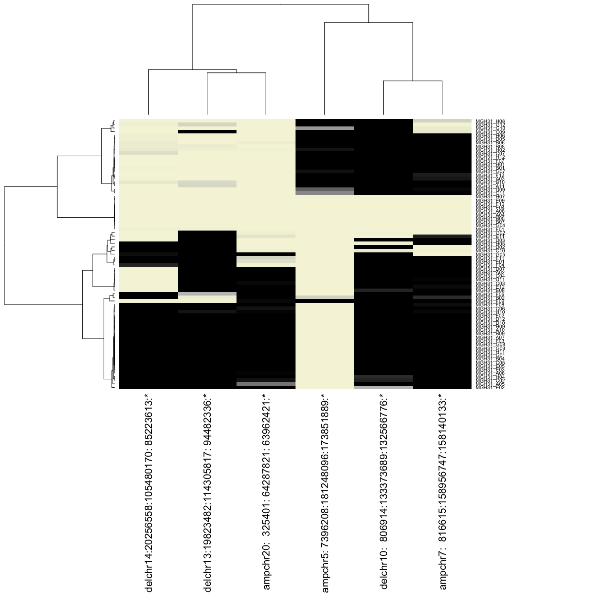
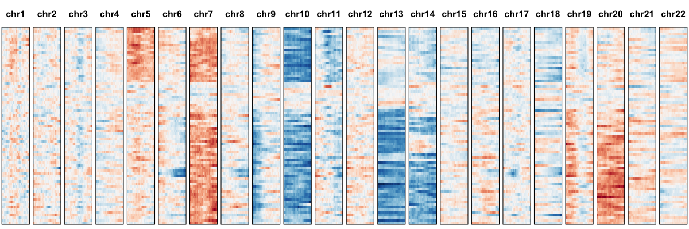
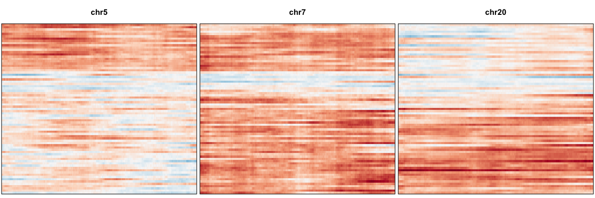
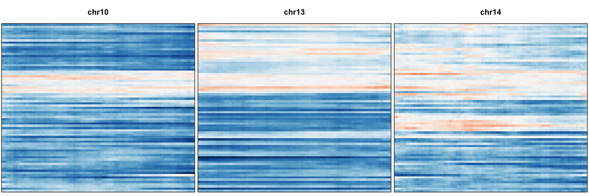
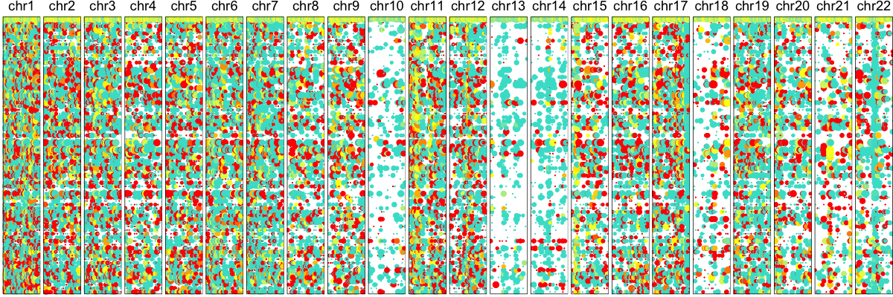
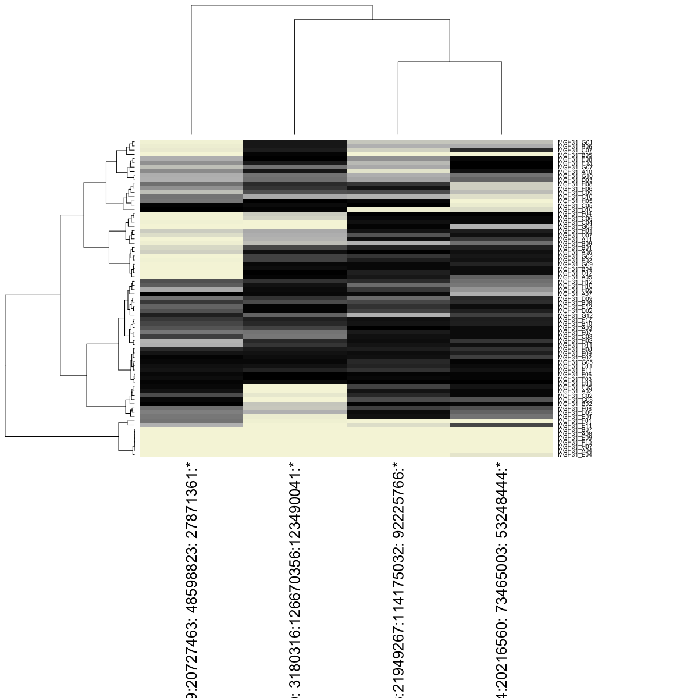
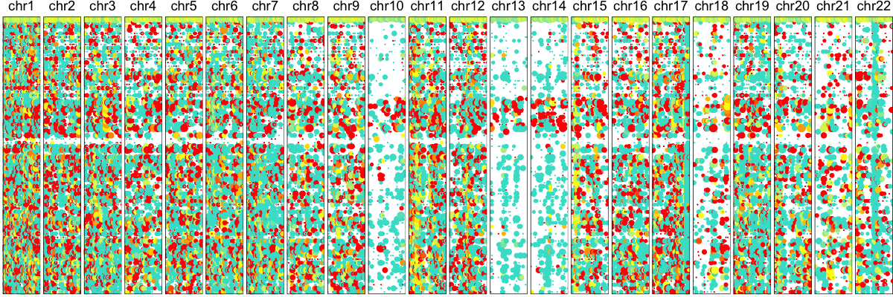
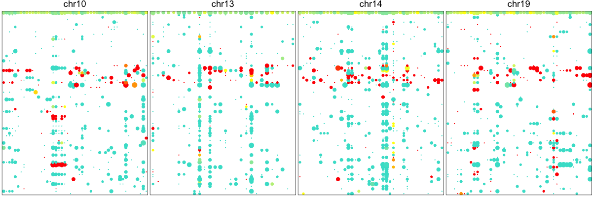
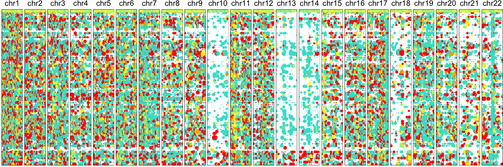
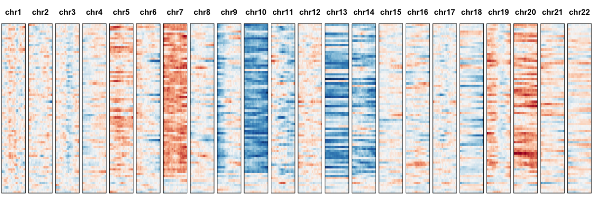

```r
library(HoneyBADGER)
```

`HoneyBADGER` identifies and quantitatively infers the presence of CNV and LOH events in single cells using allele and normalized expression information from single-cell RNA-seq data. In this tutorial, we will use `HoneyBADGER` to detect CNVs in glioblastoma tumor cells from patient MGH31 from [Patel et al](http://science.sciencemag.org/content/344/6190/1396). The single-cell RNA-seq data has been prepared for you and is included in the `HoneyBADGER` package. 

First, load the gene expression matrices for tumor cells along with a normal expression reference derived from averaging normal brain samples found in [GTex](https://www.gtexportal.org/home/). Also load a corresponding biomaRt instance (for human) to obtain chromosomal coordinate information for our genes. 


```r
data(gexp) ## tumor cells
data(ref) ## reference

require(biomaRt) ## for gene coordinates
#mart.obj <- useMart(biomart = "ENSEMBL_MART_ENSEMBL", dataset = 'hsapiens_gene_ensembl', host = "jul2015.archive.ensembl.org") ## version used in manuscript
mart.obj <- useMart(biomart = "ENSEMBL_MART_ENSEMBL", dataset = 'hsapiens_gene_ensembl') ## current version 20210603- default version hg38

mart.obj <- useMart(biomart="ENSEMBL_MART_ENSEMBL", host="grch37.ensembl.org", dataset="hsapiens_gene_ensembl") # specify the version hg19

print(gexp[1:5,1:5])
```

```
##       MGH31_A02  MGH31_A03 MGH31_A04  MGH31_A05  MGH31_A06
## AAAS   3.897660 -4.5248935 -4.183228  2.7093435  3.5550152
## AADAT  2.166325  1.5769039  3.300534  2.1134482  0.8006273
## AAGAB -4.193448  0.4587702 -4.232739 -2.6151893 -2.4645792
## AAK1   2.360924  2.6094029  2.830466  2.1001597  2.1811283
## AAMP   3.484948  2.2440590  3.007798  0.4639664  1.8083660
```

```r
print(ref[1:5])
```

```
##       AAAS      AADAT      AAGAB       AAK1       AAMP 
##  0.2962768  2.3082946 -1.1061789  2.6374479  1.9192140
```

```r
print(mart.obj)
```

```
## Object of class 'Mart':
##  Using the ENSEMBL_MART_ENSEMBL BioMart database
##  Using the hsapiens_gene_ensembl dataset
```

Make a new `HoneyBADGER` object and initialize the gene expression matrices. The data has already been filtered for highly expressed shared genes and scaled for library size differences so we can override the default filtering and scaling. 


```r
hb <- new('HoneyBADGER', name='MGH31')
hb$setGexpMats(gexp, ref, mart.obj, filter=FALSE, scale=FALSE, verbose=TRUE)
```

```
## Initializing expression matrices ... 
## Normalizing gene expression for 6082 genes and 75 cells ... 
## Done setting initial expression matrices!
```

The inputted gene expression matrix is normalized using the reference such that we may expect large-scale deviations in expression from the reference on average to be indicative of underlying CNVs. We can visualize the smoothed gene expression using the following profile. 


```r
hb$plotGexpProfile() ## initial visualization
```


Here, each row is a single cell. Genes are organized based on their position along each chromosome. Expression has been smoothed using a sliding window approach. Red indicates higher average expression compared to the reference and blue indicates lower. Visually, such expression-based karyotyping already suggests some chromosomal abnormalities. To provide a more quantitative assessment, we can model the gene expression variance and use an iterative HMM approach to identify regions affected by CNVs.


```r
hb$setMvFit(verbose=TRUE) ## model variance
```

```
## Modeling expected variance ... Done!
```

```r
hb$setGexpDev(verbose=TRUE) ## model necessary expression deviation to identify CNVs
```

```
## Optimal deviance: 1.015658
```

```r
hb$calcGexpCnvBoundaries(init=TRUE, verbose=FALSE) ## HMM
```

```
Loading required package: rjags
Loading required package: coda
Linked to JAGS 4.3.0
Loaded modules: basemod,bugs
```

```r
## double check what CNVs were identified
bgf <- hb$bound.genes.final
genes <- hb$genes
regions.genes <- range(genes[unlist(bgf)])
print(regions.genes)
```

```
## GRanges object with 9 ranges and 0 metadata columns:
##       seqnames                ranges strand
##          <Rle>             <IRanges>  <Rle>
##   [1]    chr20 [  325401,  64287821]      *
##   [2]     chr6 [  485133,  17706834]      *
##   [3]     chr7 [  816615, 158956747]      *
##   [4]    chr14 [20256558, 105480170]      *
##   [5]    chr10 [  806914, 133373689]      *
##   [6]     chr5 [ 7396208, 181248096]      *
##   [7]    chr19 [57630395,  58555124]      *
##   [8]    chr13 [19823482, 114305817]      *
##   [9]    chr21 [ 6444869,  15065000]      *
##   -------
##   seqinfo: 78 sequences from an unspecified genome; no seqlengths
```

Indeed, our initial HMM has identified a number of candidate CNVs to test. We can now retest all identified CNVs on all cells to derive the final posterior probability of each CNV in each cell. We can cluster cells on these posterior probabilities and visualize them as a heatmap. 


```r
hb$retestIdentifiedCnvs(retestBoundGenes = TRUE, retestBoundSnps = FALSE, verbose=FALSE)

## look at final results
results <- hb$summarizeResults(geneBased=TRUE, alleleBased=FALSE)
print(head(results[,1:5]))
```

```
##   seqnames    start       end     width strand
## 1    chr20   325401  64287821  63962421      *
## 2     chr6   485133  17706834  17221702      *
## 3     chr7   816615 158956747 158140133      *
## 4    chr14 20256558 105480170  85223613      *
## 5    chr10   806914 133373689 132566776      *
## 6     chr5  7396208 181248096 173851889      *
```

```r
## visualize as heatmap 
trees <- hb$visualizeResults(geneBased=TRUE, alleleBased=FALSE, details=TRUE, margins=c(25,15))
```



We can again visualize our results, this time, ordering the cells based on their posterior probabilities of harboring CNVs. 


```r
## order cells
hc <- trees$hc
order <- hc$labels[hc$order]
## plot all chromosomes
hb$plotGexpProfile(cellOrder=order)
```



```r
## plot just identified cnvs
hb$plotGexpProfile(cellOrder=order, region=hb$cnvs[['gene-based']][['amp']])
```



```r
hb$plotGexpProfile(cellOrder=order, region=hb$cnvs[['gene-based']][['del']])
```



We thus confidently identify amplifications on Chr 5, 7, 20 and deletions on Chr 10, 13, and 14 affecting a subset of cells. 

We can also identify CNVs using allele information. The allele model relies on persistent allelic imbalance detected from putative heterozygous variants to identify CNVs. Therefore, allele data for common heterozygous variants from ExAC for the same set of cells has also been prepared for you. Add them to your existing `HoneyBADGER` object. 


```r
data(r) ## alternate allele
data(cov.sc) ## total coverage

library(TxDb.Hsapiens.UCSC.hg19.knownGene) ## in order to map SNPs to genes
txdb <- TxDb.Hsapiens.UCSC.hg19.knownGene
```

The allele matrices have already been filtered for sites with coverage in any cell and where both annotated alleles are observed. We will filter these SNPs further to guard against potential RNA-editing or sequencing errors before mapping them to genes. 


```r
#hb <- new('HoneyBADGER', name='MGH31')
## Add to existing hb object
hb$setAlleleMats(r.init=r, n.sc.init=cov.sc, het.deviance.threshold=0.1, n.cores=detectCores())
```

```
## Initializing allele matrices ... 
## Creating in-silico bulk ... 
## using 75 cells ... 
## Filtering for putative heterozygous snps ... 
## allowing for a 0.1 deviation from the expected 0.5 heterozygous allele fraction ... 
## must have coverage in at least 3 cells ... 
## 5359 heterozygous SNPs identified 
## Setting composite lesser allele count ... 
## Done setting initial allele matrices!
```

```r
hb$setGeneFactors(txdb) ## map SNPs to genes
```

```
## Mapping snps to genes ... 
## >> preparing features information...		 2018-01-06 12:50:05 
## >> identifying nearest features...		 2018-01-06 12:50:05 
## >> calculating distance from peak to TSS...	 2018-01-06 12:50:05 
## >> assigning genomic annotation...		 2018-01-06 12:50:05 
## >> assigning chromosome lengths			 2018-01-06 12:50:07 
## >> done...					 2018-01-06 12:50:07 
## Done mapping snps to genes!
```

We can visualize the allelic patterns using the following lesser allele fraction profile. 


```r
hb$plotAlleleProfile() ## visualize individual SNPs
```



```r
#hb$plotSmoothedAlleleProfile() ## smoothed option for high density data
```

Here, each row is again a single cell. Each column is a SNP. Dot size illustrates coverage at the SNP site and color denotes the allele bias with yellow meaning equal observation of both alleles. Blue is mono-allelic detection of either the lesser allele, defined as the allele that is less frequently observed across our population of cells. And red being the other allele. In the presence of a deletion, we expect to see persistent depletion of this lesser allele across our population of cells harboring the deletion. Indeed, we again can already visually suspect some chromosomal abnormalities on Chr 10, 13, and 14. To provide a more quantitative assessment, we can again use an HMM approach to identify regions affected by these deletions and LOHs. 


```r
hb$calcAlleleCnvBoundaries(init=TRUE, verbose=FALSE) ## HMM
```

```
## Recursion for Group1Recursion for Group1Recursion for Group1Recursion for Group2Recursion for Group2Recursion for Group2
```

```
## NULL
```

```r
## double check what CNVs were identified
bsf <- get('bound.snps.final', slot(hb, '.xData'))
snps <- get('snps', slot(hb, '.xData'))
regions.snp <- range(snps[unlist(bsf)])
print(regions.snp)
```

```
## GRanges object with 4 ranges and 0 metadata columns:
##       seqnames                ranges strand
##          <Rle>             <IRanges>  <Rle>
##   [1]    chr10 [ 3180316, 126670356]      *
##   [2]    chr13 [21949267, 114175032]      *
##   [3]    chr14 [20216560,  73465003]      *
##   [4]    chr19 [20727463,  48598823]      *
##   -------
##   seqinfo: 22 sequences from an unspecified genome; no seqlengths
```

Indeed, our initial HMM has identified a number of candidate CNVs to test. We can now retest all identified CNVs on all cells to derive the final posterior probability of each CNV in each cell.


```r
hb$retestIdentifiedCnvs(retestBoundGenes=FALSE, retestBoundSnps=TRUE, verbose=FALSE)

## look at final results
results <- hb$summarizeResults(geneBased=FALSE, alleleBased=TRUE)
print(head(results[,1:5]))
```

```
##                                              seqnames    start       end
## del.loh.chr10: 3180316:126670356:123490041:*    chr10  3180316 126670356
## del.loh.chr13:21949267:114175032: 92225766:*    chr13 21949267 114175032
## del.loh.chr14:20216560: 73465003: 53248444:*    chr14 20216560  73465003
## del.loh.chr19:20727463: 48598823: 27871361:*    chr19 20727463  48598823
##                                                  width strand
## del.loh.chr10: 3180316:126670356:123490041:* 123490041      *
## del.loh.chr13:21949267:114175032: 92225766:*  92225766      *
## del.loh.chr14:20216560: 73465003: 53248444:*  53248444      *
## del.loh.chr19:20727463: 48598823: 27871361:*  27871361      *
```

```r
## visualize as heatmap 
trees2 <- hb$visualizeResults(geneBased=FALSE, alleleBased=TRUE, details=TRUE, margins=c(25,15))
```



We can again visualize our results, this time, ordering the cells based on our previously identified cell ordering for comparison. 


```r
## order cells
hc2 <- trees2$hc
order2 <- hc2$labels[hc2$order]

## plot all chromosomes
hb$plotAlleleProfile(cellOrder=order) ## order cells by same order as previously
```



```r
## plot just identified cnvs
hb$plotAlleleProfile(cellOrder=order, region=hb$cnvs[['allele-based']][['del.loh']])
```



```r
## compare to new order
hb$plotAlleleProfile(cellOrder=order2) 
```



```r
hb$plotGexpProfile(cellOrder=order2) 
```



Thus, we confirm the deletion on Chr 10, 13, and 14 in agreement with our expression-based approach. While an allele-based approach is not able to identify amplifications like an expression-based approach, we are generally able to have improved resolution for identifying smaller deletions such as the one on Chr 19. 

Leveraging both allele and expression information can improve power and allow us to identify potential copy-neutral LOHs. We can test regions identified by either the expression or allele-based HMMs using both expression and allele information and repeat downstream visualizations as desired.


```r
hb$retestIdentifiedCnvs(retestBoundGenes=TRUE, retestBoundSnps=TRUE, verbose=FALSE)
results <- hb$summarizeResults(geneBased=TRUE, alleleBased=TRUE)
```

---

# Additional Tutorials
- [Preparing data](Preparing_Data.md)
- [Integrating with other analyses](Integrating.md)
- [Interactive visualization](https://jef.works/blog/2018/04/15/interactive-honeybadger-laf-profiles/)

