To accomodate user/developer preferences, `HoneyBADGER` can be used with or without the `HoneyBADGER` object. In this tutorial, we will go through an analysis without the `HoneyBADGER` object, which lends itself to potentially easier downstream integration with other analysis pipelines.

In this tutorial, we will use `HoneyBADGER` to detect CNVs in glioblastoma cells from patient MGH31 from [Patel et al](http://science.sciencemag.org/content/344/6190/1396). We will then characterize the transcriptional differences between detected genetic subclones using differential expression and gene set enrichment analyses as examples of potential integrative analyses enabled by `HoneyBADGER`.

``` r
library(HoneyBADGER)
```

First, we will identify CNVs using allele information. The allele model relies on persistent allelic imbalance detected from putative heterozygous variants to identify CNVs. Therefore, allele data for common heterozygous variants from ExAC for the same set of cells has also been prepared for you.

``` r
data(r) ## alternate allele
data(cov.sc) ## total coverage
```

``` r
## set the allele matrices
allele.mats <- setAlleleMats(r, cov.sc)
```

    ## Initializing allele matrices ... 
    ## Creating in-silico bulk ... 
    ## using 75 cells ... 
    ## Filtering for putative heterozygous snps ... 
    ## allowing for a 0.05 deviation from the expected 0.5 heterozygous allele fraction ... 
    ## must have coverage in at least 3 cells ... 
    ## 5552 heterozygous SNPs identified 
    ## Setting composite lesser allele count ... 
    ## Done setting initial allele matrices!

``` r
## map snps to genes
library(TxDb.Hsapiens.UCSC.hg19.knownGene)
geneFactor <- setGeneFactors(allele.mats$snps, 
                             TxDb.Hsapiens.UCSC.hg19.knownGene)
```

    ## Mapping snps to genes ... 
    ## >> preparing features information...      2018-03-19 09:39:30 
    ## >> identifying nearest features...        2018-03-19 09:39:31 
    ## >> calculating distance from peak to TSS...   2018-03-19 09:39:31 
    ## >> assigning genomic annotation...        2018-03-19 09:39:31 
    ## >> assigning chromosome lengths           2018-03-19 09:39:51 
    ## >> done...                    2018-03-19 09:39:51 
    ## Done mapping snps to genes!

Let's visually inspect for patterns of allelic imbalance using a lesser-allele-frequency (LAF) profile.

``` r
## set widths to known chromosome sizes from UCSC
plotAlleleProfile(allele.mats$r.maf, 
                  allele.mats$n.sc, 
                  allele.mats$l.maf, 
                  allele.mats$n.bulk, 
                  allele.mats$snps, 
                  widths=c(249250621, 243199373, 198022430, 191154276, 
                           180915260, 171115067, 159138663, 146364022, 
                           141213431, 135534747, 135006516, 133851895, 
                           115169878, 107349540, 102531392, 90354753, 
                           81195210, 78077248, 59128983, 63025520, 
                           51304566, 48129895)/1e7) 
```

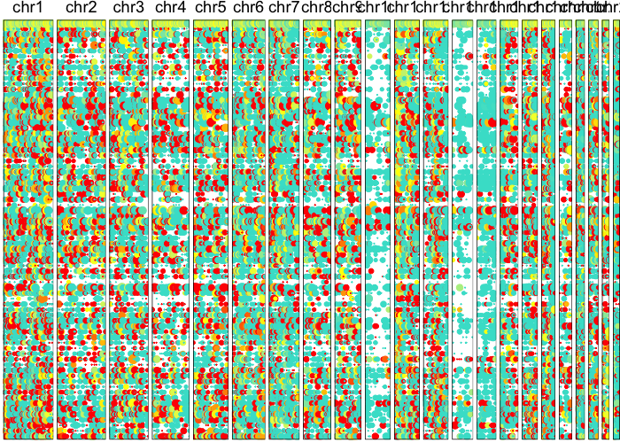

Now let's use an HMM to identify potential CNV regions.

``` r
potentialCnvs <- calcAlleleCnvBoundaries(allele.mats$r.maf, 
                                         allele.mats$n.sc, 
                                         allele.mats$l.maf, 
                                         allele.mats$n.bulk, 
                                         allele.mats$snps, 
                                         geneFactor)
## visualize affected regions, set width to correspond to number of snps in affected region
plotAlleleProfile(allele.mats$r.maf, 
                  allele.mats$n.sc, 
                  allele.mats$l.maf, 
                  allele.mats$n.bulk, 
                  allele.mats$snps, 
                  region=potentialCnvs$region)
```

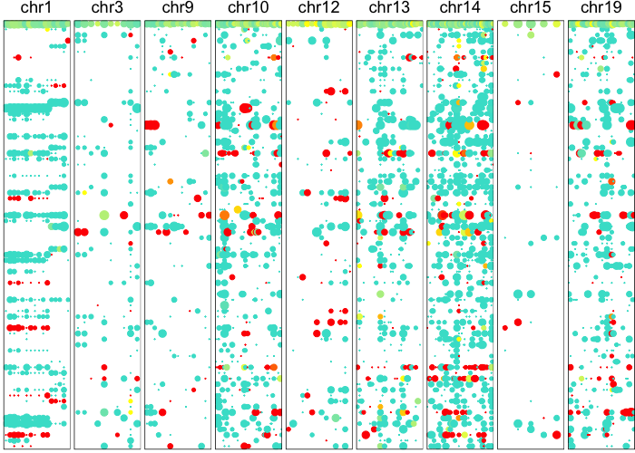

Having identified potential CNV boundaries, we can then apply our Bayesian hierarchical model to more robustly derive the posterior probability of an individual cell harboring each of these CNVs.

``` r
results <- do.call(rbind, lapply(potentialCnvs$region, function(region) {
  calcAlleleCnvProb(allele.mats$r.maf, 
                    allele.mats$n.sc, 
                    allele.mats$l.maf, 
                    allele.mats$n.bulk, 
                    allele.mats$snps, 
                    geneFactor, 
                    region=region, 
                    verbose=FALSE)
}))
```

Based on these posterior probabilities, we can split cells into putative normal and tumor cells and revisualize their LAF profiles.

``` r
## filter out CNVs with low posteriors
vi <- rowSums(results>0.9) > 0.1*ncol(results)
results.filtered <- results[vi,]
regions.filtered <- potentialCnvs$region[vi]

## cluster cells on posterior probability
hc <- hclust(dist(t(results.filtered)), method='ward.D')
## visualize as heatmap
heatmap(t(results.filtered), 
        Rowv=as.dendrogram(hc), 
        scale="none", 
        col=colorRampPalette(c('beige', 'grey', 'black'))(100))
```

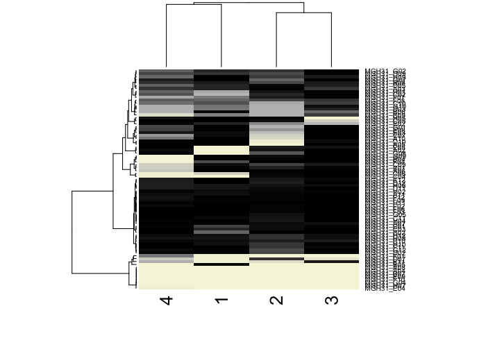

``` r
## visualize all chromosomes using derived cell ordering
plotAlleleProfile(allele.mats$r.maf, 
                  allele.mats$n.sc, 
                  allele.mats$l.maf, 
                  allele.mats$n.bulk, 
                  allele.mats$snps, 
                  cellOrder = hc$labels[hc$order])
```

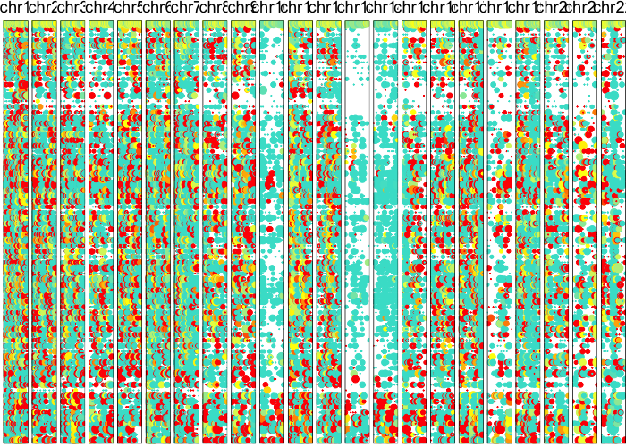

``` r
## visualize just detected CNVs
plotAlleleProfile(allele.mats$r.maf, 
                  allele.mats$n.sc, 
                  allele.mats$l.maf, 
                  allele.mats$n.bulk, 
                  allele.mats$snps, 
                  cellOrder = hc$labels[hc$order], 
                  region=regions.filtered) 
```

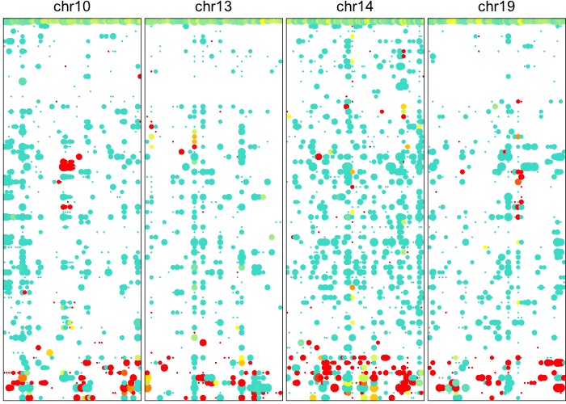

Based on these posterior probabilities of harboring CNVs, let's identify the putative normal cells as those without any of the identified CNVs.

``` r
cell.annot <- factor(cutree(hc, 2), labels=c("tumor", "normal"))
print(table(cell.annot))
```

    ## cell.annot
    ##  tumor normal 
    ##     63     12

Let's see how these tumor vs. normal annotations compare to when we cluster the data based on single-cell RNA-seq. The single-cell RNA-seq data has been prepared for you and is included in the `HoneyBADGER` package. First, load the gene expression matrices for the same set of cells.

``` r
data(gexp)
gexp <- gexp[, names(cell.annot)] ## restrict to same set of cells
```

We will perform dimensionality reduction and use tSNE to generate a 2D embedding.

``` r
## 30 PCs 
pcs <- prcomp(t(gexp))$x[,1:30] 
d <- dist(pcs, method='man')
## get tSNE embedding on PCs
emb <- Rtsne::Rtsne(d, 
                    is_distance=TRUE, 
                    perplexity=10, 
                    num_threads=parallel::detectCores(), 
                    verbose=FALSE)$Y 
rownames(emb) <- rownames(pcs)
## plot
library(MUDAN)
plotEmbedding(emb, groups=cell.annot, xlab='tSNE 1', ylab='tSNE 2')
```

    ## using provided groups as a factor

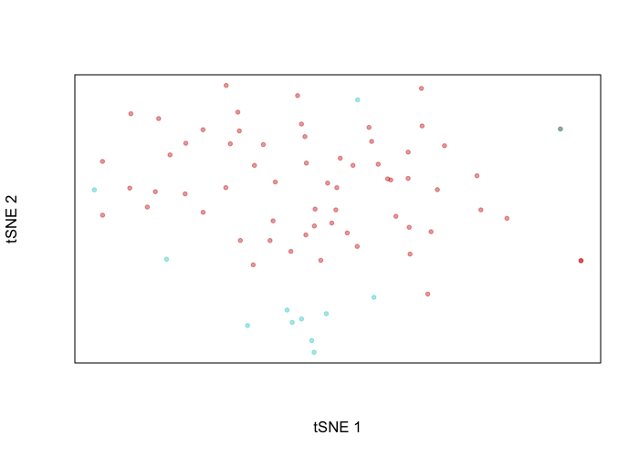

Indeed, the putative normal cells and tumor cells separate transcriptionally. We can perform differential expression analysis to see just what genes these cells differentially up and downregulate. We will leave as an exercise to the user to map these differentially expressed genes to their genomic coordinates and then assess whether these coordinates are within regions affected by identified CNVs.

``` r
## differential expression analysis by simple t-test
pv <- do.call(rbind, lapply(rownames(gexp), function(g) {
  tr <- t.test(gexp[g, cell.annot=='normal'], 
         gexp[g, cell.annot=='tumor'])
  return(c(p.value=tr$p.value, statistic=tr$statistic, tr$estimate))
}))
rownames(pv) <- rownames(gexp)
pv[, 'p.value'] <- p.adjust(pv[, 'p.value'], method="bonferroni", nrow(pv))
pv <- pv[order(pv[, 'p.value'], decreasing=FALSE), ]
print(head(pv))
```

    ##               p.value statistic.t  mean of x  mean of y
    ## TMEM176B 1.068727e-07   -8.044675 -2.1968335  1.8034484
    ## ANXA1    2.250620e-07   -8.874184 -1.2059492  3.7978929
    ## PLA2G16  1.637954e-05    7.980368  2.1609048 -2.7637300
    ## PDLIM3   3.739657e-04   -6.041985 -2.0639091  0.9151227
    ## TMEM30A  1.009570e-03   -5.871675 -6.5209581 -3.8126369
    ## EGFR     2.205127e-03   -8.005374 -0.7012331  4.8940403

``` r
library(MUDAN)
## visualize a top gene upregulated in normal cells
par(mfrow=c(1,2))
g <- rownames(pv[pv[, 'statistic.t']>0,])[1]
gcol <- scale(gexp[g,])[,1]
plotEmbedding(emb, color=gcol, xlab='tSNE 1', ylab='tSNE 2', main=g)
```

    ## treating colors as a gradient with zlim: -1.536233 1.536233

``` r
## visualize a top gene upregulated in tumor cells
g <- rownames(pv[pv[, 'statistic.t']<0,])[1]
gcol <- scale(gexp[g,])[,1]
plotEmbedding(emb, color=gcol, xlab='tSNE 1', ylab='tSNE 2', main=g)
```

    ## treating colors as a gradient with zlim: -1.393311 1.393311

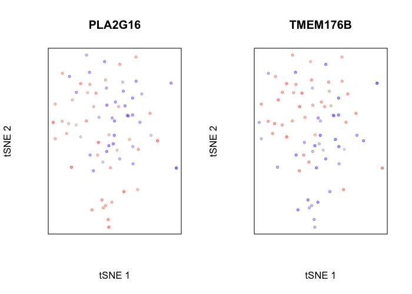

We can even perform gene set enrichment analysis to then characterize what pathways are impacted by these differentially up and downregulated genes. Of course, this analysis would be more interesting in the context of genetically distinct tumor subclones, but we will use our normal and tumor cells here for demonstrative purposes.

``` r
## perform gene set enrichment analysis
library(liger)
data(org.Hs.GO2Symbol.list) ## load built in GO gene sets
go.env <- org.Hs.GO2Symbol.list

## annotate GO terms with names
library(GO.db)
library(AnnotationDbi)
desc <- AnnotationDbi::select(
      GO.db,
      keys = names(go.env),
      columns = c("TERM"),
      multiVals = 'CharacterList'
)
names(go.env) <- paste(names(go.env), desc$TERM)

## use t-values from differential test as rank statistic
vals <- sort(pv[, 'statistic.t'])
gsea.results <- iterative.bulk.gsea(values=vals, set.list=go.env, rank=TRUE)
```

    ## initial: [1e+02 - 2185] [1e+03 - 451] [1e+04 - 180] done

``` r
gsea.sig.up <- gsea.results[gsea.results$q.val < 0.05 & gsea.results$sscore > 0 & gsea.results$edge > 0,]
gsea.sig.down <- gsea.results[gsea.results$q.val < 0.05 & gsea.results$sscore < 0 & gsea.results$edge < 0,]

## visualize top hits
print(rownames(gsea.sig.up)[1])
```

    ## [1] "GO:0002178 palmitoyltransferase complex"

``` r
gsea(values=vals, geneset=go.env[[rownames(gsea.sig.up)[1]]], plot=TRUE, rank=TRUE)
```

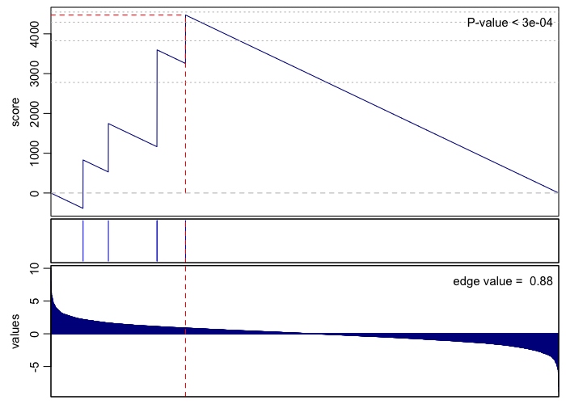

    ## [1] 3e-04

``` r
print(rownames(gsea.sig.down)[1])
```

    ## [1] "GO:0000184 nuclear-transcribed mRNA catabolic process, nonsense-mediated decay"

``` r
gsea(values=vals, geneset=go.env[[rownames(gsea.sig.down)[1]]], plot=TRUE, rank=TRUE)
```

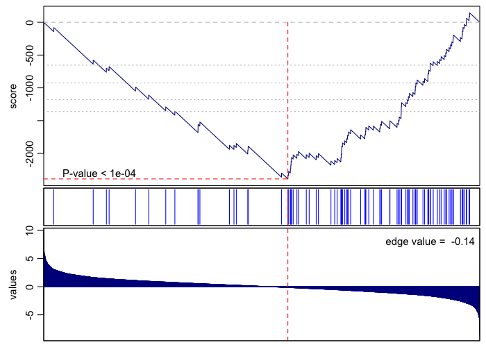

    ## [1] 1e-04

Alternatively, we can define transcriptional clusters and assess how well these transcriptional clusters overlap with our genetic subclones. In this case, of course, we get a near perfect correspondence with one of the identified clusters.

``` r
library(MUDAN)
com <- getComMembership(pcs, k=5, method=igraph::cluster_walktrap)
```

    ## [1] "finding approximate nearest neighbors ..."
    ## [1] "calculating clustering ..."
    ## [1] "graph modularity: 0.437421053647995"
    ## [1] "identifying cluster membership ..."
    ## com
    ##  1  2  3  4  5 
    ## 22 23  9 15  6

``` r
plotEmbedding(emb, groups=com, xlab='tSNE 1', ylab='tSNE 2', main='Louvain Community Detection')
```

    ## using provided groups as a factor

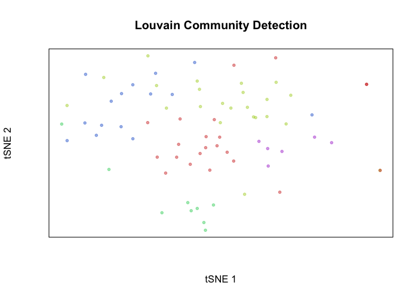

``` r
print(table(com, cell.annot))
```

    ##    cell.annot
    ## com tumor normal
    ##   1    20      2
    ##   2    22      1
    ##   3     0      9
    ##   4    15      0
    ##   5     6      0

Now that we've identified these putative normal cells, let's use them as an internal normal gene expression reference to identify more CNVs such as amplifications using our expression-based karyotyping.

``` r
require(biomaRt) ## for gene coordinates
mart.obj <- useMart(biomart = "ENSEMBL_MART_ENSEMBL", dataset = 'hsapiens_gene_ensembl', host = "jul2015.archive.ensembl.org")

gexp.normal <- gexp[, names(cell.annot)[which(cell.annot=='normal')]]
gexp.mats <- setGexpMats(gexp, gexp.normal, mart.obj, filter=FALSE, scale=FALSE)
```

    ## Initializing expression matrices ... 
    ## Normalizing gene expression for 6082 genes and 75 cells ... 
    ## Done setting initial expression matrices!

Let's visually inspect for patterns by plotting a sliding window normalized gene expression profile.

``` r
## set widths to known chromosome sizes from UCSC
## order cells by previous order derived from allele-based approach
gexp.plot <- plotGexpProfile(gexp.mats$gexp.norm, 
                             gexp.mats$genes, 
                             widths=c(249250621, 243199373, 198022430, 
                                      191154276, 180915260, 171115067,
                                      159138663, 146364022, 141213431, 
                                      135534747, 135006516, 133851895, 
                                      115169878, 107349540, 102531392, 
                                      90354753, 81195210, 78077248, 
                                      59128983, 63025520, 51304566, 
                                      48129895)/1e7, cellOrder=hc$labels[hc$order]) 
```

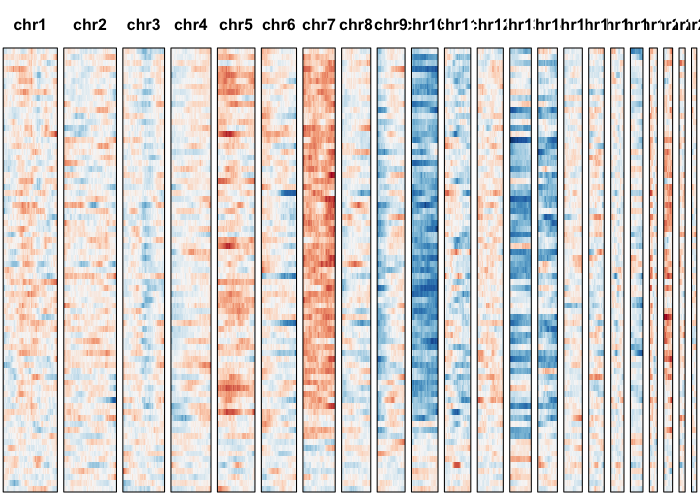

Let's use our expression-based HMM to identify potential CNVs.

``` r
dev <- setGexpDev(gexp.mats$gexp.norm) 
potentialCnvs.new <- calcGexpCnvBoundaries(gexp.mats$gexp.norm, gexp.mats$genes, m=dev)
```

Now, we have both CNVs identified by the allele and expression-based HMM. We can also test them all with a combined Bayesian hierarchical model that leverages both allele and expression information to enhance sensitivity and power.

``` r
amp.regions <- potentialCnvs.new$amp$regions

mvFit <- setMvFit(gexp.mats$gexp.norm)
```

    ## Modeling expected variance ... Done!

``` r
comb.amp.results <- do.call(rbind, lapply(amp.regions, function(region) {
  calcCombCnvProb(gexp.norm=gexp.mats$gexp.norm, 
                  genes=gexp.mats$genes, 
                  mvFit=mvFit,
                  m=dev, 
                  r.maf=allele.mats$r.maf, 
                  n.sc=allele.mats$n.sc, 
                  l.maf=allele.mats$l.maf, 
                  n.bulk=allele.mats$n.bulk, 
                  snps=allele.mats$snps, 
                  geneFactor=geneFactor, 
                  region=region,
                  verbose=FALSE)[[1]] # amplification prob
}))
```

    ## WARNING! ONLY 6 SNPS IN REGION!

``` r
## filter out CNVs with low posteriors
vi <- rowSums(comb.amp.results>0.9) > 0.1*ncol(comb.amp.results)
comb.amp.results.filtered <- comb.amp.results[vi,]
comb.amp.regions.filtered <- amp.regions[vi]

# combine with old regions
comb.results.filtered <- rbind(comb.amp.results.filtered, results.filtered)
## cluster cells on posterior probability
comb.hc <- hclust(dist(t(comb.results.filtered)), method='ward.D')
## visualize as heatmap
heatmap(t(comb.results.filtered), 
        Rowv=as.dendrogram(comb.hc), 
        scale="none", 
        col=colorRampPalette(c('beige', 'grey', 'black'))(100))
```

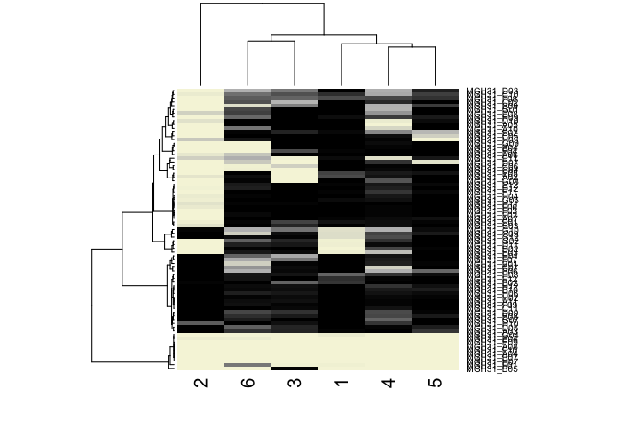

``` r
plotAlleleProfile(allele.mats$r.maf, 
                  allele.mats$n.sc, 
                  allele.mats$l.maf, 
                  allele.mats$n.bulk, 
                  allele.mats$snps, 
                  cellOrder = comb.hc$labels[comb.hc$order])
```

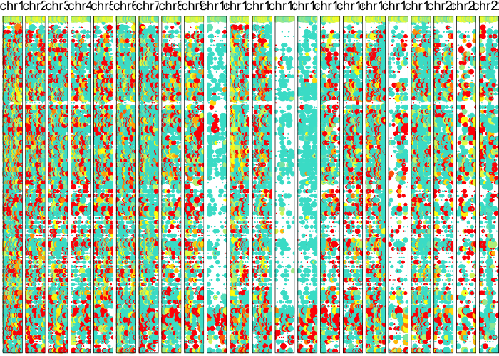

``` r
gexp.plot <- plotGexpProfile(gexp.mats$gexp.norm, 
                  gexp.mats$genes, 
                  cellOrder = comb.hc$labels[comb.hc$order])
```

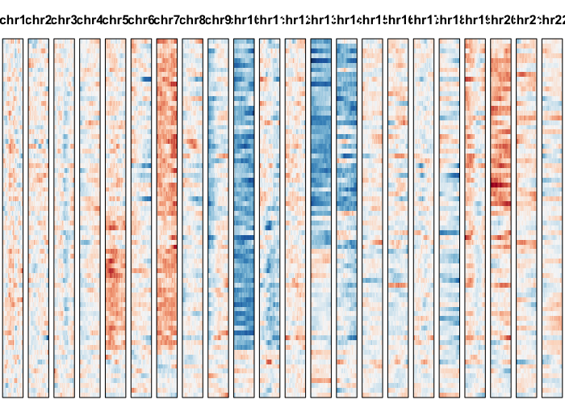

``` r
## visualize newly detected amplifications
plotAlleleProfile(allele.mats$r.maf, 
                  allele.mats$n.sc, 
                  allele.mats$l.maf, 
                  allele.mats$n.bulk, 
                  allele.mats$snps, 
                  cellOrder = comb.hc$labels[comb.hc$order], 
                  region=comb.amp.regions.filtered) 
```

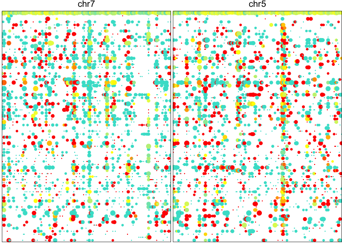

``` r
gexp.plot <- plotGexpProfile(gexp.mats$gexp.norm, 
                  gexp.mats$genes, 
                  cellOrder = comb.hc$labels[comb.hc$order], 
                  region=comb.amp.regions.filtered) 
```

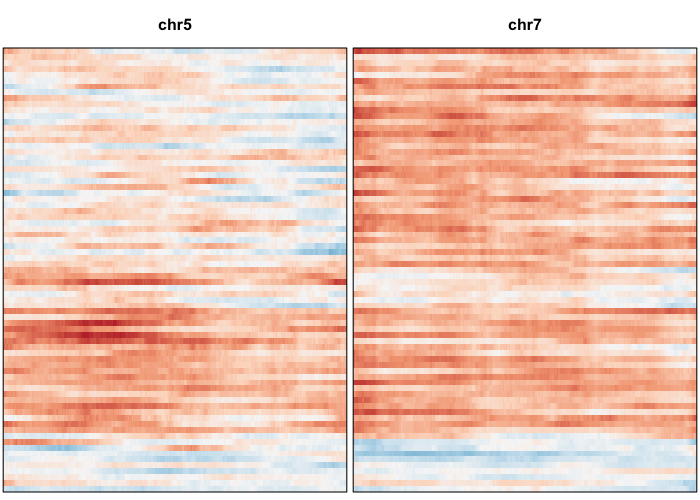

In conclusion, we have used `HoneyBADGER` to identify and quantitatively assess the presence of CNVs in glioblastoma cells from patient MGH31 from [Patel et al](http://science.sciencemag.org/content/344/6190/1396). Because `HoneyBADGER` infers CNVs from transcriptomic data, we are able to directly compare the transcriptional profiles of identified genetic subclones. Integrative analyses need not be limited to just the sample differential expression and gene set enrichment analyses presented here. Other interesting characterizations of [differential alternative splicing between genetic subclones](https://github.com/JEFworks/Supplementary-Code/tree/master/jcell201607025), [differences in transcriptional velocity and trajectories among subclones](http://velocyto.org/), and even [integration with other -omics datasets](https://github.com/JEFworks/Supplementary-Code/tree/master/snDropSeq_scTHSseq) may also be of interest.

---

# Additional tutorials
- [Preparing data](Preparing_Data.md)
- [Getting started](Getting_Started.md)
- [Interactive visualization](https://jef.works/blog/2018/04/15/interactive-honeybadger-laf-profiles/)

