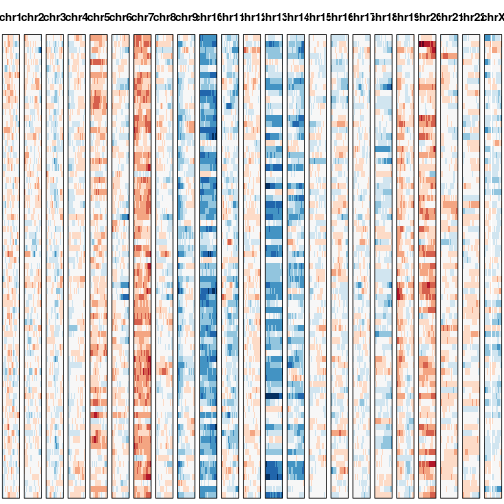

```r
library(HoneyBADGER)

data(gexp)
data(ref)

require(biomaRt) ## for gene coordinates
mart.obj <- useMart(biomart = "ENSEMBL_MART_ENSEMBL", dataset = 'hsapiens_gene_ensembl', host = "jul2015.archive.ensembl.org")
hb <- HoneyBADGER$new()
hb$setGexpMats(gexp, ref, mart.obj, filter=FALSE, scale=FALSE)
```

```
## Initializing expression matrices ... 
## normalizing gene expression for 6082 genes and 75 cells ... 
## Done setting initial expression matrices!
```

```r
hb$plotGexpProfile()
```



```r
hb$setMvFit()
```

```
## Modeling expected variance ... Done!
```

```r
hb$calcGexpCnvBoundaries(init=TRUE)
```

```
## max vote:4GENES AFFECTED BY CNV: ADCY2 MTRR SEMA5A FAM173B CCT5 CMBL MARCH6 CTNND2 TRIO ANKH FAM134B MYO10 BASP1 GUSBP1 CDH10 CDH6 DROSHA C5orf22 PDZD2 MTMR12 ZFR SUB1 TARS C1QTNF3 RAI14 RAD1 BRIX1 LMBRD2 SKP2 NIPBL C5orf42 NUP155 WDR70 LIFR OSMR RICTOR TTC33 PRKAA1 RPL37 PLCXD3 OXCT1 C5orf51 SEPP1 ZNF131 HMGCS1 PAIP1 NNT HCN1 PARP8 ITGA2 MOCS2 NDUFS4 DHX29 SKIV2L2 PPAP2A IL6ST MAP3K1 GPBP1 PDE4D ELOVL7 SMIM15 ZSWIM6 DIMT1 KIF2A IPO11 RNF180 SREK1IP1 CWC27 PPWD1 TRIM23 NLN ERBB2IP SREK1 MAST4 PIK3R1 SLC30A5 RAD17 OCLN NAIP MAP1B MRPS27 TNPO1 BTF3 ANKRA2 GFM2 NSA2 FAM169A HMGCR COL4A3BP POLK PDE8B WDR41 TBCA AP3B1 SCAMP1 ARSB JMY HOMER1 PAPD4 CMYA5 THBS4 ZFYVE16 MTRNR2L2 MSH3 RASGRF2 SSBP2 RPS23 TMEM167A VCAN COX7C RASA1 CCNH TMEM161B LINC00461 MEF2C CETN3 LYSMD3 ARRDC3 FAM172A TTC37 RHOBTB3 GLRX ELL2 PCSK1 CAST LNPEP LIX1 RIOK2 CHD1 PAM PPIP5K2 EFNA5 FER PJA2 MAN2A1 WDR36 STARD4 NREP APC REEP5 DCP2 MCC YTHDC2 TRIM36 FEM1C CDO1 ATG12 AP3S1 COMMD10 SEMA6A DMXL1 HSD17B4 SNCAIP SNX2 SNX24 CSNK1G3 ZNF608 GRAMD3 ALDH7A1 PHAX PRRC1 SLC12A2 HINT1 LYRM7 CDC42SE2 FNIP1 ACSL6 P4HA2 IRF1 RAD50 KIF3A UQCRQ AFF4 ZCCHC10 HSPA4 C5orf15 VDAC1 SKP1 UBE2B CDKN2AIPNL SAR1B SEC24A CAMLG DDX46 TXNDC15 H2AFY CXCL14 SMAD5 SPOCK1 KLHL3 FAM13B BRD8 CDC23 KDM3B EGR1 ETF1 HSPA9 CTNNA1 SIL1 MATR3 PAIP2 DNAJC18 PURA CYSTM1 PFDN1 SRA1 SLC35A4 IK HARS HARS2 ZMAT2 TAF7 PCDHGC3 DIAPH1 HDAC3 KIAA0141 RNF14 GNPDA1 NDFIP1 SPRY4 FGF1 ARHGAP26 NR3C1 YIPF5 LARS RBM27 TCERG1 PPP2R2B STK32A DPYSL3 JAKMIP2 FBXO38 SH3TC2 GRPEL2 CSNK1A1 SLC26A2 CAMK2A TCOF1 RPS14 NDST1 RBM22 DCTN4 GPX3 CCDC69 GM2A SLC36A1 ATOX1 G3BP1 GRIA1 FAM114A2 MFAP3 LARP1 CNOT8 GEMIN5 MRPL22 SGCD HAVCR2 CYFIP2 ADAM19 CLINT1 EBF1 RNF145 UBLCP1 TTC1 PWWP2A SLU7 ATP10B GABRB2 GABRG2 CCNG1 NUDCD2 MAT2B TENM2 WWC1 RARS SLIT3 KCNIP1 NPM1 STK10 DUSP1 ERGIC1 RPL26L1 ATP6V0E1 CREBRF CPEB4 SFXN1 KIAA1191 HIGD2A FAF2 UIMC1 ZNF346 NSD1 LMAN2 DBN1 DDX41 TMED9 FAM153C NHP2 CLK4 RUFY1 HNRNPH1 CANX SQSTM1 GFPT2 CNOT6 LINC00847 BTNL9 TRIM7 GNB2L1 EXOC2 SERPINB1 SERPINB9 SERPINB6 NQO2 RIPK1 BPHL TUBB2A TUBB2B PRPF4B ECI2 CDYL LYRM4 NRN1 RIOK1 SNRNP48 PAK1IP1 TMEM14C TMEM14B ELOVL2 NEDD9 TMEM170B SIRT5 RANBP9 CD83 ATXN1 CAP2 NUP153aggregating data to list ... 
## Initializing model ... 
## ...Done!AMPLIFICATION PROBABILITY: 0.81025 0.97125 0.54775 0.61225 0.89675 0.2905 0.4085 0.74675 0.98075 0.9925 0.9595 0.6825 0.15525 0.99775 0.1405 0.9935 0.88 0.97425 0.646 0.85575 0.766 0.611 0.66 0.9795 0.97775 0.8115 0.9345 0.68175 0.661 0.965 0.5875 0.9635 0.82975 0.761 0.5715 0.7265 0.205 0.655 0.60275 0.557 0.8945 0.325 0.83225 0.60925 0.657 0.7375 0.68675 0.35625 0.766 0.979 0.73775 0.962 0.1455 0.7595 0.98475 0.7755 0.775 0.42425 0.7705 0.9665 0.35575 0.7585 0.962 0.997 0.988 0.95675 0.7335 0.886 0.98525 0.58425 0.99825 0.48925 0.895 0.87775 0.9635DELETION PROBABILITY: 0 0 0 0 0 0 0 0 0 0 0 0 0 0 0 0 0 0 0 0 0 0 0 0 0 0 0 0 0 0 0 0 0 0 0 0 0 0 0 0 0 0 0 0 0 0 0 0 0 0 0 0 0 0 0 0 0 0 0 0 0 0 0 0 0 0 0 0 0 0 0 0 0 0 0GENES AFFECTED BY CNV: COX19 ZFAND2A PSMG3 FTSJ2 EIF3B GNA12 FOXK1 AP5Z1 MMD2 RNF216P1 FBXL18 RNF216 USP42 RAC1 KDELR2 ZDHHC4 C1GALT1 GLCCI1 ICA1 NDUFA4 PHF14 TMEM106B ARL4A ETV1 ANKMY2 BZW2 SNX13 HDAC9 TWISTNB SP4 RAPGEF5 TOMM7 FAM126A KLHL7 NUPL2 GPNMB TRA2A FAM221A DFNA5 OSBPL3 CYCS HNRNPA2B1 CBX3 HIBADH TAX1BP1 CREB5 CPVL WIPF3 SCRN1 FKBP14 GGCT GARS ADCYAP1R1 PDE1C LSM5 AVL9 KBTBD2 RP9P FKBP9 BBS9 BMPER DPY19L1 HERPUD2 SEPT7 ANLN ELMO1 STARD3NL VPS41 YAE1D1 RALA LINC00265 CDK13 MRPL32 STK17A COA1 BLVRA URGCP UBE2D4 POLR2J4 DBNL POLD2 NUDCD3 DDX56 TMED4 OGDH PPIA H2AFV PURB SNHG15 TBRG4 RAMP3 ADCY1 SEPT7P2 IGFBP3 HUS1 UPP1 FIGNL1 GRB10 SEC61G EGFR LANCL2 VOPP1 GBAS PSPH CCT6A SUMF2 CHCHD2 ZNF680 ZNF138 ZNF273 GUSB TPST1 LINC00174 KCTD7 TMEM248 SBDS TYW1 CALN1 SBDSP1 POM121 BAZ1B TBL2 WBSCR22 ABHD11 ELN EIF4H LAT2 HIP1 RHBDD2 POR TMEM120A STYXL1 MDH2 HSPB1 YWHAG FGL2 PTPN12 PHTF2 MAGI2 GNAI1 CACNA2D1 PCLO GRM3 KIAA1324L DMTF1 CROT SLC25A40 ADAM22 SRI STEAP2 CLDN12 CDK14 AKAP9 KRIT1 ANKIB1 GATAD1 PEX1 RBM48 CDK6 SAMD9L CCDC132 GNG11 BET1 COL1A2 CASD1 SGCE PEG10 PPP1R9A PON2 SLC25A13 SHFM1 ASNS LMTK2 TECPR1 TMEM130 TRRAP ARPC1A ARPC1B PDAP1 BUD31 CPSF4 ATP5J2 ZNF394 ZKSCAN5 FAM200A ZNF655 TRIM4 ZKSCAN1 ZNF3 COPS6 MCM7 TAF6 CNPY4 LAMTOR4 PILRB TSC22D4 AGFG2 GIGYF1 POP7 SRRT PLOD3 ZNHIT1 FIS1 CUX1 POLR2J ARMC10 NAPEPLD PMPCB DNAJC2 PSMC2 RELN ORC5 LHFPL3 SRPK2 PUS7 RINT1 ATXN7L1 CDHR3 SYPL1 NAMPT HBP1 COG5 BCAP29 CBLL1 DLD LAMB1 NRCAM PNPLA8 THAP5 DNAJB9 LRRN3 DOCK4 ZNF277 IFRD1 TMEM168 MDFIC CAV2 CAV1 CAPZA2 ST7 CTTNBP2 ING3 FAM3C AASS CADPS2 NDUFA5 WASL POT1 ARF5 SND1 RBM28 HILPDA METTL2B ATP6V1F TNPO3 AHCYL2 STRIP2 UBE2H ZC3HC1 KLHDC10 TMEM209 CEP41 MKLN1 PODXL PLXNA4 CHCHD3 EXOC4 SLC35B4 AKR1B1 BPGM CALD1 WDR91 CNOT4 NUP205 C7orf73 PTN CREB3L2 TRIM24 ZC3HAV1 UBN2 HIPK2 SLC37A3 MKRN1 DENND2A NDUFB2 BRAF MRPS33 AGK GSTK1 CASP2 ZYX CNTNAP2 CUL1 PDIA4 ZNF783 ATP6V0E2 TMEM176B CDK5 ABCF2 NUB1 RHEB PRKAG2 GALNT11 DPP6 NOM1 UBE3C DNAJB6 PTPRN2 NCAPG2 ESYT2 WDR60aggregating data to list ... 
## Initializing model ... 
## ...Done!AMPLIFICATION PROBABILITY: 0.986 0.95075 0.30475 0.999 0.99325 0.99325 0.2965 0.9845 0.98625 0.99025 0.95475 0.99325 0.23625 0.996 0.5565 0.989 0.988 0.98575 0.97775 0.99325 0.997 0.9945 0.99725 0.98325 0.92025 0.91125 0.985 0.6705 0.99725 0.98825 0.9755 0.968 0.98425 0.98125 0.97625 0.9705 0.989 0.99275 0.29425 0.993 0.9965 0.436 0.95475 0.96725 0.65825 0.984 0.99725 0.99275 0.9845 0.98025 0.96275 0.98825 0.14125 0.99675 0.951 0.9905 0.84 0.8025 0.88575 0.9895 0.99775 0.9955 0.91775 0.8905 0.98725 0.98975 0.97375 0.98075 0.982 0.42425 0.95525 0.985 0.975 0.99625 0.986DELETION PROBABILITY: 0 0 0 0 0 0 0 0 0 0 0 0 0 0 0 0 0 0 0 0 0 0 0 0 0 0 0 0 0 0 0 0 0 0 0 0 0 0 0 0 0 0 0 0 0 0 0 0 0 0 0 0 0 0 0 0 0 0 0 0 0 0 0 0 0 0 0 0 0 0 0 0 0 0 0max vote:5GENES AFFECTED BY CNV: CACNA1B DIP2C LARP4B GTPBP4 IDI1 ADARB2 PFKP PITRM1 KLF6 GDI2 FBXO18 RBM17 PFKFB3 SFMBT2 ITIH5 ATP5C1 CELF2 UPF2 DHTKD1 NUDT5 CDC123 CAMK1D OPTN PHYH NMT2 PTER RSU1 VIM CACNB2 MLLT10 PIP4K2A MSRB2 KIAA1217 ARHGAP21 PRTFDC1 THNSL1 ABI1 ANKRD26 YME1L1 ACBD5 RAB18 MPP7 WAC KIAA1462 MTPAP ZEB1 ARHGAP12 KIF5B ITGB1 NRP1 CUL2 CREM ZNF33A ZNF37A BMS1 HNRNPF C10orf10 RASSF4 ZNF22 TIMM23 NCOA4 SYT15 CISD1 TFAM PHYHIPL SLC16A9 ANK3 ARID5B ZNF365 NRBF2 JMJD1C LRRTM3 HERC4 HNRNPH3 RUFY2 CCAR1 DDX50 DDX21 HK1 TYSND1 SAR1A PPA1 SGPL1 UNC5B CDH23 PSAP CHST3 SPOCK2 ASCC1 ANAPC16 DDIT4 MICU1 MCU P4HA1 ECD MRPS16 USP54 SEC24C CAMK2G VCL AP3M1 ADK KAT6B SAMD8 VDAC2 ZNF503 KCNMA1 POLR3A RPS24 ZMIZ1 PPIF EIF5AL1 TMEM254 ANXA11 FAM213A TSPAN14 GHITM CCSER2 MMRN2 GLUD1 ATAD1 PTEN ACTA2 LIPA IFIT3 IFIT1 PANK1 RPP30 PCGF5 HECTD2 TNKS2 IDE MYOF FRA10AC1 PLCE1 SORBS1 ALDH18A1 TCTN3 ENTPD1 TM9SF3 LCOR PGAM1 MMS19 MORN4 GOLGA7B R3HCC1L CNNM1 COX15 DNMBP CWF19L1 BLOC1S2 SCD NDUFB8 HIF1AN FAM178A MRPL43 PDZD7 SFXN3 BTRC DPCD MGEA5 C10orf76 NOLC1 CUEDC2 TMEM180 ACTR1A ARL3 WBP1L NT5C2 USMG5 SLK GSTO1 XPNPEP1 ADD3 SMC3 PDCD4 SHOC2 ZDHHC6 TCF7L2 CASP7 ABLIM1 FAM160B1 EMX2 FAM204A CACUL1 NANOS1 EIF3A PRDX3 TIAL1 INPP5F SEC23IP WDR11 FGFR2 TACC2 PLEKHA1 ACADSB BUB3 OAT CTBP2 BCCIP DOCK1 PTPRE GLRX3 BNIP3 LRRC27 TUBGCP2 ECHS1 BET1L RIC8A SIRT3 PSMD13 IFITM2 IFITM3 TALDO1 PDDC1 SLC25A22 RPLP2 CD151 POLR2L CHID1 CTSD CD81aggregating data to list ... 
## Initializing model ... 
## ...Done!AMPLIFICATION PROBABILITY: 0 0 0 0 0 0 0 0 0 0 0 0 0 0 0 0 0 0 0 0 0 0 0 0 0 0 0 0 0 0 0 0 0 0 0 0 0 0 0 0 0 0 0 0 0 0 0 0 0 0 0 0 0 0 0 0 0 0 0 0 0 0 0 0 0 0 0 0 0 0 0 0 0 0 0DELETION PROBABILITY: 0.985 0.9945 0.48625 0.99 0.9875 0.97875 0.604 0.992 0.9775 0.99675 0.97925 0.99675 0.565 0.99425 0.22075 0.9805 0.993 0.992 0.9425 0.98775 0.99275 0.97825 0.999 0.9905 0.98475 0.8595 0.99625 0.98075 0.99325 0.988 0.98275 0.99625 0.99325 1 0.977 0.99475 0.89175 0.98375 0.27775 0.9995 0.954 0.67125 0.803 0.99575 0.36575 0.98875 0.99825 0.97375 0.95875 0.99425 0.99175 0.99625 0.1905 0.9855 0.99775 0.9995 0.84925 0.26075 0.99875 0.999 0.98575 0.9985 0.9855 0.98125 0.996 0.99725 0.93075 0.823 0.997 0.5725 0.996 0.9935 0.97175 0.99925 0.99575GENES AFFECTED BY CNV: CRYL1 IFT88 XPO4 SAP18 SACS SPATA13 PARP4 MTMR6 NUPL1 RNF6 WASF3 GPR12 MTIF3 PAN3 FLT1 POMP KATNAL1 USPL1 HSPH1 FRY N4BP2L2 NBEA DCLK1 SPG20 SMAD9 ALG5 EXOSC8 SUPT20H UFM1 NHLRC3 LHFP COG6 FOXO1 MRPS31 KBTBD6 NAA16 AKAP11 DNAJC15 TSC22D1 GTF2F2 TPT1 ZC3H13 ESD SUCLA2 NUDT15 MED4 ITM2B LPAR6 RCBTB2 FNDC3A SETDB2 PHF11 RCBTB1 KPNA3 SPRYD7 FAM124A CKAP2 HNRNPA1L2 SUGT1 PCDH17 PCDH9 DIS3 PIBF1 KLF12 COMMD6 MYCBP2 EDNRB RBM26 NDFIP2 SPRY2 SLITRK1 GPR180 CLDN10 DZIP1 DNAJC3 UGGT2 MBNL2 IPO5 UBAC2 TM9SF2 TPP2 ARGLU1 CARKD ANKRD10 ARHGEF7 ATP11A PCID2 DCUN1D2 TMCO3 UPF3A TTC5 CCNB1IP1 PARP2 TEP1 OSGEP APEX1 METTL17 NDRG2 LINC00641 HNRNPC SUPT16H CHD8 RAB2B TOX4 METTL3 DAD1 ABHD4 OXA1L MRPL52 RBM23 PRMT5 PSMB5 ACIN1 C14orf119 SLC7A8 NGDN AP1G2 DHRS4L2 DCAF11 PSME1 PSME2 CHMP4A GMPR2 TINF2 RABGGTA DHRS1 SDR39U1 NOVA1 FOXG1 PRKD1 G2E3 SCFD1 STRN3 AP4S1 HECTD1 HEATR5A DTD2 NUBPL ARHGAP5 AKAP6 NPAS3 EGLN3 SPTSSA EAPP SNX6 CFL2 BAZ1A SRP54 FAM177A1 PPP2R3C NFKBIA RALGAPA1 BRMS1L MBIP SEC23A TRAPPC6B PNN KLHL28 FAM179B PRPF39 FKBP3 RPS29 RPL36AL NEMF ARF6 MAP4K5 ATL1 NIN PYGL TRIM9 TMX1 C14orf166 TXNDC16 ERO1L PSMC6 STYX GNPNAT1 FERMT2 DDHD1 GMFB CGRRF1 SAMD4A SOCS4 MAPK1IP1L LGALS3 ATG14 KTN1 EXOC5 AP5M1 ACTR10 PSMA3 ARID4A KIAA0586 DAAM1 JKAMP PCNXL4 DHRS7 PPM1A MNAT1 TRMT5 SLC38A6 HIF1A RHOJ SYNE2 MTHFD1 HSPA2 SPTB MAX FUT8 GPHN MPP5 ATP6V1D EIF2S1 PLEKHH1 VTI1B RDH11 ZFP36L1 ACTN1 DCAF5 EXD2 ERH SLC39A9 SRSF5 COX16 MED6 MAP3K9 PCNX SIPA1L1 RGS6 DPF3 ZFYVE1 RBM25 PSEN1 PAPLN NUMB ELMSAN1 FAM161B ALDH6A1 LIN52 ABCD4 NPC2 ISCA2 FCF1 RPS6KL1 EIF2B2 MLH3 NEK9 TMED10 C14orf1 TTLL5 TGFB3 IFT43 GPATCH2L ANGEL1 VIPAS39 AHSA1 SPTLC2 SLIRP SNW1 NRXN3 DIO2 STON2 SEL1L GALC KCNK10 ZC3H14 TTC8 FOXN3 TDP1 PSMC1 CALM1 C14orf159 SMEK1 FBLN5 TRIP11 ATXN3 NDUFB1 CPSF2 LGMN GOLGA5 UNC79 SERPINA3 CLMN C14orf132 GSKIP PAPOLA SETD3 YY1 WARS WDR25 MEG3 PPP2R5C DYNC1H1 HSP90AA1 WDR20 MOK CINP TECPR2 TNFAIP2 EIF5 MARK3 CKB BAG5 APOPT1 KLC1 ZFYVE21 C14orf2aggregating data to list ... 
## Initializing model ... 
## ...Done!AMPLIFICATION PROBABILITY: 0 0 0 0 0 0 0 0 0 0 0 0 0 0 0 0 0 0 0 0 0 0 0 0 0 0 0 0 0 0 0 0 0 0 0 0 0 0 0 0 0 0 0 0 0 0 0 0 0 0 0 0 0 0 0 0 0 0 0 0 0 0 0 0 0 0 0 0 0 0 0 0 0 0 0DELETION PROBABILITY: 0.92475 0.6295 0.34025 0.9985 0.99975 0.999 0.4525 0.9965 0.8125 0.71675 0.974 0.9955 0.34675 0.86275 0.25375 0.91125 1 0.912 0.9865 0.4435 0.82775 0.9975 0.99775 0.80925 0.9025 0.991 0.71075 0.993 0.88 0.8275 0.82725 0.6875 0.9965 0.58475 0.98875 0.991 0.9885 0.99625 0.571 0.9995 0.8885 0.172 0.94275 0.7965 0.8345 0.999 0.99875 0.99075 0.9955 0.4625 0.9995 0.461 0.40275 0.99925 0.73575 0.99 0.525 0.1965 0.98575 0.65375 0.99925 0.99875 0.6545 0.9225 0.642 0.881 0.99125 0.99725 0.85725 0.3375 0.41675 0.99725 0.9925 0.99775 0.7815[1] "CNV SNPS:"
##   [1] "CACNA1B"  "DIP2C"    "LARP4B"   "GTPBP4"   "IDI1"     "ADARB2"  
##   [7] "PFKP"     "PITRM1"   "KLF6"     "GDI2"     "FBXO18"   "RBM17"   
##  [13] "PFKFB3"   "SFMBT2"   "ITIH5"    "ATP5C1"   "CELF2"    "UPF2"    
##  [19] "DHTKD1"   "NUDT5"    "CDC123"   "CAMK1D"   "OPTN"     "PHYH"    
##  [25] "NMT2"     "PTER"     "RSU1"     "VIM"      "CACNB2"   "MLLT10"  
##  [31] "PIP4K2A"  "MSRB2"    "KIAA1217" "ARHGAP21" "PRTFDC1"  "THNSL1"  
##  [37] "ABI1"     "ANKRD26"  "YME1L1"   "ACBD5"    "RAB18"    "MPP7"    
##  [43] "WAC"      "KIAA1462" "MTPAP"    "ZEB1"     "ARHGAP12" "KIF5B"   
##  [49] "ITGB1"    "NRP1"     "CUL2"     "CREM"     "ZNF33A"   "ZNF37A"  
##  [55] "BMS1"     "HNRNPF"   "C10orf10" "RASSF4"   "ZNF22"    "TIMM23"  
##  [61] "NCOA4"    "SYT15"    "CISD1"    "TFAM"     "PHYHIPL"  "SLC16A9" 
##  [67] "ANK3"     "ARID5B"   "ZNF365"   "NRBF2"    "JMJD1C"   "LRRTM3"  
##  [73] "HERC4"    "HNRNPH3"  "RUFY2"    "CCAR1"    "DDX50"    "DDX21"   
##  [79] "HK1"      "TYSND1"   "SAR1A"    "PPA1"     "SGPL1"    "UNC5B"   
##  [85] "CDH23"    "PSAP"     "CHST3"    "SPOCK2"   "ASCC1"    "ANAPC16" 
##  [91] "DDIT4"    "MICU1"    "MCU"      "P4HA1"    "ECD"      "MRPS16"  
##  [97] "USP54"    "SEC24C"   "CAMK2G"   "VCL"      "AP3M1"    "ADK"     
## [103] "KAT6B"    "SAMD8"    "VDAC2"    "ZNF503"   "KCNMA1"   "POLR3A"  
## [109] "RPS24"    "ZMIZ1"    "PPIF"     "EIF5AL1"  "TMEM254"  "ANXA11"  
## [115] "FAM213A"  "TSPAN14"  "GHITM"    "CCSER2"   "MMRN2"    "GLUD1"   
## [121] "ATAD1"    "PTEN"     "ACTA2"    "LIPA"     "IFIT3"    "IFIT1"   
## [127] "PANK1"    "RPP30"    "PCGF5"    "HECTD2"   "TNKS2"    "IDE"     
## [133] "MYOF"     "FRA10AC1" "PLCE1"    "SORBS1"   "ALDH18A1" "TCTN3"   
## [139] "ENTPD1"   "TM9SF3"   "LCOR"     "PGAM1"    "MMS19"    "MORN4"   
## [145] "GOLGA7B"  "R3HCC1L"  "CNNM1"    "COX15"    "DNMBP"    "CWF19L1" 
## [151] "BLOC1S2"  "SCD"      "NDUFB8"   "HIF1AN"   "FAM178A"  "MRPL43"  
## [157] "PDZD7"    "SFXN3"    "BTRC"     "DPCD"     "MGEA5"    "C10orf76"
## [163] "NOLC1"    "CUEDC2"   "TMEM180"  "ACTR1A"   "ARL3"     "WBP1L"   
## [169] "NT5C2"    "USMG5"    "SLK"      "GSTO1"    "XPNPEP1"  "ADD3"    
## [175] "SMC3"     "PDCD4"    "SHOC2"    "ZDHHC6"   "TCF7L2"   "CASP7"   
## [181] "ABLIM1"   "FAM160B1" "EMX2"     "FAM204A"  "CACUL1"   "NANOS1"  
## [187] "EIF3A"    "PRDX3"    "TIAL1"    "INPP5F"   "SEC23IP"  "WDR11"   
## [193] "FGFR2"    "TACC2"    "PLEKHA1"  "ACADSB"   "BUB3"     "OAT"     
## [199] "CTBP2"    "BCCIP"    "DOCK1"    "PTPRE"    "GLRX3"    "BNIP3"   
## [205] "LRRC27"   "TUBGCP2"  "ECHS1"    "BET1L"    "RIC8A"    "SIRT3"   
## [211] "PSMD13"   "IFITM2"   "IFITM3"   "TALDO1"   "PDDC1"    "SLC25A22"
## [217] "RPLP2"    "CD151"    "POLR2L"   "CHID1"    "CTSD"     "CD81"    
##      MGH31_A02 MGH31_A03 MGH31_A04 MGH31_A05 MGH31_A06 MGH31_A07 MGH31_A08
## [1,]     0.985    0.9945   0.48625      0.99    0.9875   0.97875     0.604
##      MGH31_A10 MGH31_A11 MGH31_B01 MGH31_B02 MGH31_B04 MGH31_B05 MGH31_B06
## [1,]     0.992    0.9775   0.99675   0.97925   0.99675     0.565   0.99425
##      MGH31_B07 MGH31_B08 MGH31_B09 MGH31_B10 MGH31_C02 MGH31_C03 MGH31_C04
## [1,]   0.22075    0.9805     0.993     0.992    0.9425   0.98775   0.99275
##      MGH31_C05 MGH31_C06 MGH31_C07 MGH31_C09 MGH31_C10 MGH31_C11 MGH31_D02
## [1,]   0.97825     0.999    0.9905   0.98475    0.8595   0.99625   0.98075
##      MGH31_D03 MGH31_D05 MGH31_D07 MGH31_D09 MGH31_D10 MGH31_D11 MGH31_D12
## [1,]   0.99325     0.988   0.98275   0.99625   0.99325         1     0.977
##      MGH31_E01 MGH31_E02 MGH31_E03 MGH31_E04 MGH31_E05 MGH31_E08 MGH31_E09
## [1,]   0.99475   0.89175   0.98375   0.27775    0.9995     0.954   0.67125
##      MGH31_E11 MGH31_E12 MGH31_F01 MGH31_F02 MGH31_F03 MGH31_F04 MGH31_F06
## [1,]     0.803   0.99575   0.36575   0.98875   0.99825   0.97375   0.95875
##      MGH31_F07 MGH31_F08 MGH31_F09 MGH31_F10 MGH31_F11 MGH31_F12 MGH31_G01
## [1,]   0.99425   0.99175   0.99625    0.1905    0.9855   0.99775    0.9995
##      MGH31_G02 MGH31_G04 MGH31_G05 MGH31_G07 MGH31_G08 MGH31_G09 MGH31_G10
## [1,]   0.84925   0.26075   0.99875     0.999   0.98575    0.9985    0.9855
##      MGH31_G12 MGH31_H01 MGH31_H02 MGH31_H04 MGH31_H05 MGH31_H06 MGH31_H07
## [1,]   0.98125     0.996   0.99725   0.93075     0.823     0.997    0.5725
##      MGH31_H08 MGH31_H09 MGH31_H10 MGH31_H11 MGH31_H12
## [1,]     0.996    0.9935   0.97175   0.99925   0.99575
## [1] "GROUP1:"
##  [1] "MGH31_A02" "MGH31_A03" "MGH31_A05" "MGH31_A06" "MGH31_A07"
##  [6] "MGH31_A10" "MGH31_A11" "MGH31_B01" "MGH31_B02" "MGH31_B04"
## [11] "MGH31_B06" "MGH31_B08" "MGH31_B09" "MGH31_B10" "MGH31_C02"
## [16] "MGH31_C03" "MGH31_C04" "MGH31_C05" "MGH31_C06" "MGH31_C07"
## [21] "MGH31_C09" "MGH31_C10" "MGH31_C11" "MGH31_D02" "MGH31_D03"
## [26] "MGH31_D05" "MGH31_D07" "MGH31_D09" "MGH31_D10" "MGH31_D11"
## [31] "MGH31_D12" "MGH31_E01" "MGH31_E02" "MGH31_E03" "MGH31_E05"
## [36] "MGH31_E08" "MGH31_E11" "MGH31_E12" "MGH31_F02" "MGH31_F03"
## [41] "MGH31_F04" "MGH31_F06" "MGH31_F07" "MGH31_F08" "MGH31_F09"
## [46] "MGH31_F11" "MGH31_F12" "MGH31_G01" "MGH31_G02" "MGH31_G05"
## [51] "MGH31_G07" "MGH31_G08" "MGH31_G09" "MGH31_G10" "MGH31_G12"
## [56] "MGH31_H01" "MGH31_H02" "MGH31_H04" "MGH31_H05" "MGH31_H06"
## [61] "MGH31_H08" "MGH31_H09" "MGH31_H10" "MGH31_H11" "MGH31_H12"
## [1] "GROUP2:"
## [1] "MGH31_B07" "MGH31_F10"
## [1] "Recursion for Group1"
## max vote:6GENES AFFECTED BY CNV: ADCY2 MTRR SEMA5A FAM173B CCT5 CMBL MARCH6 CTNND2 TRIO ANKH FAM134B MYO10 BASP1 GUSBP1 CDH10 CDH6 DROSHA C5orf22 PDZD2 MTMR12 ZFR SUB1 TARS C1QTNF3 RAI14 RAD1 BRIX1 LMBRD2 SKP2 NIPBL C5orf42 NUP155 WDR70 LIFR OSMR RICTOR TTC33 PRKAA1 RPL37 PLCXD3 OXCT1 C5orf51 SEPP1 ZNF131 HMGCS1 PAIP1 NNT HCN1 PARP8 ITGA2 MOCS2 NDUFS4 DHX29 SKIV2L2 PPAP2A IL6ST MAP3K1 GPBP1 PDE4D ELOVL7 SMIM15 ZSWIM6 DIMT1 KIF2A IPO11 RNF180 SREK1IP1 CWC27 PPWD1 TRIM23 NLN ERBB2IP SREK1 MAST4 PIK3R1 SLC30A5 RAD17 OCLN NAIP MAP1B MRPS27 TNPO1 BTF3 ANKRA2 GFM2 NSA2 FAM169A HMGCR COL4A3BP POLK PDE8B WDR41 TBCA AP3B1 SCAMP1 ARSB JMY HOMER1 PAPD4 CMYA5 THBS4 ZFYVE16 MTRNR2L2 MSH3 RASGRF2 SSBP2 RPS23 TMEM167A VCAN COX7C RASA1 CCNH TMEM161B LINC00461 MEF2C CETN3 LYSMD3 ARRDC3 FAM172A TTC37 RHOBTB3 GLRX ELL2 PCSK1 CAST LNPEP LIX1 RIOK2 CHD1 PAM PPIP5K2 EFNA5 FER PJA2 MAN2A1 WDR36 STARD4 NREP APC REEP5 DCP2 MCC YTHDC2 TRIM36 FEM1C CDO1 ATG12 AP3S1 COMMD10 SEMA6A DMXL1 HSD17B4 SNCAIP SNX2 SNX24 CSNK1G3 ZNF608 GRAMD3 ALDH7A1 PHAX PRRC1 SLC12A2 HINT1 LYRM7 CDC42SE2 FNIP1 ACSL6 P4HA2 IRF1 RAD50 KIF3A UQCRQ AFF4 ZCCHC10 HSPA4 C5orf15 VDAC1 SKP1 UBE2B CDKN2AIPNL SAR1B SEC24A CAMLG DDX46 TXNDC15 H2AFY CXCL14 SMAD5 SPOCK1 KLHL3 FAM13B BRD8 CDC23 KDM3B EGR1 ETF1 HSPA9 CTNNA1 SIL1 MATR3 PAIP2 DNAJC18 PURA CYSTM1 PFDN1 SRA1 SLC35A4 IK HARS HARS2 ZMAT2 TAF7 PCDHGC3 DIAPH1 HDAC3 KIAA0141 RNF14 GNPDA1 NDFIP1 SPRY4 FGF1 ARHGAP26 NR3C1 YIPF5 LARS RBM27 TCERG1 PPP2R2B STK32A DPYSL3 JAKMIP2 FBXO38 SH3TC2 GRPEL2 CSNK1A1 SLC26A2 CAMK2A TCOF1 RPS14 NDST1 RBM22 DCTN4 GPX3 CCDC69 GM2A SLC36A1 ATOX1 G3BP1 GRIA1 FAM114A2 MFAP3 LARP1 CNOT8 GEMIN5 MRPL22 SGCD HAVCR2 CYFIP2 ADAM19 CLINT1 EBF1 RNF145 UBLCP1 TTC1 PWWP2A SLU7 ATP10B GABRB2 GABRG2 CCNG1 NUDCD2 MAT2B TENM2 WWC1 RARS SLIT3 KCNIP1 NPM1 STK10 DUSP1 ERGIC1 RPL26L1 ATP6V0E1 CREBRF CPEB4 SFXN1 KIAA1191 HIGD2A FAF2 UIMC1 ZNF346 NSD1 LMAN2 DBN1 DDX41 TMED9 FAM153C NHP2 CLK4 RUFY1 HNRNPH1 CANX SQSTM1 GFPT2 CNOT6 LINC00847 BTNL9 TRIM7 GNB2L1 EXOC2 SERPINB1 SERPINB9 SERPINB6 NQO2 RIPK1 BPHL TUBB2A TUBB2B PRPF4B ECI2 CDYL LYRM4 NRN1 RIOK1 SNRNP48 PAK1IP1 TMEM14C TMEM14B ELOVL2 NEDD9 TMEM170B SIRT5 RANBP9 CD83 ATXN1 CAP2 NUP153aggregating data to list ... 
## Initializing model ... 
## ...Done!AMPLIFICATION PROBABILITY: 0.82425 0.9725 0.59825 0.89925 0.302 0.7545 0.97775 0.99125 0.94925 0.6645 0.9985 0.99275 0.88 0.97325 0.63175 0.872 0.775 0.61725 0.653 0.9805 0.97625 0.8325 0.93475 0.685 0.6685 0.96525 0.573 0.96425 0.82225 0.76275 0.58075 0.7325 0.21275 0.6755 0.53525 0.892 0.834 0.6165 0.752 0.70025 0.354 0.75275 0.9785 0.74225 0.96975 0.7785 0.985 0.78025 0.77325 0.77125 0.96625 0.35825 0.7555 0.95575 0.99825 0.98875 0.95725 0.71075 0.8775 0.98425 0.999 0.474 0.8845 0.877 0.96125DELETION PROBABILITY: 0 0 0 0 0 0 0 0 0 0 0 0 0 0 0 0 0 0 0 0 0 0 0 0 0 0 0 0 0 0 0 0 0 0 0 0 0 0 0 0 0 0 0 0 0 0 0 0 0 0 0 0 0 0 0 0 0 0 0 0 0 0 0 0 0GENES AFFECTED BY CNV: SUN1 COX19 ZFAND2A PSMG3 FTSJ2 EIF3B GNA12 FOXK1 AP5Z1 MMD2 RNF216P1 FBXL18 RNF216 USP42 RAC1 KDELR2 ZDHHC4 C1GALT1 GLCCI1 ICA1 NDUFA4 PHF14 TMEM106B ARL4A ETV1 ANKMY2 BZW2 SNX13 HDAC9 TWISTNB SP4 RAPGEF5 TOMM7 FAM126A KLHL7 NUPL2 GPNMB TRA2A FAM221A DFNA5 OSBPL3 CYCS HNRNPA2B1 CBX3 HIBADH TAX1BP1 CREB5 CPVL WIPF3 SCRN1 FKBP14 GGCT GARS ADCYAP1R1 PDE1C LSM5 AVL9 KBTBD2 RP9P FKBP9 BBS9 BMPER DPY19L1 HERPUD2 SEPT7 ANLN ELMO1 STARD3NL VPS41 YAE1D1 RALA LINC00265 CDK13 MRPL32 STK17A COA1 BLVRA URGCP UBE2D4 POLR2J4 DBNL POLD2 NUDCD3 DDX56 TMED4 OGDH PPIA H2AFV PURB SNHG15 TBRG4 RAMP3 ADCY1 SEPT7P2 IGFBP3 HUS1 UPP1 FIGNL1 GRB10 SEC61G EGFR LANCL2 VOPP1 GBAS PSPH CCT6A SUMF2 CHCHD2 ZNF680 ZNF138 ZNF273 GUSB TPST1 LINC00174 KCTD7 TMEM248 SBDS TYW1 CALN1 SBDSP1 POM121 BAZ1B TBL2 WBSCR22 ABHD11 ELN EIF4H LAT2 HIP1 RHBDD2 POR TMEM120A STYXL1 MDH2 HSPB1 YWHAG FGL2 PTPN12 PHTF2 MAGI2 GNAI1 CACNA2D1 PCLO GRM3 KIAA1324L DMTF1 CROT SLC25A40 ADAM22 SRI STEAP2 CLDN12 CDK14 AKAP9 KRIT1 ANKIB1 GATAD1 PEX1 RBM48 CDK6 SAMD9L CCDC132 GNG11 BET1 COL1A2 CASD1 SGCE PEG10 PPP1R9A PON2 SLC25A13 SHFM1 ASNS LMTK2 TECPR1 TMEM130 TRRAP ARPC1A ARPC1B PDAP1 BUD31 CPSF4 ATP5J2 ZNF394 ZKSCAN5 FAM200A ZNF655 TRIM4 ZKSCAN1 ZNF3 COPS6 MCM7 TAF6 CNPY4 LAMTOR4 PILRB TSC22D4 AGFG2 GIGYF1 POP7 SRRT PLOD3 ZNHIT1 FIS1 CUX1 POLR2J ARMC10 NAPEPLD PMPCB DNAJC2 PSMC2 RELN ORC5 LHFPL3 SRPK2 PUS7 RINT1 ATXN7L1 CDHR3 SYPL1 NAMPT HBP1 COG5 BCAP29 CBLL1 DLD LAMB1 NRCAM PNPLA8 THAP5 DNAJB9 LRRN3 DOCK4 ZNF277 IFRD1 TMEM168 MDFIC CAV2 CAV1 CAPZA2 ST7 CTTNBP2 ING3 FAM3C AASS CADPS2 NDUFA5 WASL POT1 ARF5 SND1 RBM28 HILPDA METTL2B ATP6V1F TNPO3 AHCYL2 STRIP2 UBE2H ZC3HC1 KLHDC10 TMEM209 CEP41 MKLN1 PODXL PLXNA4 CHCHD3 EXOC4 SLC35B4 AKR1B1 BPGM CALD1 WDR91 CNOT4 NUP205 C7orf73 PTN CREB3L2 TRIM24 ZC3HAV1 UBN2 HIPK2 SLC37A3 MKRN1 DENND2A NDUFB2 BRAF MRPS33 AGK GSTK1 CASP2 ZYX CNTNAP2 CUL1 PDIA4 ZNF783 ATP6V0E2 TMEM176B CDK5 ABCF2 NUB1 RHEB PRKAG2 GALNT11 DPP6 NOM1 UBE3C DNAJB6 PTPRN2 NCAPG2 ESYT2 WDR60aggregating data to list ... 
## Initializing model ... 
## ...Done!AMPLIFICATION PROBABILITY: 0.983 0.94725 0.9985 0.996 0.99425 0.9835 0.987 0.995 0.96175 0.99325 0.99575 0.98875 0.9885 0.9835 0.98125 0.9945 0.99775 0.9935 0.9985 0.9845 0.91925 0.9125 0.9905 0.69375 0.998 0.98975 0.9855 0.96875 0.981 0.98175 0.98175 0.976 0.98875 0.98925 0.9935 0.99675 0.95675 0.96475 0.98875 0.99775 0.99275 0.98525 0.98475 0.97125 0.986 0.99525 0.96425 0.98925 0.822 0.88 0.98725 0.99675 0.99675 0.9235 0.88175 0.98675 0.9895 0.97125 0.98725 0.985 0.956 0.987 0.9745 0.9975 0.98525DELETION PROBABILITY: 0 0 0 0 0 0 0 0 0 0 0 0 0 0 0 0 0 0 0 0 0 0 0 0 0 0 0 0 0 0 0 0 0 0 0 0 0 0 0 0 0 0 0 0 0 0 0 0 0 0 0 0 0 0 0 0 0 0 0 0 0 0 0 0 0GENES AFFECTED BY CNV: ZNF211 ZNF671 ZNF814 ZNF418 ZNF606 ZNF135 ZNF329 ZNF544 ZNF497 RPS5 CHMP2A SOX12 NRSN2 TBC1D20 CSNK2A1 PSMF1 FKBP1A NSFL1C STK35 SNRPB ZNF343 NOP56 IDH3B VPS16 PTPRA UBOX5 ITPA C20orf194 ATRN ADAM33 AP5S1 MAVS RNF24 SMOX PRNP RASSF2 SLC23A2 TMEM230 PCNA CDS2 GPCPD1 CRLS1 PLCB4 MKKS JAG1 BTBD3 ESF1 FLRT3 SNRPB2 PCSK2 DSTN SNX5 ZNF133 DZANK1 POLR3F RBBP9 SEC23B LINC00493 DTD1 RIN2 NAA20 CRNKL1 RALGAPA2 XRN2 CST3 APMAP ENTPD6 PYGB ZNF337 FRG1B HM13 BCL2L1 TM9SF4 POFUT1 KIF3B ASXL1 MAPRE1 CDK5RAP1 CBFA2T2 EIF2S2 AHCY ITCH DYNLRB1 PIGU NCOA6 GSS MYH7B EDEM2 EIF6 CEP250 ERGIC3 CPNE1 NFS1 ROMO1 RBM39 PHF20 LINC00657 EPB41L1 AAR2 DLGAP4 NDRG3 SOGA1 SAMHD1 RPN2 MANBAL BLCAP CTNNBL1 TTI1 KIAA1755 RALGAPB TOP1 ZHX3 CHD6 PTPRT L3MBTL1 IFT52 GDAP1L1 TTPAL SERINC3 PKIG YWHAB TOMM34 SDC4 SYS1 PIGT ACOT8 ZSWIM1 CTSA PLTP PCIF1 SLC35C2 ELMO2 ZNF334 TP53RK ZMYND8 SULF2 ARFGEF2 CSE1L STAU1 DDX27 ZNFX1 ZFAS1 B4GALT5 SLC9A8 RNF114 TMEM189 BCAS4 DPM1 ATP9A ZFP64 BCAS1 PFDN4 DOK5 FAM210B CSTF1 RTFDC1 BMP7 RAE1 RAB22A VAPB STX16 GNAS NELFCD ATP5E SLMO2 FAM217B PSMA7 SS18L1 OSBPL2 ADRM1 RPS21 GID8 NKAIN4 HELZ2 STMN3 TPD52L2 PRPF6 PCMTD2 CBS SMIM11 HSPA13 NRIP1aggregating data to list ... 
## Initializing model ... 
## ...Done!AMPLIFICATION PROBABILITY: 0.97675 0.7305 0.9565 0.94975 0.998 0.98975 0.649 0.466 0.9895 0.97775 0.88625 0.703 0.98825 0.659 0.9205 0.94875 0.94375 0.987 0.941 0.36025 0.47925 0.87625 0.83175 0.82675 0.777 0.3445 0.97525 0.7575 0.9795 0.98775 0.989 0.9025 0.97375 0.98375 0.99625 0.985 0.91175 0.971 0.98 0.9935 0.8655 0.962 0.8035 0.96725 0.938 0.93225 0.74125 0.97675 0.808 0.97875 0.7855 0.99025 0.99625 0.613 0.54825 0.82325 0.82075 0.976 0.82175 0.64425 0.71925 0.989 0.9555 0.99875 0.73825DELETION PROBABILITY: 0 0 0 0 0 0 0 0 0 0 0 0 0 0 0 0 0 0 0 0 0 0 0 0 0 0 0 0 0 0 0 0 0 0 0 0 0 0 0 0 0 0 0 0 0 0 0 0 0 0 0 0 0 0 0 0 0 0 0 0 0 0 0 0 0max vote:2GENES AFFECTED BY CNV: CRYL1 IFT88 XPO4 SAP18 SACS SPATA13 PARP4 MTMR6 NUPL1 RNF6 WASF3 GPR12 MTIF3 PAN3 FLT1 POMP KATNAL1 USPL1 HSPH1 FRY N4BP2L2 NBEA DCLK1 SPG20 SMAD9 ALG5 EXOSC8 SUPT20H UFM1 NHLRC3 LHFP COG6 FOXO1 MRPS31 KBTBD6 NAA16 AKAP11 DNAJC15 TSC22D1 GTF2F2 TPT1 ZC3H13 ESD SUCLA2 NUDT15 MED4 ITM2B LPAR6 RCBTB2 FNDC3A SETDB2 PHF11 RCBTB1 KPNA3 SPRYD7 FAM124A CKAP2 HNRNPA1L2 SUGT1 PCDH17 PCDH9 DIS3 PIBF1 KLF12 COMMD6 MYCBP2 EDNRB RBM26 NDFIP2 SPRY2 SLITRK1 GPR180 CLDN10 DZIP1 DNAJC3 UGGT2 MBNL2 IPO5 UBAC2 TM9SF2 TPP2 ARGLU1 CARKD ANKRD10 ARHGEF7 ATP11A PCID2 DCUN1D2 TMCO3 UPF3A TTC5 CCNB1IP1 PARP2 TEP1 OSGEP APEX1 METTL17 NDRG2 LINC00641 HNRNPC SUPT16H CHD8 RAB2B TOX4 METTL3 DAD1 ABHD4 OXA1L MRPL52 RBM23 PRMT5 PSMB5 ACIN1 C14orf119 SLC7A8 NGDN AP1G2 DHRS4L2 DCAF11 PSME1 PSME2 CHMP4A GMPR2 TINF2 RABGGTA DHRS1 SDR39U1 NOVA1 FOXG1 PRKD1 G2E3 SCFD1 STRN3 AP4S1 HECTD1 HEATR5A DTD2 NUBPL ARHGAP5 AKAP6 NPAS3 EGLN3 SPTSSA EAPP SNX6 CFL2 BAZ1A SRP54 FAM177A1 PPP2R3C NFKBIA RALGAPA1 BRMS1L MBIP SEC23A TRAPPC6B PNN KLHL28 FAM179B PRPF39 FKBP3 RPS29 RPL36AL NEMF ARF6 MAP4K5 ATL1 NIN PYGL TRIM9 TMX1 C14orf166 TXNDC16 ERO1L PSMC6 STYX GNPNAT1 FERMT2 DDHD1 GMFB CGRRF1 SAMD4A SOCS4 MAPK1IP1L LGALS3 ATG14 KTN1 EXOC5 AP5M1 ACTR10 PSMA3 ARID4A KIAA0586 DAAM1 JKAMP PCNXL4 DHRS7 PPM1A MNAT1 TRMT5 SLC38A6 HIF1A RHOJ SYNE2 MTHFD1 HSPA2 SPTB MAX FUT8 GPHN MPP5 ATP6V1D EIF2S1 PLEKHH1 VTI1B RDH11 ZFP36L1 ACTN1 DCAF5 EXD2 ERH SLC39A9 SRSF5 COX16 MED6 MAP3K9 PCNX SIPA1L1 RGS6 DPF3 ZFYVE1 RBM25 PSEN1 PAPLN NUMB ELMSAN1 FAM161B ALDH6A1 LIN52 ABCD4 NPC2 ISCA2 FCF1 RPS6KL1 EIF2B2 MLH3 NEK9 TMED10 C14orf1 TTLL5 TGFB3 IFT43 GPATCH2L ANGEL1 VIPAS39 AHSA1 SPTLC2 SLIRP SNW1 NRXN3 DIO2 STON2 SEL1L GALC KCNK10 ZC3H14 TTC8 FOXN3 TDP1 PSMC1 CALM1 C14orf159 SMEK1 FBLN5 TRIP11 ATXN3 NDUFB1 CPSF2 LGMN GOLGA5 UNC79 SERPINA3 CLMN C14orf132 GSKIP PAPOLA SETD3 YY1 WARS WDR25 MEG3 PPP2R5C DYNC1H1 HSP90AA1 WDR20 MOK CINP TECPR2 TNFAIP2 EIF5 MARK3 CKB BAG5 APOPT1 KLC1 ZFYVE21 C14orf2aggregating data to list ... 
## Initializing model ... 
## ...Done!AMPLIFICATION PROBABILITY: 0 0 0 0 0 0 0 0 0 0 0 0 0 0 0 0 0 0 0 0 0 0 0 0 0 0 0 0 0 0 0 0 0 0 0 0 0 0 0 0 0 0 0 0 0 0 0 0 0 0 0 0 0 0 0 0 0 0 0 0 0 0 0 0 0DELETION PROBABILITY: 0.921 0.5875 0.999 0.99975 0.99975 0.99625 0.82425 0.706 0.974 0.996 0.8625 0.90075 1 0.90225 0.98925 0.44925 0.834 0.997 0.99675 0.80975 0.90625 0.99125 0.68175 0.994 0.8995 0.8345 0.841 0.682 0.9965 0.60275 0.991 0.99575 0.9895 0.9975 0.9965 0.878 0.94575 0.79 0.99775 0.99875 0.99375 0.9955 0.45325 0.99975 0.45425 0.9995 0.74 0.99175 0.5205 0.98775 0.67525 0.99975 0.999 0.656 0.92275 0.63275 0.884 0.99075 0.9975 0.875 0.403 0.9965 0.992 0.99875 0.797[1] "CNV SNPS:"
##   [1] "SUN1"      "COX19"     "ZFAND2A"   "PSMG3"     "FTSJ2"    
##   [6] "EIF3B"     "GNA12"     "FOXK1"     "AP5Z1"     "MMD2"     
##  [11] "RNF216P1"  "FBXL18"    "RNF216"    "USP42"     "RAC1"     
##  [16] "KDELR2"    "ZDHHC4"    "C1GALT1"   "GLCCI1"    "ICA1"     
##  [21] "NDUFA4"    "PHF14"     "TMEM106B"  "ARL4A"     "ETV1"     
##  [26] "ANKMY2"    "BZW2"      "SNX13"     "HDAC9"     "TWISTNB"  
##  [31] "SP4"       "RAPGEF5"   "TOMM7"     "FAM126A"   "KLHL7"    
##  [36] "NUPL2"     "GPNMB"     "TRA2A"     "FAM221A"   "DFNA5"    
##  [41] "OSBPL3"    "CYCS"      "HNRNPA2B1" "CBX3"      "HIBADH"   
##  [46] "TAX1BP1"   "CREB5"     "CPVL"      "WIPF3"     "SCRN1"    
##  [51] "FKBP14"    "GGCT"      "GARS"      "ADCYAP1R1" "PDE1C"    
##  [56] "LSM5"      "AVL9"      "KBTBD2"    "RP9P"      "FKBP9"    
##  [61] "BBS9"      "BMPER"     "DPY19L1"   "HERPUD2"   "SEPT7"    
##  [66] "ANLN"      "ELMO1"     "STARD3NL"  "VPS41"     "YAE1D1"   
##  [71] "RALA"      "LINC00265" "CDK13"     "MRPL32"    "STK17A"   
##  [76] "COA1"      "BLVRA"     "URGCP"     "UBE2D4"    "POLR2J4"  
##  [81] "DBNL"      "POLD2"     "NUDCD3"    "DDX56"     "TMED4"    
##  [86] "OGDH"      "PPIA"      "H2AFV"     "PURB"      "SNHG15"   
##  [91] "TBRG4"     "RAMP3"     "ADCY1"     "SEPT7P2"   "IGFBP3"   
##  [96] "HUS1"      "UPP1"      "FIGNL1"    "GRB10"     "SEC61G"   
## [101] "EGFR"      "LANCL2"    "VOPP1"     "GBAS"      "PSPH"     
## [106] "CCT6A"     "SUMF2"     "CHCHD2"    "ZNF680"    "ZNF138"   
## [111] "ZNF273"    "GUSB"      "TPST1"     "LINC00174" "KCTD7"    
## [116] "TMEM248"   "SBDS"      "TYW1"      "CALN1"     "SBDSP1"   
## [121] "POM121"    "BAZ1B"     "TBL2"      "WBSCR22"   "ABHD11"   
## [126] "ELN"       "EIF4H"     "LAT2"      "HIP1"      "RHBDD2"   
## [131] "POR"       "TMEM120A"  "STYXL1"    "MDH2"      "HSPB1"    
## [136] "YWHAG"     "FGL2"      "PTPN12"    "PHTF2"     "MAGI2"    
## [141] "GNAI1"     "CACNA2D1"  "PCLO"      "GRM3"      "KIAA1324L"
## [146] "DMTF1"     "CROT"      "SLC25A40"  "ADAM22"    "SRI"      
## [151] "STEAP2"    "CLDN12"    "CDK14"     "AKAP9"     "KRIT1"    
## [156] "ANKIB1"    "GATAD1"    "PEX1"      "RBM48"     "CDK6"     
## [161] "SAMD9L"    "CCDC132"   "GNG11"     "BET1"      "COL1A2"   
## [166] "CASD1"     "SGCE"      "PEG10"     "PPP1R9A"   "PON2"     
## [171] "SLC25A13"  "SHFM1"     "ASNS"      "LMTK2"     "TECPR1"   
## [176] "TMEM130"   "TRRAP"     "ARPC1A"    "ARPC1B"    "PDAP1"    
## [181] "BUD31"     "CPSF4"     "ATP5J2"    "ZNF394"    "ZKSCAN5"  
## [186] "FAM200A"   "ZNF655"    "TRIM4"     "ZKSCAN1"   "ZNF3"     
## [191] "COPS6"     "MCM7"      "TAF6"      "CNPY4"     "LAMTOR4"  
## [196] "PILRB"     "TSC22D4"   "AGFG2"     "GIGYF1"    "POP7"     
## [201] "SRRT"      "PLOD3"     "ZNHIT1"    "FIS1"      "CUX1"     
## [206] "POLR2J"    "ARMC10"    "NAPEPLD"   "PMPCB"     "DNAJC2"   
## [211] "PSMC2"     "RELN"      "ORC5"      "LHFPL3"    "SRPK2"    
## [216] "PUS7"      "RINT1"     "ATXN7L1"   "CDHR3"     "SYPL1"    
## [221] "NAMPT"     "HBP1"      "COG5"      "BCAP29"    "CBLL1"    
## [226] "DLD"       "LAMB1"     "NRCAM"     "PNPLA8"    "THAP5"    
## [231] "DNAJB9"    "LRRN3"     "DOCK4"     "ZNF277"    "IFRD1"    
## [236] "TMEM168"   "MDFIC"     "CAV2"      "CAV1"      "CAPZA2"   
## [241] "ST7"       "CTTNBP2"   "ING3"      "FAM3C"     "AASS"     
## [246] "CADPS2"    "NDUFA5"    "WASL"      "POT1"      "ARF5"     
## [251] "SND1"      "RBM28"     "HILPDA"    "METTL2B"   "ATP6V1F"  
## [256] "TNPO3"     "AHCYL2"    "STRIP2"    "UBE2H"     "ZC3HC1"   
## [261] "KLHDC10"   "TMEM209"   "CEP41"     "MKLN1"     "PODXL"    
## [266] "PLXNA4"    "CHCHD3"    "EXOC4"     "SLC35B4"   "AKR1B1"   
## [271] "BPGM"      "CALD1"     "WDR91"     "CNOT4"     "NUP205"   
## [276] "C7orf73"   "PTN"       "CREB3L2"   "TRIM24"    "ZC3HAV1"  
## [281] "UBN2"      "HIPK2"     "SLC37A3"   "MKRN1"     "DENND2A"  
## [286] "NDUFB2"    "BRAF"      "MRPS33"    "AGK"       "GSTK1"    
## [291] "CASP2"     "ZYX"       "CNTNAP2"   "CUL1"      "PDIA4"    
## [296] "ZNF783"    "ATP6V0E2"  "TMEM176B"  "CDK5"      "ABCF2"    
## [301] "NUB1"      "RHEB"      "PRKAG2"    "GALNT11"   "DPP6"     
## [306] "NOM1"      "UBE3C"     "DNAJB6"    "PTPRN2"    "NCAPG2"   
## [311] "ESYT2"     "WDR60"    
##      MGH31_A02 MGH31_A03 MGH31_A05 MGH31_A06 MGH31_A07 MGH31_A10 MGH31_A11
## [1,]     0.983   0.94725    0.9985     0.996   0.99425    0.9835     0.987
##      MGH31_B01 MGH31_B02 MGH31_B04 MGH31_B06 MGH31_B08 MGH31_B09 MGH31_B10
## [1,]     0.995   0.96175   0.99325   0.99575   0.98875    0.9885    0.9835
##      MGH31_C02 MGH31_C03 MGH31_C04 MGH31_C05 MGH31_C06 MGH31_C07 MGH31_C09
## [1,]   0.98125    0.9945   0.99775    0.9935    0.9985    0.9845   0.91925
##      MGH31_C10 MGH31_C11 MGH31_D02 MGH31_D03 MGH31_D05 MGH31_D07 MGH31_D09
## [1,]    0.9125    0.9905   0.69375     0.998   0.98975    0.9855   0.96875
##      MGH31_D10 MGH31_D11 MGH31_D12 MGH31_E01 MGH31_E02 MGH31_E03 MGH31_E05
## [1,]     0.981   0.98175   0.98175     0.976   0.98875   0.98925    0.9935
##      MGH31_E08 MGH31_E11 MGH31_E12 MGH31_F02 MGH31_F03 MGH31_F04 MGH31_F06
## [1,]   0.99675   0.95675   0.96475   0.98875   0.99775   0.99275   0.98525
##      MGH31_F07 MGH31_F08 MGH31_F09 MGH31_F11 MGH31_F12 MGH31_G01 MGH31_G02
## [1,]   0.98475   0.97125     0.986   0.99525   0.96425   0.98925     0.822
##      MGH31_G05 MGH31_G07 MGH31_G08 MGH31_G09 MGH31_G10 MGH31_G12 MGH31_H01
## [1,]      0.88   0.98725   0.99675   0.99675    0.9235   0.88175   0.98675
##      MGH31_H02 MGH31_H04 MGH31_H05 MGH31_H06 MGH31_H08 MGH31_H09 MGH31_H10
## [1,]    0.9895   0.97125   0.98725     0.985     0.956     0.987    0.9745
##      MGH31_H11 MGH31_H12
## [1,]    0.9975   0.98525
## [1] "GROUP1:"
##  [1] "MGH31_A02" "MGH31_A03" "MGH31_A05" "MGH31_A06" "MGH31_A07"
##  [6] "MGH31_A10" "MGH31_A11" "MGH31_B01" "MGH31_B02" "MGH31_B04"
## [11] "MGH31_B06" "MGH31_B08" "MGH31_B09" "MGH31_B10" "MGH31_C02"
## [16] "MGH31_C03" "MGH31_C04" "MGH31_C05" "MGH31_C06" "MGH31_C07"
## [21] "MGH31_C09" "MGH31_C10" "MGH31_C11" "MGH31_D03" "MGH31_D05"
## [26] "MGH31_D07" "MGH31_D09" "MGH31_D10" "MGH31_D11" "MGH31_D12"
## [31] "MGH31_E01" "MGH31_E02" "MGH31_E03" "MGH31_E05" "MGH31_E08"
## [36] "MGH31_E11" "MGH31_E12" "MGH31_F02" "MGH31_F03" "MGH31_F04"
## [41] "MGH31_F06" "MGH31_F07" "MGH31_F08" "MGH31_F09" "MGH31_F11"
## [46] "MGH31_F12" "MGH31_G01" "MGH31_G02" "MGH31_G05" "MGH31_G07"
## [51] "MGH31_G08" "MGH31_G09" "MGH31_G10" "MGH31_G12" "MGH31_H01"
## [56] "MGH31_H02" "MGH31_H04" "MGH31_H05" "MGH31_H06" "MGH31_H08"
## [61] "MGH31_H09" "MGH31_H10" "MGH31_H11" "MGH31_H12"
## [1] "GROUP2:"
## character(0)
## [1] "Recursion for Group1"
## max vote:2GENES AFFECTED BY CNV: ADCY2 MTRR SEMA5A FAM173B CCT5 CMBL MARCH6 CTNND2 TRIO ANKH FAM134B MYO10 BASP1 GUSBP1 CDH10 CDH6 DROSHA C5orf22 PDZD2 MTMR12 ZFR SUB1 TARS C1QTNF3 RAI14 RAD1 BRIX1 LMBRD2 SKP2 NIPBL C5orf42 NUP155 WDR70 LIFR OSMR RICTOR TTC33 PRKAA1 RPL37 PLCXD3 OXCT1 C5orf51 SEPP1 ZNF131 HMGCS1 PAIP1 NNT HCN1 PARP8 ITGA2 MOCS2 NDUFS4 DHX29 SKIV2L2 PPAP2A IL6ST MAP3K1 GPBP1 PDE4D ELOVL7 SMIM15 ZSWIM6 DIMT1 KIF2A IPO11 RNF180 SREK1IP1 CWC27 PPWD1 TRIM23 NLN ERBB2IP SREK1 MAST4 PIK3R1 SLC30A5 RAD17 OCLN NAIP MAP1B MRPS27 TNPO1 BTF3 ANKRA2 GFM2 NSA2 FAM169A HMGCR COL4A3BP POLK PDE8B WDR41 TBCA AP3B1 SCAMP1 ARSB JMY HOMER1 PAPD4 CMYA5 THBS4 ZFYVE16 MTRNR2L2 MSH3 RASGRF2 SSBP2 RPS23 TMEM167A VCAN COX7C RASA1 CCNH TMEM161B LINC00461 MEF2C CETN3 LYSMD3 ARRDC3 FAM172A TTC37 RHOBTB3 GLRX ELL2 PCSK1 CAST LNPEP LIX1 RIOK2 CHD1 PAM PPIP5K2 EFNA5 FER PJA2 MAN2A1 WDR36 STARD4 NREP APC REEP5 DCP2 MCC YTHDC2 TRIM36 FEM1C CDO1 ATG12 AP3S1 COMMD10 SEMA6A DMXL1 HSD17B4 SNCAIP SNX2 SNX24 CSNK1G3 ZNF608 GRAMD3 ALDH7A1 PHAX PRRC1 SLC12A2 HINT1 LYRM7 CDC42SE2 FNIP1 ACSL6 P4HA2 IRF1 RAD50 KIF3A UQCRQ AFF4 ZCCHC10 HSPA4 C5orf15 VDAC1 SKP1 UBE2B CDKN2AIPNL SAR1B SEC24A CAMLG DDX46 TXNDC15 H2AFY CXCL14 SMAD5 SPOCK1 KLHL3 FAM13B BRD8 CDC23 KDM3B EGR1 ETF1 HSPA9 CTNNA1 SIL1 MATR3 PAIP2 DNAJC18 PURA CYSTM1 PFDN1 SRA1 SLC35A4 IK HARS HARS2 ZMAT2 TAF7 PCDHGC3 DIAPH1 HDAC3 KIAA0141 RNF14 GNPDA1 NDFIP1 SPRY4 FGF1 ARHGAP26 NR3C1 YIPF5 LARS RBM27 TCERG1 PPP2R2B STK32A DPYSL3 JAKMIP2 FBXO38 SH3TC2 GRPEL2 CSNK1A1 SLC26A2 CAMK2A TCOF1 RPS14 NDST1 RBM22 DCTN4 GPX3 CCDC69 GM2A SLC36A1 ATOX1 G3BP1 GRIA1 FAM114A2 MFAP3 LARP1 CNOT8 GEMIN5 MRPL22 SGCD HAVCR2 CYFIP2 ADAM19 CLINT1 EBF1 RNF145 UBLCP1 TTC1 PWWP2A SLU7 ATP10B GABRB2 GABRG2 CCNG1 NUDCD2 MAT2B TENM2 WWC1 RARS SLIT3 KCNIP1 NPM1 STK10 DUSP1 ERGIC1 RPL26L1 ATP6V0E1 CREBRF CPEB4 SFXN1 KIAA1191 HIGD2A FAF2 UIMC1 ZNF346 NSD1 LMAN2 DBN1 DDX41 TMED9 FAM153C NHP2 CLK4 RUFY1 HNRNPH1 CANX SQSTM1 GFPT2 CNOT6 LINC00847 BTNL9 TRIM7 GNB2L1 EXOC2 SERPINB1 SERPINB9 SERPINB6 NQO2 RIPK1 BPHL TUBB2A TUBB2B PRPF4B ECI2 CDYL LYRM4 NRN1 RIOK1 SNRNP48 PAK1IP1 TMEM14C TMEM14B ELOVL2 NEDD9 TMEM170B SIRT5 RANBP9 CD83 ATXN1 CAP2 NUP153aggregating data to list ... 
## Initializing model ... 
## ...Done!AMPLIFICATION PROBABILITY: 0.81925 0.972 0.58725 0.90825 0.28525 0.7575 0.9855 0.99075 0.95625 0.67725 0.998 0.99175 0.8735 0.9795 0.638 0.87925 0.7745 0.61975 0.63975 0.98175 0.98225 0.83125 0.9395 0.66025 0.9665 0.574 0.9635 0.8255 0.74425 0.5665 0.74925 0.20725 0.67025 0.569 0.89225 0.845 0.6245 0.7035 0.69925 0.368 0.7615 0.97575 0.7335 0.963 0.76025 0.98225 0.78225 0.782 0.787 0.96475 0.36425 0.74925 0.95525 0.9975 0.9885 0.95675 0.71225 0.89975 0.98625 0.9975 0.476 0.877 0.8785 0.968DELETION PROBABILITY: 0 0 0 0 0 0 0 0 0 0 0 0 0 0 0 0 0 0 0 0 0 0 0 0 0 0 0 0 0 0 0 0 0 0 0 0 0 0 0 0 0 0 0 0 0 0 0 0 0 0 0 0 0 0 0 0 0 0 0 0 0 0 0 0GENES AFFECTED BY CNV: ZNF211 ZNF671 ZNF814 ZNF418 ZNF606 ZNF135 ZNF329 ZNF544 ZNF497 RPS5 CHMP2A SOX12 NRSN2 TBC1D20 CSNK2A1 PSMF1 FKBP1A NSFL1C STK35 SNRPB ZNF343 NOP56 IDH3B VPS16 PTPRA UBOX5 ITPA C20orf194 ATRN ADAM33 AP5S1 MAVS RNF24 SMOX PRNP RASSF2 SLC23A2 TMEM230 PCNA CDS2 GPCPD1 CRLS1 PLCB4 MKKS JAG1 BTBD3 ESF1 FLRT3 SNRPB2 PCSK2 DSTN SNX5 ZNF133 DZANK1 POLR3F RBBP9 SEC23B LINC00493 DTD1 RIN2 NAA20 CRNKL1 RALGAPA2 XRN2 CST3 APMAP ENTPD6 PYGB ZNF337 FRG1B HM13 BCL2L1 TM9SF4 POFUT1 KIF3B ASXL1 MAPRE1 CDK5RAP1 CBFA2T2 EIF2S2 AHCY ITCH DYNLRB1 PIGU NCOA6 GSS MYH7B EDEM2 EIF6 CEP250 ERGIC3 CPNE1 NFS1 ROMO1 RBM39 PHF20 LINC00657 EPB41L1 AAR2 DLGAP4 NDRG3 SOGA1 SAMHD1 RPN2 MANBAL BLCAP CTNNBL1 TTI1 KIAA1755 RALGAPB TOP1 ZHX3 CHD6 PTPRT L3MBTL1 IFT52 GDAP1L1 TTPAL SERINC3 PKIG YWHAB TOMM34 SDC4 SYS1 PIGT ACOT8 ZSWIM1 CTSA PLTP PCIF1 SLC35C2 ELMO2 ZNF334 TP53RK ZMYND8 SULF2 ARFGEF2 CSE1L STAU1 DDX27 ZNFX1 ZFAS1 B4GALT5 SLC9A8 RNF114 TMEM189 BCAS4 DPM1 ATP9A ZFP64 BCAS1 PFDN4 DOK5 FAM210B CSTF1 RTFDC1 BMP7 RAE1 RAB22A VAPB STX16 GNAS NELFCD ATP5E SLMO2 FAM217B PSMA7 SS18L1 OSBPL2 ADRM1 RPS21 GID8 NKAIN4 HELZ2 STMN3 TPD52L2 PRPF6 PCMTD2 CBS SMIM11 HSPA13 NRIP1aggregating data to list ... 
## Initializing model ... 
## ...Done!AMPLIFICATION PROBABILITY: 0.96825 0.71575 0.946 0.95925 0.998 0.9865 0.66275 0.45575 0.98975 0.97875 0.885 0.693 0.98925 0.66725 0.9225 0.94975 0.9505 0.9865 0.94575 0.357 0.47125 0.8735 0.8275 0.79175 0.343 0.976 0.77825 0.97875 0.98325 0.9885 0.895 0.9735 0.98375 0.99525 0.99225 0.924 0.9745 0.9785 0.997 0.8445 0.96625 0.81725 0.9725 0.94125 0.93225 0.767 0.97425 0.791 0.9795 0.796 0.98875 0.996 0.59775 0.57175 0.82125 0.83 0.978 0.83475 0.62525 0.7285 0.99025 0.958 0.99925 0.7415DELETION PROBABILITY: 0 0 0 0 0 0 0 0 0 0 0 0 0 0 0 0 0 0 0 0 0 0 0 0 0 0 0 0 0 0 0 0 0 0 0 0 0 0 0 0 0 0 0 0 0 0 0 0 0 0 0 0 0 0 0 0 0 0 0 0 0 0 0 0max vote:2GENES AFFECTED BY CNV: CRYL1 IFT88 XPO4 SAP18 SACS SPATA13 PARP4 MTMR6 NUPL1 RNF6 WASF3 GPR12 MTIF3 PAN3 FLT1 POMP KATNAL1 USPL1 HSPH1 FRY N4BP2L2 NBEA DCLK1 SPG20 SMAD9 ALG5 EXOSC8 SUPT20H UFM1 NHLRC3 LHFP COG6 FOXO1 MRPS31 KBTBD6 NAA16 AKAP11 DNAJC15 TSC22D1 GTF2F2 TPT1 ZC3H13 ESD SUCLA2 NUDT15 MED4 ITM2B LPAR6 RCBTB2 FNDC3A SETDB2 PHF11 RCBTB1 KPNA3 SPRYD7 FAM124A CKAP2 HNRNPA1L2 SUGT1 PCDH17 PCDH9 DIS3 PIBF1 KLF12 COMMD6 MYCBP2 EDNRB RBM26 NDFIP2 SPRY2 SLITRK1 GPR180 CLDN10 DZIP1 DNAJC3 UGGT2 MBNL2 IPO5 UBAC2 TM9SF2 TPP2 ARGLU1 CARKD ANKRD10 ARHGEF7 ATP11A PCID2 DCUN1D2 TMCO3 UPF3A TTC5 CCNB1IP1 PARP2 TEP1 OSGEP APEX1 METTL17 NDRG2 LINC00641 HNRNPC SUPT16H CHD8 RAB2B TOX4 METTL3 DAD1 ABHD4 OXA1L MRPL52 RBM23 PRMT5 PSMB5 ACIN1 C14orf119 SLC7A8 NGDN AP1G2 DHRS4L2 DCAF11 PSME1 PSME2 CHMP4A GMPR2 TINF2 RABGGTA DHRS1 SDR39U1 NOVA1 FOXG1 PRKD1 G2E3 SCFD1 STRN3 AP4S1 HECTD1 HEATR5A DTD2 NUBPL ARHGAP5 AKAP6 NPAS3 EGLN3 SPTSSA EAPP SNX6 CFL2 BAZ1A SRP54 FAM177A1 PPP2R3C NFKBIA RALGAPA1 BRMS1L MBIP SEC23A TRAPPC6B PNN KLHL28 FAM179B PRPF39 FKBP3 RPS29 RPL36AL NEMF ARF6 MAP4K5 ATL1 NIN PYGL TRIM9 TMX1 C14orf166 TXNDC16 ERO1L PSMC6 STYX GNPNAT1 FERMT2 DDHD1 GMFB CGRRF1 SAMD4A SOCS4 MAPK1IP1L LGALS3 ATG14 KTN1 EXOC5 AP5M1 ACTR10 PSMA3 ARID4A KIAA0586 DAAM1 JKAMP PCNXL4 DHRS7 PPM1A MNAT1 TRMT5 SLC38A6 HIF1A RHOJ SYNE2 MTHFD1 HSPA2 SPTB MAX FUT8 GPHN MPP5 ATP6V1D EIF2S1 PLEKHH1 VTI1B RDH11 ZFP36L1 ACTN1 DCAF5 EXD2 ERH SLC39A9 SRSF5 COX16 MED6 MAP3K9 PCNX SIPA1L1 RGS6 DPF3 ZFYVE1 RBM25 PSEN1 PAPLN NUMB ELMSAN1 FAM161B ALDH6A1 LIN52 ABCD4 NPC2 ISCA2 FCF1 RPS6KL1 EIF2B2 MLH3 NEK9 TMED10 C14orf1 TTLL5 TGFB3 IFT43 GPATCH2L ANGEL1 VIPAS39 AHSA1 SPTLC2 SLIRP SNW1 NRXN3 DIO2 STON2 SEL1L GALC KCNK10 ZC3H14 TTC8 FOXN3 TDP1 PSMC1 CALM1 C14orf159 SMEK1 FBLN5 TRIP11 ATXN3 NDUFB1 CPSF2 LGMN GOLGA5 UNC79 SERPINA3 CLMN C14orf132 GSKIP PAPOLA SETD3 YY1 WARS WDR25 MEG3 PPP2R5C DYNC1H1 HSP90AA1 WDR20 MOK CINP TECPR2 TNFAIP2 EIF5 MARK3 CKB BAG5 APOPT1 KLC1 ZFYVE21 C14orf2 INF2 SIVA1 PACS2 CRIP2aggregating data to list ... 
## Initializing model ... 
## ...Done!AMPLIFICATION PROBABILITY: 0 0 0 0 0 0 0 0 0 0 0 0 0 0 0 0 0 0 0 0 0 0 0 0 0 0 0 0 0 0 0 0 0 0 0 0 0 0 0 0 0 0 0 0 0 0 0 0 0 0 0 0 0 0 0 0 0 0 0 0 0 0 0 0DELETION PROBABILITY: 0.9205 0.6155 0.999 1 0.99975 0.99475 0.80025 0.732 0.9715 0.996 0.8715 0.90525 1 0.914 0.9865 0.41125 0.8285 0.99775 0.9975 0.8205 0.9015 0.989 0.70675 0.89525 0.82425 0.81 0.70875 0.99525 0.61175 0.9915 0.9955 0.99175 0.99525 0.9965 0.8895 0.93975 0.7365 0.99925 0.9985 0.993 0.99625 0.44525 0.999 0.50525 1 0.7085 0.99225 0.498 0.9845 0.6615 0.99875 0.99925 0.654 0.91425 0.65125 0.89125 0.99075 0.9985 0.89025 0.45625 0.9965 0.99075 0.997 0.79725[1] "CNV SNPS:"
##   [1] "ZNF211"    "ZNF671"    "ZNF814"    "ZNF418"    "ZNF606"   
##   [6] "ZNF135"    "ZNF329"    "ZNF544"    "ZNF497"    "RPS5"     
##  [11] "CHMP2A"    "SOX12"     "NRSN2"     "TBC1D20"   "CSNK2A1"  
##  [16] "PSMF1"     "FKBP1A"    "NSFL1C"    "STK35"     "SNRPB"    
##  [21] "ZNF343"    "NOP56"     "IDH3B"     "VPS16"     "PTPRA"    
##  [26] "UBOX5"     "ITPA"      "C20orf194" "ATRN"      "ADAM33"   
##  [31] "AP5S1"     "MAVS"      "RNF24"     "SMOX"      "PRNP"     
##  [36] "RASSF2"    "SLC23A2"   "TMEM230"   "PCNA"      "CDS2"     
##  [41] "GPCPD1"    "CRLS1"     "PLCB4"     "MKKS"      "JAG1"     
##  [46] "BTBD3"     "ESF1"      "FLRT3"     "SNRPB2"    "PCSK2"    
##  [51] "DSTN"      "SNX5"      "ZNF133"    "DZANK1"    "POLR3F"   
##  [56] "RBBP9"     "SEC23B"    "LINC00493" "DTD1"      "RIN2"     
##  [61] "NAA20"     "CRNKL1"    "RALGAPA2"  "XRN2"      "CST3"     
##  [66] "APMAP"     "ENTPD6"    "PYGB"      "ZNF337"    "FRG1B"    
##  [71] "HM13"      "BCL2L1"    "TM9SF4"    "POFUT1"    "KIF3B"    
##  [76] "ASXL1"     "MAPRE1"    "CDK5RAP1"  "CBFA2T2"   "EIF2S2"   
##  [81] "AHCY"      "ITCH"      "DYNLRB1"   "PIGU"      "NCOA6"    
##  [86] "GSS"       "MYH7B"     "EDEM2"     "EIF6"      "CEP250"   
##  [91] "ERGIC3"    "CPNE1"     "NFS1"      "ROMO1"     "RBM39"    
##  [96] "PHF20"     "LINC00657" "EPB41L1"   "AAR2"      "DLGAP4"   
## [101] "NDRG3"     "SOGA1"     "SAMHD1"    "RPN2"      "MANBAL"   
## [106] "BLCAP"     "CTNNBL1"   "TTI1"      "KIAA1755"  "RALGAPB"  
## [111] "TOP1"      "ZHX3"      "CHD6"      "PTPRT"     "L3MBTL1"  
## [116] "IFT52"     "GDAP1L1"   "TTPAL"     "SERINC3"   "PKIG"     
## [121] "YWHAB"     "TOMM34"    "SDC4"      "SYS1"      "PIGT"     
## [126] "ACOT8"     "ZSWIM1"    "CTSA"      "PLTP"      "PCIF1"    
## [131] "SLC35C2"   "ELMO2"     "ZNF334"    "TP53RK"    "ZMYND8"   
## [136] "SULF2"     "ARFGEF2"   "CSE1L"     "STAU1"     "DDX27"    
## [141] "ZNFX1"     "ZFAS1"     "B4GALT5"   "SLC9A8"    "RNF114"   
## [146] "TMEM189"   "BCAS4"     "DPM1"      "ATP9A"     "ZFP64"    
## [151] "BCAS1"     "PFDN4"     "DOK5"      "FAM210B"   "CSTF1"    
## [156] "RTFDC1"    "BMP7"      "RAE1"      "RAB22A"    "VAPB"     
## [161] "STX16"     "GNAS"      "NELFCD"    "ATP5E"     "SLMO2"    
## [166] "FAM217B"   "PSMA7"     "SS18L1"    "OSBPL2"    "ADRM1"    
## [171] "RPS21"     "GID8"      "NKAIN4"    "HELZ2"     "STMN3"    
## [176] "TPD52L2"   "PRPF6"     "PCMTD2"    "CBS"       "SMIM11"   
## [181] "HSPA13"    "NRIP1"    
##      MGH31_A02 MGH31_A03 MGH31_A05 MGH31_A06 MGH31_A07 MGH31_A10 MGH31_A11
## [1,]   0.96825   0.71575     0.946   0.95925     0.998    0.9865   0.66275
##      MGH31_B01 MGH31_B02 MGH31_B04 MGH31_B06 MGH31_B08 MGH31_B09 MGH31_B10
## [1,]   0.45575   0.98975   0.97875     0.885     0.693   0.98925   0.66725
##      MGH31_C02 MGH31_C03 MGH31_C04 MGH31_C05 MGH31_C06 MGH31_C07 MGH31_C09
## [1,]    0.9225   0.94975    0.9505    0.9865   0.94575     0.357   0.47125
##      MGH31_C10 MGH31_C11 MGH31_D03 MGH31_D05 MGH31_D07 MGH31_D09 MGH31_D10
## [1,]    0.8735    0.8275   0.79175     0.343     0.976   0.77825   0.97875
##      MGH31_D11 MGH31_D12 MGH31_E01 MGH31_E02 MGH31_E03 MGH31_E05 MGH31_E08
## [1,]   0.98325    0.9885     0.895    0.9735   0.98375   0.99525   0.99225
##      MGH31_E11 MGH31_E12 MGH31_F02 MGH31_F03 MGH31_F04 MGH31_F06 MGH31_F07
## [1,]     0.924    0.9745    0.9785     0.997    0.8445   0.96625   0.81725
##      MGH31_F08 MGH31_F09 MGH31_F11 MGH31_F12 MGH31_G01 MGH31_G02 MGH31_G05
## [1,]    0.9725   0.94125   0.93225     0.767   0.97425     0.791    0.9795
##      MGH31_G07 MGH31_G08 MGH31_G09 MGH31_G10 MGH31_G12 MGH31_H01 MGH31_H02
## [1,]     0.796   0.98875     0.996   0.59775   0.57175   0.82125      0.83
##      MGH31_H04 MGH31_H05 MGH31_H06 MGH31_H08 MGH31_H09 MGH31_H10 MGH31_H11
## [1,]     0.978   0.83475   0.62525    0.7285   0.99025     0.958   0.99925
##      MGH31_H12
## [1,]    0.7415
## [1] "GROUP1:"
##  [1] "MGH31_A02" "MGH31_A05" "MGH31_A06" "MGH31_A07" "MGH31_A10"
##  [6] "MGH31_B02" "MGH31_B04" "MGH31_B06" "MGH31_B09" "MGH31_C02"
## [11] "MGH31_C03" "MGH31_C04" "MGH31_C05" "MGH31_C06" "MGH31_C10"
## [16] "MGH31_C11" "MGH31_D03" "MGH31_D07" "MGH31_D09" "MGH31_D10"
## [21] "MGH31_D11" "MGH31_D12" "MGH31_E01" "MGH31_E02" "MGH31_E03"
## [26] "MGH31_E05" "MGH31_E08" "MGH31_E11" "MGH31_E12" "MGH31_F02"
## [31] "MGH31_F03" "MGH31_F04" "MGH31_F06" "MGH31_F07" "MGH31_F08"
## [36] "MGH31_F09" "MGH31_F11" "MGH31_F12" "MGH31_G01" "MGH31_G02"
## [41] "MGH31_G05" "MGH31_G07" "MGH31_G08" "MGH31_G09" "MGH31_H01"
## [46] "MGH31_H02" "MGH31_H04" "MGH31_H05" "MGH31_H09" "MGH31_H10"
## [51] "MGH31_H11"
## [1] "GROUP2:"
## character(0)
## [1] "Recursion for Group1"
## max vote:0max vote:4GENES AFFECTED BY CNV: CRYL1 IFT88 XPO4 SAP18 SACS SPATA13 PARP4 MTMR6 NUPL1 RNF6 WASF3 GPR12 MTIF3 PAN3 FLT1 POMP KATNAL1 USPL1 HSPH1 FRY N4BP2L2 NBEA DCLK1 SPG20 SMAD9 ALG5 EXOSC8 SUPT20H UFM1 NHLRC3 LHFP COG6 FOXO1 MRPS31 KBTBD6 NAA16 AKAP11 DNAJC15 TSC22D1 GTF2F2 TPT1 ZC3H13 ESD SUCLA2 NUDT15 MED4 ITM2B LPAR6 RCBTB2 FNDC3A SETDB2 PHF11 RCBTB1 KPNA3 SPRYD7 FAM124A CKAP2 HNRNPA1L2 SUGT1 PCDH17 PCDH9 DIS3 PIBF1 KLF12 COMMD6 MYCBP2 EDNRB RBM26 NDFIP2 SPRY2 SLITRK1 GPR180 CLDN10 DZIP1 DNAJC3 UGGT2 MBNL2 IPO5 UBAC2 TM9SF2 TPP2 ARGLU1 CARKD ANKRD10 ARHGEF7 ATP11A PCID2 DCUN1D2 TMCO3 UPF3A TTC5 CCNB1IP1 PARP2 TEP1 OSGEP APEX1 METTL17 NDRG2 LINC00641 HNRNPC SUPT16H CHD8 RAB2B TOX4 METTL3 DAD1 ABHD4 OXA1L MRPL52 RBM23 PRMT5 PSMB5 ACIN1 C14orf119 SLC7A8 NGDN AP1G2 DHRS4L2 DCAF11 PSME1 PSME2 CHMP4A GMPR2 TINF2 RABGGTA DHRS1 SDR39U1 NOVA1 FOXG1 PRKD1 G2E3 SCFD1 STRN3 AP4S1 HECTD1 HEATR5A DTD2 NUBPL ARHGAP5 AKAP6 NPAS3 EGLN3 SPTSSA EAPP SNX6 CFL2 BAZ1A SRP54 FAM177A1 PPP2R3C NFKBIA RALGAPA1 BRMS1L MBIP SEC23A TRAPPC6B PNN KLHL28 FAM179B PRPF39 FKBP3 RPS29 RPL36AL NEMF ARF6 MAP4K5 ATL1 NIN PYGL TRIM9 TMX1 C14orf166 TXNDC16 ERO1L PSMC6 STYX GNPNAT1 FERMT2 DDHD1 GMFB CGRRF1 SAMD4A SOCS4 MAPK1IP1L LGALS3 ATG14 KTN1 EXOC5 AP5M1 ACTR10 PSMA3 ARID4A KIAA0586 DAAM1 JKAMP PCNXL4 DHRS7 PPM1A MNAT1 TRMT5 SLC38A6 HIF1A RHOJ SYNE2 MTHFD1 HSPA2 SPTB MAX FUT8 GPHN MPP5 ATP6V1D EIF2S1 PLEKHH1 VTI1B RDH11 ZFP36L1 ACTN1 DCAF5 EXD2 ERH SLC39A9 SRSF5 COX16 MED6 MAP3K9 PCNX SIPA1L1 RGS6 DPF3 ZFYVE1 RBM25 PSEN1 PAPLN NUMB ELMSAN1 FAM161B ALDH6A1 LIN52 ABCD4 NPC2 ISCA2 FCF1 RPS6KL1 EIF2B2 MLH3 NEK9 TMED10 C14orf1 TTLL5 TGFB3 IFT43 GPATCH2L ANGEL1 VIPAS39 AHSA1 SPTLC2 SLIRP SNW1 NRXN3 DIO2 STON2 SEL1L GALC KCNK10 ZC3H14 TTC8 FOXN3 TDP1 PSMC1 CALM1 C14orf159 SMEK1 FBLN5 TRIP11 ATXN3 NDUFB1 CPSF2 LGMN GOLGA5 UNC79 SERPINA3 CLMN C14orf132 GSKIP PAPOLA SETD3 YY1 WARS WDR25 MEG3 PPP2R5C DYNC1H1 HSP90AA1 WDR20 MOK CINP TECPR2 TNFAIP2 EIF5 MARK3 CKB BAG5 APOPT1 KLC1 ZFYVE21 C14orf2 INF2 SIVA1 PACS2 CRIP2aggregating data to list ... 
## Initializing model ... 
## ...Done!AMPLIFICATION PROBABILITY: 0 0 0 0 0 0 0 0 0 0 0 0 0 0 0 0 0 0 0 0 0 0 0 0 0 0 0 0 0 0 0 0 0 0 0 0 0 0 0 0 0 0 0 0 0 0 0 0 0 0 0DELETION PROBABILITY: 0.92225 0.9995 0.99975 0.9995 0.99525 0.97425 0.99675 0.8675 0.9995 0.98375 0.42175 0.82975 0.99775 0.9975 0.988 0.6845 0.893 0.815 0.715 0.99525 0.62425 0.993 0.9955 0.99225 0.9975 0.9985 0.881 0.9415 0.755 0.998 0.99775 0.9945 0.9975 0.4505 0.9995 0.488 0.999 0.7135 0.9925 0.51 0.989 0.6465 0.99925 0.99925 0.6555 0.8825 0.99275 0.99775 0.99675 0.99125 0.9965[1] "CNV SNPS:"
##   [1] "CRYL1"     "IFT88"     "XPO4"      "SAP18"     "SACS"     
##   [6] "SPATA13"   "PARP4"     "MTMR6"     "NUPL1"     "RNF6"     
##  [11] "WASF3"     "GPR12"     "MTIF3"     "PAN3"      "FLT1"     
##  [16] "POMP"      "KATNAL1"   "USPL1"     "HSPH1"     "FRY"      
##  [21] "N4BP2L2"   "NBEA"      "DCLK1"     "SPG20"     "SMAD9"    
##  [26] "ALG5"      "EXOSC8"    "SUPT20H"   "UFM1"      "NHLRC3"   
##  [31] "LHFP"      "COG6"      "FOXO1"     "MRPS31"    "KBTBD6"   
##  [36] "NAA16"     "AKAP11"    "DNAJC15"   "TSC22D1"   "GTF2F2"   
##  [41] "TPT1"      "ZC3H13"    "ESD"       "SUCLA2"    "NUDT15"   
##  [46] "MED4"      "ITM2B"     "LPAR6"     "RCBTB2"    "FNDC3A"   
##  [51] "SETDB2"    "PHF11"     "RCBTB1"    "KPNA3"     "SPRYD7"   
##  [56] "FAM124A"   "CKAP2"     "HNRNPA1L2" "SUGT1"     "PCDH17"   
##  [61] "PCDH9"     "DIS3"      "PIBF1"     "KLF12"     "COMMD6"   
##  [66] "MYCBP2"    "EDNRB"     "RBM26"     "NDFIP2"    "SPRY2"    
##  [71] "SLITRK1"   "GPR180"    "CLDN10"    "DZIP1"     "DNAJC3"   
##  [76] "UGGT2"     "MBNL2"     "IPO5"      "UBAC2"     "TM9SF2"   
##  [81] "TPP2"      "ARGLU1"    "CARKD"     "ANKRD10"   "ARHGEF7"  
##  [86] "ATP11A"    "PCID2"     "DCUN1D2"   "TMCO3"     "UPF3A"    
##  [91] "TTC5"      "CCNB1IP1"  "PARP2"     "TEP1"      "OSGEP"    
##  [96] "APEX1"     "METTL17"   "NDRG2"     "LINC00641" "HNRNPC"   
## [101] "SUPT16H"   "CHD8"      "RAB2B"     "TOX4"      "METTL3"   
## [106] "DAD1"      "ABHD4"     "OXA1L"     "MRPL52"    "RBM23"    
## [111] "PRMT5"     "PSMB5"     "ACIN1"     "C14orf119" "SLC7A8"   
## [116] "NGDN"      "AP1G2"     "DHRS4L2"   "DCAF11"    "PSME1"    
## [121] "PSME2"     "CHMP4A"    "GMPR2"     "TINF2"     "RABGGTA"  
## [126] "DHRS1"     "SDR39U1"   "NOVA1"     "FOXG1"     "PRKD1"    
## [131] "G2E3"      "SCFD1"     "STRN3"     "AP4S1"     "HECTD1"   
## [136] "HEATR5A"   "DTD2"      "NUBPL"     "ARHGAP5"   "AKAP6"    
## [141] "NPAS3"     "EGLN3"     "SPTSSA"    "EAPP"      "SNX6"     
## [146] "CFL2"      "BAZ1A"     "SRP54"     "FAM177A1"  "PPP2R3C"  
## [151] "NFKBIA"    "RALGAPA1"  "BRMS1L"    "MBIP"      "SEC23A"   
## [156] "TRAPPC6B"  "PNN"       "KLHL28"    "FAM179B"   "PRPF39"   
## [161] "FKBP3"     "RPS29"     "RPL36AL"   "NEMF"      "ARF6"     
## [166] "MAP4K5"    "ATL1"      "NIN"       "PYGL"      "TRIM9"    
## [171] "TMX1"      "C14orf166" "TXNDC16"   "ERO1L"     "PSMC6"    
## [176] "STYX"      "GNPNAT1"   "FERMT2"    "DDHD1"     "GMFB"     
## [181] "CGRRF1"    "SAMD4A"    "SOCS4"     "MAPK1IP1L" "LGALS3"   
## [186] "ATG14"     "KTN1"      "EXOC5"     "AP5M1"     "ACTR10"   
## [191] "PSMA3"     "ARID4A"    "KIAA0586"  "DAAM1"     "JKAMP"    
## [196] "PCNXL4"    "DHRS7"     "PPM1A"     "MNAT1"     "TRMT5"    
## [201] "SLC38A6"   "HIF1A"     "RHOJ"      "SYNE2"     "MTHFD1"   
## [206] "HSPA2"     "SPTB"      "MAX"       "FUT8"      "GPHN"     
## [211] "MPP5"      "ATP6V1D"   "EIF2S1"    "PLEKHH1"   "VTI1B"    
## [216] "RDH11"     "ZFP36L1"   "ACTN1"     "DCAF5"     "EXD2"     
## [221] "ERH"       "SLC39A9"   "SRSF5"     "COX16"     "MED6"     
## [226] "MAP3K9"    "PCNX"      "SIPA1L1"   "RGS6"      "DPF3"     
## [231] "ZFYVE1"    "RBM25"     "PSEN1"     "PAPLN"     "NUMB"     
## [236] "ELMSAN1"   "FAM161B"   "ALDH6A1"   "LIN52"     "ABCD4"    
## [241] "NPC2"      "ISCA2"     "FCF1"      "RPS6KL1"   "EIF2B2"   
## [246] "MLH3"      "NEK9"      "TMED10"    "C14orf1"   "TTLL5"    
## [251] "TGFB3"     "IFT43"     "GPATCH2L"  "ANGEL1"    "VIPAS39"  
## [256] "AHSA1"     "SPTLC2"    "SLIRP"     "SNW1"      "NRXN3"    
## [261] "DIO2"      "STON2"     "SEL1L"     "GALC"      "KCNK10"   
## [266] "ZC3H14"    "TTC8"      "FOXN3"     "TDP1"      "PSMC1"    
## [271] "CALM1"     "C14orf159" "SMEK1"     "FBLN5"     "TRIP11"   
## [276] "ATXN3"     "NDUFB1"    "CPSF2"     "LGMN"      "GOLGA5"   
## [281] "UNC79"     "SERPINA3"  "CLMN"      "C14orf132" "GSKIP"    
## [286] "PAPOLA"    "SETD3"     "YY1"       "WARS"      "WDR25"    
## [291] "MEG3"      "PPP2R5C"   "DYNC1H1"   "HSP90AA1"  "WDR20"    
## [296] "MOK"       "CINP"      "TECPR2"    "TNFAIP2"   "EIF5"     
## [301] "MARK3"     "CKB"       "BAG5"      "APOPT1"    "KLC1"     
## [306] "ZFYVE21"   "C14orf2"   "INF2"      "SIVA1"     "PACS2"    
## [311] "CRIP2"    
##      MGH31_A02 MGH31_A05 MGH31_A06 MGH31_A07 MGH31_A10 MGH31_B02 MGH31_B04
## [1,]   0.92225    0.9995   0.99975    0.9995   0.99525   0.97425   0.99675
##      MGH31_B06 MGH31_B09 MGH31_C02 MGH31_C03 MGH31_C04 MGH31_C05 MGH31_C06
## [1,]    0.8675    0.9995   0.98375   0.42175   0.82975   0.99775    0.9975
##      MGH31_C10 MGH31_C11 MGH31_D03 MGH31_D07 MGH31_D09 MGH31_D10 MGH31_D11
## [1,]     0.988    0.6845     0.893     0.815     0.715   0.99525   0.62425
##      MGH31_D12 MGH31_E01 MGH31_E02 MGH31_E03 MGH31_E05 MGH31_E08 MGH31_E11
## [1,]     0.993    0.9955   0.99225    0.9975    0.9985     0.881    0.9415
##      MGH31_E12 MGH31_F02 MGH31_F03 MGH31_F04 MGH31_F06 MGH31_F07 MGH31_F08
## [1,]     0.755     0.998   0.99775    0.9945    0.9975    0.4505    0.9995
##      MGH31_F09 MGH31_F11 MGH31_F12 MGH31_G01 MGH31_G02 MGH31_G05 MGH31_G07
## [1,]     0.488     0.999    0.7135    0.9925      0.51     0.989    0.6465
##      MGH31_G08 MGH31_G09 MGH31_H01 MGH31_H02 MGH31_H04 MGH31_H05 MGH31_H09
## [1,]   0.99925   0.99925    0.6555    0.8825   0.99275   0.99775   0.99675
##      MGH31_H10 MGH31_H11
## [1,]   0.99125    0.9965
## [1] "GROUP1:"
##  [1] "MGH31_A02" "MGH31_A05" "MGH31_A06" "MGH31_A07" "MGH31_A10"
##  [6] "MGH31_B02" "MGH31_B04" "MGH31_B06" "MGH31_B09" "MGH31_C02"
## [11] "MGH31_C04" "MGH31_C05" "MGH31_C06" "MGH31_C10" "MGH31_D03"
## [16] "MGH31_D07" "MGH31_D10" "MGH31_D12" "MGH31_E01" "MGH31_E02"
## [21] "MGH31_E03" "MGH31_E05" "MGH31_E08" "MGH31_E11" "MGH31_E12"
## [26] "MGH31_F02" "MGH31_F03" "MGH31_F04" "MGH31_F06" "MGH31_F08"
## [31] "MGH31_F11" "MGH31_G01" "MGH31_G05" "MGH31_G08" "MGH31_G09"
## [36] "MGH31_H02" "MGH31_H04" "MGH31_H05" "MGH31_H09" "MGH31_H10"
## [41] "MGH31_H11"
## [1] "GROUP2:"
## character(0)
## [1] "Recursion for Group1"
## max vote:0max vote:2GENES AFFECTED BY CNV: MUT MCM3 PAQR8 EFHC1 TRAM2 TMEM14A GSTA4 ICK FBXO9 ELOVL5 LRRC1 DST ZNF451 PTP4A1 PHF3 LMBRD1 FAM135A RIMS1 MTO1 SLC17A5 COX7A2 TMEM30A SENP6 MYO6 PHIP HMGN3 SH3BGRL2 BCKDHB IBTK PGM3 MRAP2 SNX14 SYNCRIP SNHG5 ZNF292 RARS2 ORC3 CNR1 RNGTT PNRC1 SRSF12 PM20D2 RRAGD MDN1 CASP8AP2 BACH2 MAP3K7 MANEA FUT9 UFL1 NDUFAF4 POU3F2 PNISR USP45 CCNC ASCC3 GRIK2 BVES ATG5 QRSL1 C6orf203 PDSS2 SOBP SEC63 OSTM1 SNX3 FOXO3 CD164 FIG4 CDC40 CDK19 AMD1 GTF3C6 RPF2 REV3L TRAF3IP2 FYN TUBE1 FAM229B LAMA4 MARCKS HDAC2 NT5DC1 TSPYL4 TSPYL1 RWDD1 SLC35F1 CEP85L ASF1A GJA1 HSF2 SERINC1 PKIB FABP7 HDDC2 NCOA7 HINT3 TRMT11 ECHDC1 LAMA2 EPB41L2 AKAP7 MED23 STX7 SLC18B1 RPS12 SGK1 HBS1L AHI1 PDE7B BCLAF1 IFNGR1 HECA VTA1 AIG1 ADAT2 PEX3 FUCA2 LTV1 SF3B5 UTRN SHPRH SASH1 UST TAB2 PPIL4 LATS1 NUP43 PCMT1 PLEKHG1 MTHFD1L AKAP12 RMND1 SYNE1 MTRF1L RGS17 IPCEF1 ARID1B TMEM242 SERAC1 GTF2H5 TULP4 TMEM181 DYNLT1 EZR WTAP ACAT2 TCP1 MRPL18 IGF2R PARK2 QKI SFT2D1 MPC1 RPS6KA2 MLLT4 THBS2 WDR27 TBP CSMD1 MCPH1 AGPAT5 MFHAS1 ERI1 TNKS MSRA MTMR9 NEIL2 FDFT1 CTSB KIAA1456 DLC1 ZDHHC2 CNOT7 SLC7A2 MTUS1 PCM1 ASAH1 PSD3 CSGALNACT1 INTS10 LPL ATP6V1B2 LZTS1 SLC39A14 EGR3 CHMP7 R3HCC1 ENTPD4 DOCK5 PPP2R2A BNIP3L DPYSL2 TRIM35 PTK2B SCARA3 CCDC25 ELP3 FZD3 EXTL3 INTS9 HMBOX1 KIF13B LEPROTL1 DCTN6 RBPMS UBXN8 WRN ERLIN2 PROSC ASH2L LSM1 BAG4 DDHD2 PPAPDC1B WHSC1L1 FGFR1 TACC1 PLEKHA2 TM2D2 GOLGA7 AGPAT6 ANK1 KAT6A AP3M2 PLAT VDAC3 SLC20A2 RNF170 FNTA HGSNAT PRKDC MCM4 UBE2V2 ST18 RB1CC1 ATP6V1H TCEA1 LYPLA1 MRPL15 TMEM68 TGS1 RPS20 CHCHD7 IMPAD1 UBXN2B SDCBP NSMAF TOX RAB2A CHD7 ASPH GGH YTHDF3 ARMC1 C8orf46 VCPIP1 SNHG6 COPS5 CSPP1 ARFGEF1 PREX2 SULF1 TRAM1 TERF1 RPL7 RDH10 STAU2 UBE2W TCEB1 TMEM70 GDAP1 ZFHX4 PEX2 STMN2 HEY1 MRPS28 TPD52 ZNF704 PAG1 PMP2 IMPA1 ZFAND1 RALYL LRRCC1 C8orf59 CA2 WWP1 RMDN1 CPNE3 MMP16 NBN DECR1 TMEM55A OTUD6B RUNX1T1 FAM92A1 TMEM67 PDP1 KIAA1429 DPY19L4 INTS8 UQCRB PTDSS1 CPQ MTDH LAPTM4B MATN2 RPL30 HRSP12 VPS13B COX6C POLR2K SPAG1 RNF19A ANKRD46 PABPC1 YWHAZ ZNF706 NCALD RRM2B UBR5 KLF10 AZIN1 ATP6V1C1 BAALC SLC25A32 DCAF13 RIMS2 OXR1 EIF3E EMC2 NUDCD1 ENY2 SYBU CSMD3 TRPS1 EIF3H UTP23 RAD21 SAMD12 ENPP2 TAF2 MRPL13 DERL1 ZHX1 ATAD2 FBXO32 NDUFB9 SQLE KIAA0196 FAM84B FAM49B ASAP1 PHF20L1 NDRG1 ST3GAL1 KHDRBS3 CHRAC1 PTK2 EEF1D KIAA1875 VPS28 RPL8 ZNF517 ZNF250 ZNF252P C8orf33 KANK1 SMARCA2 RFX3 GLIS3 CDC37L1 AK3 KIAA2026 RANBP6 IL33 GLDC KDM4C PTPRD MPDZ ZDHHC21 SNAPC3 PSIP1 RPS6 SLC24A2 MLLT3 FOCAD KLHL9 MTAP IFT74 MOB3B C9orf72 ACO1 DDX58 NDUFB6 APTX DNAJA1 SMU1 B4GALT1 BAG1 CHMP5 NFX1 NOL6 UBE2R2 UBAP2 DCAF12 UBAP1 KIAA1161 DCTN3 GALT VCP PIGO STOML2 UNC13B TLN1 CREB3 GBA2 GLIPR2 GNE RNF38 ZCCHC7 GRHPR POLR1E TRMT10Baggregating data to list ... 
## Initializing model ... 
## ...Done!AMPLIFICATION PROBABILITY: 0 0 0 0 0 0 0 0 0 0 0 0 0 0 0 0 0 0 0 0 0 0 0 0 0 0 0 0 0 0 0 0 0 0 0 0 0 0 0 0 0DELETION PROBABILITY: 0.78925 0.53225 0.57975 0.9065 0.58575 0.7905 0.76325 0.506 0.7585 0.76925 0.4395 0.2405 0.656 0.873 0.20925 0.67875 0.99775 0.9935 0.768 0.80175 0.674 0.67875 0.36725 0.43125 0.75525 0.99975 0.75825 0.9145 0.66875 0.82475 0.65675 0.673 0.85925 0.77625 0.594 0.3775 0.97275 0.93125 0.38125 0.985 0.1775[1] "CNV SNPS:"
##   [1] "MUT"        "MCM3"       "PAQR8"      "EFHC1"      "TRAM2"     
##   [6] "TMEM14A"    "GSTA4"      "ICK"        "FBXO9"      "ELOVL5"    
##  [11] "LRRC1"      "DST"        "ZNF451"     "PTP4A1"     "PHF3"      
##  [16] "LMBRD1"     "FAM135A"    "RIMS1"      "MTO1"       "SLC17A5"   
##  [21] "COX7A2"     "TMEM30A"    "SENP6"      "MYO6"       "PHIP"      
##  [26] "HMGN3"      "SH3BGRL2"   "BCKDHB"     "IBTK"       "PGM3"      
##  [31] "MRAP2"      "SNX14"      "SYNCRIP"    "SNHG5"      "ZNF292"    
##  [36] "RARS2"      "ORC3"       "CNR1"       "RNGTT"      "PNRC1"     
##  [41] "SRSF12"     "PM20D2"     "RRAGD"      "MDN1"       "CASP8AP2"  
##  [46] "BACH2"      "MAP3K7"     "MANEA"      "FUT9"       "UFL1"      
##  [51] "NDUFAF4"    "POU3F2"     "PNISR"      "USP45"      "CCNC"      
##  [56] "ASCC3"      "GRIK2"      "BVES"       "ATG5"       "QRSL1"     
##  [61] "C6orf203"   "PDSS2"      "SOBP"       "SEC63"      "OSTM1"     
##  [66] "SNX3"       "FOXO3"      "CD164"      "FIG4"       "CDC40"     
##  [71] "CDK19"      "AMD1"       "GTF3C6"     "RPF2"       "REV3L"     
##  [76] "TRAF3IP2"   "FYN"        "TUBE1"      "FAM229B"    "LAMA4"     
##  [81] "MARCKS"     "HDAC2"      "NT5DC1"     "TSPYL4"     "TSPYL1"    
##  [86] "RWDD1"      "SLC35F1"    "CEP85L"     "ASF1A"      "GJA1"      
##  [91] "HSF2"       "SERINC1"    "PKIB"       "FABP7"      "HDDC2"     
##  [96] "NCOA7"      "HINT3"      "TRMT11"     "ECHDC1"     "LAMA2"     
## [101] "EPB41L2"    "AKAP7"      "MED23"      "STX7"       "SLC18B1"   
## [106] "RPS12"      "SGK1"       "HBS1L"      "AHI1"       "PDE7B"     
## [111] "BCLAF1"     "IFNGR1"     "HECA"       "VTA1"       "AIG1"      
## [116] "ADAT2"      "PEX3"       "FUCA2"      "LTV1"       "SF3B5"     
## [121] "UTRN"       "SHPRH"      "SASH1"      "UST"        "TAB2"      
## [126] "PPIL4"      "LATS1"      "NUP43"      "PCMT1"      "PLEKHG1"   
## [131] "MTHFD1L"    "AKAP12"     "RMND1"      "SYNE1"      "MTRF1L"    
## [136] "RGS17"      "IPCEF1"     "ARID1B"     "TMEM242"    "SERAC1"    
## [141] "GTF2H5"     "TULP4"      "TMEM181"    "DYNLT1"     "EZR"       
## [146] "WTAP"       "ACAT2"      "TCP1"       "MRPL18"     "IGF2R"     
## [151] "PARK2"      "QKI"        "SFT2D1"     "MPC1"       "RPS6KA2"   
## [156] "MLLT4"      "THBS2"      "WDR27"      "TBP"        "CSMD1"     
## [161] "MCPH1"      "AGPAT5"     "MFHAS1"     "ERI1"       "TNKS"      
## [166] "MSRA"       "MTMR9"      "NEIL2"      "FDFT1"      "CTSB"      
## [171] "KIAA1456"   "DLC1"       "ZDHHC2"     "CNOT7"      "SLC7A2"    
## [176] "MTUS1"      "PCM1"       "ASAH1"      "PSD3"       "CSGALNACT1"
## [181] "INTS10"     "LPL"        "ATP6V1B2"   "LZTS1"      "SLC39A14"  
## [186] "EGR3"       "CHMP7"      "R3HCC1"     "ENTPD4"     "DOCK5"     
## [191] "PPP2R2A"    "BNIP3L"     "DPYSL2"     "TRIM35"     "PTK2B"     
## [196] "SCARA3"     "CCDC25"     "ELP3"       "FZD3"       "EXTL3"     
## [201] "INTS9"      "HMBOX1"     "KIF13B"     "LEPROTL1"   "DCTN6"     
## [206] "RBPMS"      "UBXN8"      "WRN"        "ERLIN2"     "PROSC"     
## [211] "ASH2L"      "LSM1"       "BAG4"       "DDHD2"      "PPAPDC1B"  
## [216] "WHSC1L1"    "FGFR1"      "TACC1"      "PLEKHA2"    "TM2D2"     
## [221] "GOLGA7"     "AGPAT6"     "ANK1"       "KAT6A"      "AP3M2"     
## [226] "PLAT"       "VDAC3"      "SLC20A2"    "RNF170"     "FNTA"      
## [231] "HGSNAT"     "PRKDC"      "MCM4"       "UBE2V2"     "ST18"      
## [236] "RB1CC1"     "ATP6V1H"    "TCEA1"      "LYPLA1"     "MRPL15"    
## [241] "TMEM68"     "TGS1"       "RPS20"      "CHCHD7"     "IMPAD1"    
## [246] "UBXN2B"     "SDCBP"      "NSMAF"      "TOX"        "RAB2A"     
## [251] "CHD7"       "ASPH"       "GGH"        "YTHDF3"     "ARMC1"     
## [256] "C8orf46"    "VCPIP1"     "SNHG6"      "COPS5"      "CSPP1"     
## [261] "ARFGEF1"    "PREX2"      "SULF1"      "TRAM1"      "TERF1"     
## [266] "RPL7"       "RDH10"      "STAU2"      "UBE2W"      "TCEB1"     
## [271] "TMEM70"     "GDAP1"      "ZFHX4"      "PEX2"       "STMN2"     
## [276] "HEY1"       "MRPS28"     "TPD52"      "ZNF704"     "PAG1"      
## [281] "PMP2"       "IMPA1"      "ZFAND1"     "RALYL"      "LRRCC1"    
## [286] "C8orf59"    "CA2"        "WWP1"       "RMDN1"      "CPNE3"     
## [291] "MMP16"      "NBN"        "DECR1"      "TMEM55A"    "OTUD6B"    
## [296] "RUNX1T1"    "FAM92A1"    "TMEM67"     "PDP1"       "KIAA1429"  
## [301] "DPY19L4"    "INTS8"      "UQCRB"      "PTDSS1"     "CPQ"       
## [306] "MTDH"       "LAPTM4B"    "MATN2"      "RPL30"      "HRSP12"    
## [311] "VPS13B"     "COX6C"      "POLR2K"     "SPAG1"      "RNF19A"    
## [316] "ANKRD46"    "PABPC1"     "YWHAZ"      "ZNF706"     "NCALD"     
## [321] "RRM2B"      "UBR5"       "KLF10"      "AZIN1"      "ATP6V1C1"  
## [326] "BAALC"      "SLC25A32"   "DCAF13"     "RIMS2"      "OXR1"      
## [331] "EIF3E"      "EMC2"       "NUDCD1"     "ENY2"       "SYBU"      
## [336] "CSMD3"      "TRPS1"      "EIF3H"      "UTP23"      "RAD21"     
## [341] "SAMD12"     "ENPP2"      "TAF2"       "MRPL13"     "DERL1"     
## [346] "ZHX1"       "ATAD2"      "FBXO32"     "NDUFB9"     "SQLE"      
## [351] "KIAA0196"   "FAM84B"     "FAM49B"     "ASAP1"      "PHF20L1"   
## [356] "NDRG1"      "ST3GAL1"    "KHDRBS3"    "CHRAC1"     "PTK2"      
## [361] "EEF1D"      "KIAA1875"   "VPS28"      "RPL8"       "ZNF517"    
## [366] "ZNF250"     "ZNF252P"    "C8orf33"    "KANK1"      "SMARCA2"   
## [371] "RFX3"       "GLIS3"      "CDC37L1"    "AK3"        "KIAA2026"  
## [376] "RANBP6"     "IL33"       "GLDC"       "KDM4C"      "PTPRD"     
## [381] "MPDZ"       "ZDHHC21"    "SNAPC3"     "PSIP1"      "RPS6"      
## [386] "SLC24A2"    "MLLT3"      "FOCAD"      "KLHL9"      "MTAP"      
## [391] "IFT74"      "MOB3B"      "C9orf72"    "ACO1"       "DDX58"     
## [396] "NDUFB6"     "APTX"       "DNAJA1"     "SMU1"       "B4GALT1"   
## [401] "BAG1"       "CHMP5"      "NFX1"       "NOL6"       "UBE2R2"    
## [406] "UBAP2"      "DCAF12"     "UBAP1"      "KIAA1161"   "DCTN3"     
## [411] "GALT"       "VCP"        "PIGO"       "STOML2"     "UNC13B"    
## [416] "TLN1"       "CREB3"      "GBA2"       "GLIPR2"     "GNE"       
## [421] "RNF38"      "ZCCHC7"     "GRHPR"      "POLR1E"     "TRMT10B"   
##      MGH31_A02 MGH31_A05 MGH31_A06 MGH31_A07 MGH31_A10 MGH31_B02 MGH31_B04
## [1,]   0.78925   0.53225   0.57975    0.9065   0.58575    0.7905   0.76325
##      MGH31_B06 MGH31_B09 MGH31_C02 MGH31_C04 MGH31_C05 MGH31_C06 MGH31_C10
## [1,]     0.506    0.7585   0.76925    0.4395    0.2405     0.656     0.873
##      MGH31_D03 MGH31_D07 MGH31_D10 MGH31_D12 MGH31_E01 MGH31_E02 MGH31_E03
## [1,]   0.20925   0.67875   0.99775    0.9935     0.768   0.80175     0.674
##      MGH31_E05 MGH31_E08 MGH31_E11 MGH31_E12 MGH31_F02 MGH31_F03 MGH31_F04
## [1,]   0.67875   0.36725   0.43125   0.75525   0.99975   0.75825    0.9145
##      MGH31_F06 MGH31_F08 MGH31_F11 MGH31_G01 MGH31_G05 MGH31_G08 MGH31_G09
## [1,]   0.66875   0.82475   0.65675     0.673   0.85925   0.77625     0.594
##      MGH31_H02 MGH31_H04 MGH31_H05 MGH31_H09 MGH31_H10 MGH31_H11
## [1,]    0.3775   0.97275   0.93125   0.38125     0.985    0.1775
## [1] "GROUP1:"
##  [1] "MGH31_A02" "MGH31_A07" "MGH31_B02" "MGH31_B04" "MGH31_B09"
##  [6] "MGH31_C02" "MGH31_C10" "MGH31_D10" "MGH31_D12" "MGH31_E01"
## [11] "MGH31_E02" "MGH31_E12" "MGH31_F02" "MGH31_F03" "MGH31_F04"
## [16] "MGH31_F08" "MGH31_G05" "MGH31_G08" "MGH31_H04" "MGH31_H05"
## [21] "MGH31_H10"
## [1] "GROUP2:"
## [1] "MGH31_C05" "MGH31_D03" "MGH31_H11"
## [1] "Recursion for Group1"
## max vote:0max vote:0ERROR: Error in if (ncol(prob.bin) > 1) {: argument is of length zero
## [1] "Recursion for Group2"
## max vote:0max vote:0ERROR: Error in if (ncol(prob.bin) > 1) {: argument is of length zero
## [1] "Recursion for Group2"
## [1] "Recursion for Group2"
## [1] "Recursion for Group2"
## [1] "Recursion for Group2"
```

```r
bgf <- get('bound.genes.final', slot(hb, '.xData'))
genes <- get('genes', slot(hb, '.xData'))
range(genes)
```

```
## GRanges object with 78 ranges and 0 metadata columns:
##                     seqnames                 ranges strand
##                        <Rle>              <IRanges>  <Rle>
##    [1]                 chr12  [  280129, 133107544]      *
##    [2]                  chr4  [  425435, 186726722]      *
##    [3]                 chr15  [22867052, 101652391]      *
##    [4]                  chr2  [  264140, 241729478]      *
##    [5]                 chr20  [  325401,  64287821]      *
##    ...                   ...                    ...    ...
##   [74] chrCHR_HSCHR4_6_CTG12 [189944765, 189967182]      *
##   [75] chrCHR_HSCHR21_5_CTG2 [ 46190452,  46221883]      *
##   [76] chrCHR_HSCHR17_1_CTG2 [  1711493,   1717174]      *
##   [77]  chrCHR_HSCHR6_1_CTG8 [127968779, 128524810]      *
##   [78] chrCHR_HSCHR17_3_CTG2 [   978299,    979770]      *
##   -------
##   seqinfo: 78 sequences from an unspecified genome; no seqlengths
```

```r
hb$retestIdentifiedCnvs()
```

```
## Retesting bound genes ... restricting to 167 genes in region 
## aggregating data to list ... 
## Initializing model ... 
## ...Done!restricting to 159 genes in region 
## aggregating data to list ... 
## Initializing model ... 
## ...Done!restricting to 15 genes in region 
## aggregating data to list ... 
## Initializing model ... 
## ...Done!restricting to 312 genes in region 
## aggregating data to list ... 
## Initializing model ... 
## ...Done!restricting to 218 genes in region 
## aggregating data to list ... 
## Initializing model ... 
## ...Done!restricting to 221 genes in region 
## aggregating data to list ... 
## Initializing model ... 
## ...Done!restricting to 206 genes in region 
## aggregating data to list ... 
## Initializing model ... 
## ...Done!restricting to 11 genes in region 
## aggregating data to list ... 
## Initializing model ... 
## ...Done!restricting to 209 genes in region 
## aggregating data to list ... 
## Initializing model ... 
## ...Done!restricting to 90 genes in region 
## aggregating data to list ... 
## Initializing model ... 
## ...Done!restricting to 4 genes in region 
## aggregating data to list ... 
## Initializing model ... 
## ...Done!
```

```r
retest <- get('results', slot(hb, '.xData'))[['gene-based']]
results <- do.call(rbind, lapply(retest, function(x) rbind(x[[1]], x[[2]])))
hc <- hclust(dist(t(results)), method='ward.D2')
hb$plotGexpProfile(order=hc$labels[hc$order])
```


```r
hb$summarizeResults(geneBased=TRUE)
```

```
##    seqnames    start       end     width strand avg.amp.gexp avg.del.gexp
## 1     chr20   325401  64287821  63962421      *    0.7726033    0.0000000
## 2      chr6 49430360 170572870 121142511      *    0.0000000    0.5117967
## 3     chr11   167784   2397419   2229636      *    0.1866167    0.2986467
## 4      chr7   816615 158956747 158140133      *    0.8984633    0.0000000
## 5      chr9   470291 138124624 137654334      *    0.0000000    0.6586400
## 6     chr14 20256558 105480170  85223613      *    0.0000000    0.7564733
## 7     chr10   274190 133373689 133099500      *    0.0000000    0.9033000
## 8     chr19 57630395  58555124    924730      *    0.6957833    0.0000000
## 9      chr8  2935353 145056030 142120678      *    0.1531733    0.2670333
## 10    chr13 20403667 114305817  93902151      *    0.0000000    0.7837567
## 11    chr21  6444869  15065000   8620132      *    0.6373933    0.0000000
##    amp.gexp.MGH31_A02 amp.gexp.MGH31_A03 amp.gexp.MGH31_A04
## 1             0.96350            0.70975            0.33025
## 2             0.00000            0.00000            0.00000
## 3             0.14150            0.11575            0.27725
## 4             0.98075            0.95475            0.29200
## 5             0.00000            0.00000            0.00000
## 6             0.00000            0.00000            0.00000
## 7             0.00000            0.00000            0.00000
## 8             0.87975            0.40700            0.52975
## 9             0.20875            0.18000            0.19800
## 10            0.00000            0.00000            0.00000
## 11            0.57825            0.76525            0.49425
##    amp.gexp.MGH31_A05 amp.gexp.MGH31_A06 amp.gexp.MGH31_A07
## 1             0.92950            0.95575            0.99775
## 2             0.00000            0.00000            0.00000
## 3             0.35575            0.33250            0.35075
## 4             0.99900            0.99600            0.99550
## 5             0.00000            0.00000            0.00000
## 6             0.00000            0.00000            0.00000
## 7             0.00000            0.00000            0.00000
## 8             0.93825            0.63450            0.63300
## 9             0.17900            0.22575            0.04475
## 10            0.00000            0.00000            0.00000
## 11            0.33750            0.53825            0.58275
##    amp.gexp.MGH31_A08 amp.gexp.MGH31_A10 amp.gexp.MGH31_A11
## 1             0.34000            0.98150            0.62600
## 2             0.00000            0.00000            0.00000
## 3             0.16500            0.14225            0.14175
## 4             0.28875            0.98850            0.98700
## 5             0.00000            0.00000            0.00000
## 6             0.00000            0.00000            0.00000
## 7             0.00000            0.00000            0.00000
## 8             0.44125            0.81325            0.59800
## 9             0.27125            0.06775            0.21050
## 10            0.00000            0.00000            0.00000
## 11            0.32650            0.75300            0.55250
##    amp.gexp.MGH31_B01 amp.gexp.MGH31_B02 amp.gexp.MGH31_B04
## 1             0.34850            0.97600            0.98225
## 2             0.00000            0.00000            0.00000
## 3             0.02925            0.08125            0.26950
## 4             0.99500            0.95675            0.99225
## 5             0.00000            0.00000            0.00000
## 6             0.00000            0.00000            0.00000
## 7             0.00000            0.00000            0.00000
## 8             0.80850            0.96100            0.43225
## 9             0.17375            0.12225            0.09225
## 10            0.00000            0.00000            0.00000
## 11            0.55200            0.80325            0.68725
##    amp.gexp.MGH31_B05 amp.gexp.MGH31_B06 amp.gexp.MGH31_B07
## 1             0.45075            0.85625            0.53125
## 2             0.00000            0.00000            0.00000
## 3             0.22850            0.07725            0.24125
## 4             0.24800            0.99475            0.54575
## 5             0.00000            0.00000            0.00000
## 6             0.00000            0.00000            0.00000
## 7             0.00000            0.00000            0.00000
## 8             0.23275            0.85225            0.53600
## 9             0.16725            0.07800            0.19700
## 10            0.00000            0.00000            0.00000
## 11            0.60350            0.29850            0.63750
##    amp.gexp.MGH31_B08 amp.gexp.MGH31_B09 amp.gexp.MGH31_B10
## 1             0.58075            0.99000            0.57775
## 2             0.00000            0.00000            0.00000
## 3             0.05950            0.24900            0.12625
## 4             0.98925            0.99350            0.98650
## 5             0.00000            0.00000            0.00000
## 6             0.00000            0.00000            0.00000
## 7             0.00000            0.00000            0.00000
## 8             0.80625            0.36600            0.75725
## 9             0.19825            0.06700            0.05550
## 10            0.00000            0.00000            0.00000
## 11            0.66000            0.92225            0.52150
##    amp.gexp.MGH31_C02 amp.gexp.MGH31_C03 amp.gexp.MGH31_C04
## 1             0.91975            0.93675            0.94900
## 2             0.00000            0.00000            0.00000
## 3             0.07400            0.11750            0.28150
## 4             0.97475            0.99525            0.99750
## 5             0.00000            0.00000            0.00000
## 6             0.00000            0.00000            0.00000
## 7             0.00000            0.00000            0.00000
## 8             0.36475            0.88325            0.45425
## 9             0.14225            0.21275            0.34900
## 10            0.00000            0.00000            0.00000
## 11            0.77775            0.44150            0.72250
##    amp.gexp.MGH31_C05 amp.gexp.MGH31_C06 amp.gexp.MGH31_C07
## 1             0.97200            0.93650            0.26650
## 2             0.00000            0.00000            0.00000
## 3             0.18700            0.04525            0.05575
## 4             0.99425            0.99875            0.98850
## 5             0.00000            0.00000            0.00000
## 6             0.00000            0.00000            0.00000
## 7             0.00000            0.00000            0.00000
## 8             0.87050            0.56325            0.80975
## 9             0.33250            0.16550            0.14325
## 10            0.00000            0.00000            0.00000
## 11            0.87750            0.91675            0.56700
##    amp.gexp.MGH31_C09 amp.gexp.MGH31_C10 amp.gexp.MGH31_C11
## 1             0.36275            0.83150            0.78300
## 2             0.00000            0.00000            0.00000
## 3             0.13875            0.22050            0.17525
## 4             0.92250            0.90750            0.99000
## 5             0.00000            0.00000            0.00000
## 6             0.00000            0.00000            0.00000
## 7             0.00000            0.00000            0.00000
## 8             0.77125            0.80325            0.72975
## 9             0.09375            0.09625            0.16425
## 10            0.00000            0.00000            0.00000
## 11            0.67725            0.74325            0.67500
##    amp.gexp.MGH31_D02 amp.gexp.MGH31_D03 amp.gexp.MGH31_D05
## 1             0.77450            0.64975            0.28975
## 2             0.00000            0.00000            0.00000
## 3             0.42975            0.02150            0.04750
## 4             0.69250            0.99775            0.99100
## 5             0.00000            0.00000            0.00000
## 6             0.00000            0.00000            0.00000
## 7             0.00000            0.00000            0.00000
## 8             0.61825            0.90550            0.79000
## 9             0.15875            0.25600            0.25700
## 10            0.00000            0.00000            0.00000
## 11            0.90325            0.76075            0.44950
##    amp.gexp.MGH31_D07 amp.gexp.MGH31_D09 amp.gexp.MGH31_D10
## 1             0.97550            0.71900            0.97475
## 2             0.00000            0.00000            0.00000
## 3             0.09925            0.12750            0.39250
## 4             0.97825            0.96900            0.98375
## 5             0.00000            0.00000            0.00000
## 6             0.00000            0.00000            0.00000
## 7             0.00000            0.00000            0.00000
## 8             0.59450            0.61250            0.78050
## 9             0.26425            0.21125            0.01350
## 10            0.00000            0.00000            0.00000
## 11            0.70150            0.67325            0.48050
##    amp.gexp.MGH31_D11 amp.gexp.MGH31_D12 amp.gexp.MGH31_E01
## 1             0.98625            0.98725            0.85475
## 2             0.00000            0.00000            0.00000
## 3             0.18950            0.41125            0.05550
## 4             0.98450            0.97675            0.97600
## 5             0.00000            0.00000            0.00000
## 6             0.00000            0.00000            0.00000
## 7             0.00000            0.00000            0.00000
## 8             0.62275            0.61875            0.92175
## 9             0.08900            0.02500            0.20675
## 10            0.00000            0.00000            0.00000
## 11            0.44700            0.84050            0.26750
##    amp.gexp.MGH31_E02 amp.gexp.MGH31_E03 amp.gexp.MGH31_E04
## 1             0.94625            0.97700            0.40875
## 2             0.00000            0.00000            0.00000
## 3             0.28025            0.21575            0.16300
## 4             0.98950            0.99050            0.29250
## 5             0.00000            0.00000            0.00000
## 6             0.00000            0.00000            0.00000
## 7             0.00000            0.00000            0.00000
## 8             0.92950            0.67300            0.61450
## 9             0.06800            0.16700            0.08500
## 10            0.00000            0.00000            0.00000
## 11            0.94600            0.65950            0.20700
##    amp.gexp.MGH31_E05 amp.gexp.MGH31_E08 amp.gexp.MGH31_E09
## 1             0.99675            0.98425            0.51725
## 2             0.00000            0.00000            0.00000
## 3             0.28375            0.14125            0.33175
## 4             0.99350            0.99600            0.43650
## 5             0.00000            0.00000            0.00000
## 6             0.00000            0.00000            0.00000
## 7             0.00000            0.00000            0.00000
## 8             0.63125            0.79675            0.55750
## 9             0.31750            0.23125            0.06175
## 10            0.00000            0.00000            0.00000
## 11            0.66700            0.93425            0.38950
##    amp.gexp.MGH31_E11 amp.gexp.MGH31_E12 amp.gexp.MGH31_F01
## 1             0.85300            0.96400            0.46350
## 2             0.00000            0.00000            0.00000
## 3             0.13700            0.27475            0.16875
## 4             0.95625            0.96900            0.65375
## 5             0.00000            0.00000            0.00000
## 6             0.00000            0.00000            0.00000
## 7             0.00000            0.00000            0.00000
## 8             0.82450            0.71200            0.75250
## 9             0.18700            0.10450            0.15000
## 10            0.00000            0.00000            0.00000
## 11            0.95300            0.78050            0.69350
##    amp.gexp.MGH31_F02 amp.gexp.MGH31_F03 amp.gexp.MGH31_F04
## 1             0.97200            0.99200            0.73375
## 2             0.00000            0.00000            0.00000
## 3             0.33925            0.12625            0.42350
## 4             0.99050            0.99900            0.99400
## 5             0.00000            0.00000            0.00000
## 6             0.00000            0.00000            0.00000
## 7             0.00000            0.00000            0.00000
## 8             0.85075            0.68300            0.93525
## 9             0.01225            0.13725            0.09850
## 10            0.00000            0.00000            0.00000
## 11            0.87325            0.83500            0.77125
##    amp.gexp.MGH31_F06 amp.gexp.MGH31_F07 amp.gexp.MGH31_F08
## 1             0.95050            0.74450             0.9500
## 2             0.00000            0.00000             0.0000
## 3             0.36550            0.07200             0.3215
## 4             0.98925            0.98325             0.9645
## 5             0.00000            0.00000             0.0000
## 6             0.00000            0.00000             0.0000
## 7             0.00000            0.00000             0.0000
## 8             0.63325            0.86100             0.9055
## 9             0.11625            0.07850             0.1540
## 10            0.00000            0.00000             0.0000
## 11            0.87175            0.42825             0.5710
##    amp.gexp.MGH31_F09 amp.gexp.MGH31_F10 amp.gexp.MGH31_F11
## 1             0.92150            0.29400            0.89325
## 2             0.00000            0.00000            0.00000
## 3             0.15950            0.16975            0.23800
## 4             0.98725            0.16350            0.99650
## 5             0.00000            0.00000            0.00000
## 6             0.00000            0.00000            0.00000
## 7             0.00000            0.00000            0.00000
## 8             0.75975            0.30600            0.81975
## 9             0.03175            0.08575            0.19350
## 10            0.00000            0.00000            0.00000
## 11            0.75200            0.47350            0.77525
##    amp.gexp.MGH31_F12 amp.gexp.MGH31_G01 amp.gexp.MGH31_G02
## 1             0.58400            0.96150            0.80900
## 2             0.00000            0.00000            0.00000
## 3             0.25500            0.13675            0.18150
## 4             0.97075            0.98750            0.83175
## 5             0.00000            0.00000            0.00000
## 6             0.00000            0.00000            0.00000
## 7             0.00000            0.00000            0.00000
## 8             0.95950            0.82375            0.63050
## 9             0.18650            0.09875            0.14350
## 10            0.00000            0.00000            0.00000
## 11            0.71300            0.65775            0.26125
##    amp.gexp.MGH31_G04 amp.gexp.MGH31_G05 amp.gexp.MGH31_G07
## 1             0.33250            0.97750            0.79175
## 2             0.00000            0.00000            0.00000
## 3             0.19100            0.12250            0.19175
## 4             0.80000            0.89800            0.99000
## 5             0.00000            0.00000            0.00000
## 6             0.00000            0.00000            0.00000
## 7             0.00000            0.00000            0.00000
## 8             0.40050            0.64350            0.80150
## 9             0.14575            0.16300            0.16725
## 10            0.00000            0.00000            0.00000
## 11            0.55875            0.69125            0.18325
##    amp.gexp.MGH31_G08 amp.gexp.MGH31_G09 amp.gexp.MGH31_G10
## 1             0.98275            0.99475            0.54875
## 2             0.00000            0.00000            0.00000
## 3             0.13075            0.17900            0.17925
## 4             0.99775            0.99825            0.92775
## 5             0.00000            0.00000            0.00000
## 6             0.00000            0.00000            0.00000
## 7             0.00000            0.00000            0.00000
## 8             0.94350            0.57975            0.82575
## 9             0.25550            0.25050            0.18825
## 10            0.00000            0.00000            0.00000
## 11            0.62650            0.89400            0.44875
##    amp.gexp.MGH31_G12 amp.gexp.MGH31_H01 amp.gexp.MGH31_H02
## 1             0.51400            0.76675            0.77325
## 2             0.00000            0.00000            0.00000
## 3             0.17825            0.08775            0.12575
## 4             0.88500            0.98750            0.99100
## 5             0.00000            0.00000            0.00000
## 6             0.00000            0.00000            0.00000
## 7             0.00000            0.00000            0.00000
## 8             0.66325            0.65950            0.80100
## 9             0.10725            0.12250            0.17775
## 10            0.00000            0.00000            0.00000
## 11            0.47625            0.76225            0.51825
##    amp.gexp.MGH31_H04 amp.gexp.MGH31_H05 amp.gexp.MGH31_H06
## 1             0.96900            0.82200            0.55075
## 2             0.00000            0.00000            0.00000
## 3             0.11575            0.25400            0.17050
## 4             0.97325            0.98175            0.98825
## 5             0.00000            0.00000            0.00000
## 6             0.00000            0.00000            0.00000
## 7             0.00000            0.00000            0.00000
## 8             0.76325            0.43650            0.69550
## 9             0.02475            0.15575            0.08325
## 10            0.00000            0.00000            0.00000
## 11            0.73350            0.85100            0.73650
##    amp.gexp.MGH31_H07 amp.gexp.MGH31_H08 amp.gexp.MGH31_H09
## 1             0.48525            0.61775            0.98075
## 2             0.00000            0.00000            0.00000
## 3             0.19350            0.18400            0.06400
## 4             0.43300            0.95225            0.98625
## 5             0.00000            0.00000            0.00000
## 6             0.00000            0.00000            0.00000
## 7             0.00000            0.00000            0.00000
## 8             0.56225            0.83075            0.76000
## 9             0.22500            0.03175            0.26075
## 10            0.00000            0.00000            0.00000
## 11            0.47250            0.49150            0.74475
##    amp.gexp.MGH31_H10 amp.gexp.MGH31_H11 amp.gexp.MGH31_H12
## 1             0.95150            0.99875            0.67400
## 2             0.00000            0.00000            0.00000
## 3             0.11875            0.22725            0.04375
## 4             0.97175            0.99650            0.98875
## 5             0.00000            0.00000            0.00000
## 6             0.00000            0.00000            0.00000
## 7             0.00000            0.00000            0.00000
## 8             0.61950            0.40975            0.78700
## 9             0.01650            0.30525            0.18075
## 10            0.00000            0.00000            0.00000
## 11            0.72925            0.38725            0.74925
##    del.gexp.MGH31_A02 del.gexp.MGH31_A03 del.gexp.MGH31_A04
## 1             0.00000            0.00000            0.00000
## 2             0.76950            0.21225            0.77600
## 3             0.36475            0.36800            0.21625
## 4             0.00000            0.00000            0.00000
## 5             0.93900            0.30350            0.15150
## 6             0.57575            0.55200            0.37350
## 7             0.98425            0.99225            0.51300
## 8             0.00000            0.00000            0.00000
## 9             0.18575            0.20225            0.20625
## 10            0.98625            0.63225            0.39975
## 11            0.00000            0.00000            0.00000
##    del.gexp.MGH31_A05 del.gexp.MGH31_A06 del.gexp.MGH31_A07
## 1             0.00000            0.00000            0.00000
## 2             0.48675            0.49775            0.38725
## 3             0.09900            0.12850            0.10725
## 4             0.00000            0.00000            0.00000
## 5             0.75275            0.71825            0.88400
## 6             0.99325            0.99750            0.99725
## 7             0.99350            0.99200            0.98650
## 8             0.00000            0.00000            0.00000
## 9             0.19475            0.15350            0.44325
## 10            0.99575            0.99125            0.99150
## 11            0.00000            0.00000            0.00000
##    del.gexp.MGH31_A08 del.gexp.MGH31_A10 del.gexp.MGH31_A11
## 1             0.00000            0.00000            0.00000
## 2             0.46375            0.25375            0.19775
## 3             0.30875            0.34900            0.35250
## 4             0.00000            0.00000            0.00000
## 5             0.32350            0.86050            0.62700
## 6             0.42525            0.99250            0.73500
## 7             0.57375            0.99425            0.97850
## 8             0.00000            0.00000            0.00000
## 9             0.10625            0.41150            0.15775
## 10            0.52225            0.93400            0.74675
## 11            0.00000            0.00000            0.00000
##    del.gexp.MGH31_B01 del.gexp.MGH31_B02 del.gexp.MGH31_B04
## 1             0.00000            0.00000            0.00000
## 2             0.69650            0.69850            0.43625
## 3             0.50025            0.43875            0.19175
## 4             0.00000            0.00000            0.00000
## 5             0.46600            0.54150            0.68675
## 6             0.86200            0.97100            0.99325
## 7             0.99475            0.97050            0.99850
## 8             0.00000            0.00000            0.00000
## 9             0.19325            0.29775            0.35650
## 10            0.30475            0.74675            0.94250
## 11            0.00000            0.00000            0.00000
##    del.gexp.MGH31_B05 del.gexp.MGH31_B06 del.gexp.MGH31_B07
## 1             0.00000            0.00000            0.00000
## 2             0.74550            0.09525            0.37750
## 3             0.23700            0.43575            0.22575
## 4             0.00000            0.00000            0.00000
## 5             0.14700            0.58600            0.60675
## 6             0.39100            0.90250            0.44125
## 7             0.59575            0.99050            0.22750
## 8             0.00000            0.00000            0.00000
## 9             0.22775            0.37275            0.18125
## 10            0.41200            0.48425            0.15475
## 11            0.00000            0.00000            0.00000
##    del.gexp.MGH31_B08 del.gexp.MGH31_B09 del.gexp.MGH31_B10
## 1             0.00000            0.00000            0.00000
## 2             0.32550            0.37250            0.39150
## 3             0.46750            0.21300            0.38125
## 4             0.00000            0.00000            0.00000
## 5             0.43475            0.62625            0.43850
## 6             0.88100            0.99925            0.87800
## 7             0.97550            0.99450            0.99075
## 8             0.00000            0.00000            0.00000
## 9             0.18250            0.41525            0.47100
## 10            0.74550            0.99900            0.76750
## 11            0.00000            0.00000            0.00000
##    del.gexp.MGH31_C02 del.gexp.MGH31_C03 del.gexp.MGH31_C04
## 1             0.00000            0.00000            0.00000
## 2             0.70675            0.42600            0.75925
## 3             0.45400            0.37225            0.16650
## 4             0.00000            0.00000            0.00000
## 5             0.70500            0.94950            0.94925
## 6             0.97225            0.07650            0.37025
## 7             0.92825            0.98750            0.99550
## 8             0.00000            0.00000            0.00000
## 9             0.27525            0.17100            0.02375
## 10            0.90425            0.96700            0.98675
## 11            0.00000            0.00000            0.00000
##    del.gexp.MGH31_C05 del.gexp.MGH31_C06 del.gexp.MGH31_C07
## 1             0.00000            0.00000            0.00000
## 2             0.25050            0.48900            0.36525
## 3             0.28950            0.48675            0.47175
## 4             0.00000            0.00000            0.00000
## 5             0.98200            0.89000            0.61525
## 6             0.99525            0.99375            0.89375
## 7             0.98000            0.99900            0.98225
## 8             0.00000            0.00000            0.00000
## 9             0.03225            0.22550            0.24175
## 10            0.95125            0.96875            0.43475
## 11            0.00000            0.00000            0.00000
##    del.gexp.MGH31_C09 del.gexp.MGH31_C10 del.gexp.MGH31_C11
## 1             0.00000            0.00000            0.00000
## 2             0.28575            0.89125            0.54950
## 3             0.35850            0.23325            0.30975
## 4             0.00000            0.00000            0.00000
## 5             0.52025            0.46800            0.40550
## 6             0.77125            0.97775            0.62975
## 7             0.98375            0.88725            0.99700
## 8             0.00000            0.00000            0.00000
## 9             0.33900            0.31525            0.21450
## 10            0.90400            0.93025            0.66700
## 11            0.00000            0.00000            0.00000
##    del.gexp.MGH31_D02 del.gexp.MGH31_D03 del.gexp.MGH31_D05
## 1             0.00000            0.00000            0.00000
## 2             0.80650            0.15625            0.70300
## 3             0.02250            0.51150            0.47975
## 4             0.00000            0.00000            0.00000
## 5             0.81775            0.87150            0.66825
## 6             0.97525            0.47125            0.83625
## 7             0.99225            0.98500            0.98400
## 8             0.00000            0.00000            0.00000
## 9             0.21825            0.10625            0.12250
## 10            0.96950            0.98550            0.64025
## 11            0.00000            0.00000            0.00000
##    del.gexp.MGH31_D07 del.gexp.MGH31_D09 del.gexp.MGH31_D10
## 1             0.00000            0.00000            0.00000
## 2             0.75325            0.33675            0.99725
## 3             0.40275            0.38650            0.06075
## 4             0.00000            0.00000            0.00000
## 5             0.87000            0.64300            0.43400
## 6             0.41625            0.64375            0.97650
## 7             0.97725            0.99775            0.99675
## 8             0.00000            0.00000            0.00000
## 9             0.09175            0.17550            0.56825
## 10            0.97225            0.67050            0.96950
## 11            0.00000            0.00000            0.00000
##    del.gexp.MGH31_D11 del.gexp.MGH31_D12 del.gexp.MGH31_E01
## 1             0.00000            0.00000            0.00000
## 2             0.36800            0.99225            0.77375
## 3             0.26375            0.03875            0.46675
## 4             0.00000            0.00000            0.00000
## 5             0.94625            0.73825            0.92925
## 6             0.17500            0.97550            0.99025
## 7             1.00000            0.99175            0.99675
## 8             0.00000            0.00000            0.00000
## 9             0.35550            0.51075            0.16225
## 10            0.96950            0.97525            0.91425
## 11            0.00000            0.00000            0.00000
##    del.gexp.MGH31_E02 del.gexp.MGH31_E03 del.gexp.MGH31_E04
## 1             0.00000            0.00000            0.00000
## 2             0.61125            0.34675            0.25175
## 3             0.16250            0.25375            0.33400
## 4             0.00000            0.00000            0.00000
## 5             0.56125            0.60225            0.43450
## 6             0.98100            0.99500            0.61425
## 7             0.91425            0.98575            0.25850
## 8             0.00000            0.00000            0.00000
## 9             0.44425            0.21350            0.41025
## 10            0.92500            0.92975            0.43650
## 11            0.00000            0.00000            0.00000
##    del.gexp.MGH31_E05 del.gexp.MGH31_E08 del.gexp.MGH31_E09
## 1             0.00000            0.00000            0.00000
## 2             0.72250            0.30250            0.45950
## 3             0.15925            0.36800            0.13300
## 4             0.00000            0.00000            0.00000
## 5             0.98425            0.96800            0.59500
## 6             0.98250            0.46275            0.10525
## 7             1.00000            0.94900            0.70300
## 8             0.00000            0.00000            0.00000
## 9             0.04900            0.11625            0.41375
## 10            0.99725            0.98350            0.66850
## 11            0.00000            0.00000            0.00000
##    del.gexp.MGH31_E11 del.gexp.MGH31_E12 del.gexp.MGH31_F01
## 1             0.00000            0.00000            0.00000
## 2             0.30975            0.46000            0.36125
## 3             0.34750            0.21800            0.31475
## 4             0.00000            0.00000            0.00000
## 5             0.91175            0.96700            0.30125
## 6             0.79275            0.26575            0.83050
## 7             0.79275            0.99600            0.35050
## 8             0.00000            0.00000            0.00000
## 9             0.18950            0.34250            0.25225
## 10            0.97550            0.97625            0.69075
## 11            0.00000            0.00000            0.00000
##    del.gexp.MGH31_F02 del.gexp.MGH31_F03 del.gexp.MGH31_F04
## 1             0.00000            0.00000            0.00000
## 2             0.99775            0.48500            0.79325
## 3             0.12375            0.35475            0.03375
## 4             0.00000            0.00000            0.00000
## 5             0.85625            0.90300            0.62600
## 6             0.99500            0.99100            0.95475
## 7             0.99200            0.99975            0.98875
## 8             0.00000            0.00000            0.00000
## 9             0.58325            0.25775            0.33625
## 10            0.98525            0.98675            0.99000
## 11            0.00000            0.00000            0.00000
##    del.gexp.MGH31_F06 del.gexp.MGH31_F07 del.gexp.MGH31_F08
## 1             0.00000            0.00000            0.00000
## 2             0.35325            0.56275            0.73575
## 3             0.07525            0.45150            0.13600
## 4             0.00000            0.00000            0.00000
## 5             0.72150            0.34225            0.87350
## 6             0.99825            0.51875            0.99375
## 7             0.97350            0.99375            0.99475
## 8             0.00000            0.00000            0.00000
## 9             0.33625            0.38450            0.24475
## 10            0.82025            0.39375            0.99175
## 11            0.00000            0.00000            0.00000
##    del.gexp.MGH31_F09 del.gexp.MGH31_F10 del.gexp.MGH31_F11
## 1             0.00000            0.00000            0.00000
## 2             0.45275            0.30700            0.58225
## 3             0.32900            0.32675            0.23950
## 4             0.00000            0.00000            0.00000
## 5             0.64225            0.62650            0.82850
## 6             0.36875            0.49300            0.99475
## 7             0.99600            0.16750            0.98225
## 8             0.00000            0.00000            0.00000
## 9             0.51100            0.37500            0.18425
## 10            0.65725            0.37225            0.99150
## 11            0.00000            0.00000            0.00000
##    del.gexp.MGH31_F12 del.gexp.MGH31_G01 del.gexp.MGH31_G02
## 1             0.00000            0.00000            0.00000
## 2             0.51000            0.32775            0.57575
## 3             0.22225            0.39250            0.30775
## 4             0.00000            0.00000            0.00000
## 5             0.71575            0.72750            0.62675
## 6             0.74725            0.97775            0.15475
## 7             0.99575            0.99875            0.84325
## 8             0.00000            0.00000            0.00000
## 9             0.19400            0.31775            0.25525
## 10            0.54200            0.95150            0.94175
## 11            0.00000            0.00000            0.00000
##    del.gexp.MGH31_G04 del.gexp.MGH31_G05 del.gexp.MGH31_G07
## 1             0.00000            0.00000            0.00000
## 2             0.27875            0.87700            0.28175
## 3             0.26775            0.36125            0.26575
## 4             0.00000            0.00000            0.00000
## 5             0.68025            0.93125            0.28300
## 6             0.18725            0.95700            0.64425
## 7             0.23675            0.99825            1.00000
## 8             0.00000            0.00000            0.00000
## 9             0.23075            0.24100            0.23325
## 10            0.28150            0.98175            0.52775
## 11            0.00000            0.00000            0.00000
##    del.gexp.MGH31_G08 del.gexp.MGH31_G09 del.gexp.MGH31_G10
## 1             0.00000            0.00000            0.00000
## 2             0.92975            0.57000            0.58425
## 3             0.36450            0.28125            0.30875
## 4             0.00000            0.00000            0.00000
## 5             0.28525            0.95525            0.85750
## 6             0.99700            0.99775            0.65250
## 7             0.99000            0.99675            0.98525
## 8             0.00000            0.00000            0.00000
## 9             0.08700            0.09325            0.20725
## 10            0.98275            0.97775            0.55550
## 11            0.00000            0.00000            0.00000
##    del.gexp.MGH31_G12 del.gexp.MGH31_H01 del.gexp.MGH31_H02
## 1             0.00000            0.00000            0.00000
## 2             0.66000            0.23975            0.21150
## 3             0.29400            0.43375            0.38450
## 4             0.00000            0.00000            0.00000
## 5             0.43700            0.67225            0.62150
## 6             0.87500            0.78275            0.85175
## 7             0.98025            0.99550            0.99775
## 8             0.00000            0.00000            0.00000
## 9             0.33825            0.30975            0.22225
## 10            0.79375            0.31225            0.72275
## 11            0.00000            0.00000            0.00000
##    del.gexp.MGH31_H04 del.gexp.MGH31_H05 del.gexp.MGH31_H06
## 1             0.00000            0.00000            0.00000
## 2             0.94675            0.93450            0.31950
## 3             0.39675            0.20275            0.29375
## 4             0.00000            0.00000            0.00000
## 5             0.59100            0.84900            0.56600
## 6             0.97350            0.99400            0.87875
## 7             0.91975            0.83800            0.99850
## 8             0.00000            0.00000            0.00000
## 9             0.53100            0.25425            0.37300
## 10            0.96800            0.93100            0.66575
## 11            0.00000            0.00000            0.00000
##    del.gexp.MGH31_H07 del.gexp.MGH31_H08 del.gexp.MGH31_H09
## 1             0.00000            0.00000            0.00000
## 2             0.26925            0.21525            0.48450
## 3             0.26875            0.28475            0.45275
## 4             0.00000            0.00000            0.00000
## 5             0.40650            0.54450            0.77025
## 6             0.24400            0.61700            0.99300
## 7             0.57200            0.99750            0.99000
## 8             0.00000            0.00000            0.00000
## 9             0.15800            0.50725            0.08750
## 10            0.61175            0.27100            0.94400
## 11            0.00000            0.00000            0.00000
##    del.gexp.MGH31_H10 del.gexp.MGH31_H11 del.gexp.MGH31_H12
## 1             0.00000            0.00000            0.00000
## 2             0.92425            0.15300            0.20250
## 3             0.35925            0.24950            0.48500
## 4             0.00000            0.00000            0.00000
## 5             0.25875            0.92125            0.45600
## 6             0.98575            0.98800            0.79700
## 7             0.97525            0.99825            0.99375
## 8             0.00000            0.00000            0.00000
## 9             0.55275            0.05300            0.22825
## 10            0.93025            0.98525            0.59475
## 11            0.00000            0.00000            0.00000
```
